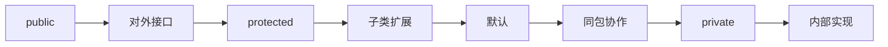

# 3.2 访问修饰符

> [!abstract] 定义
> 访问修饰符（Access Modifier）用于控制类成员（属性和方法）的访问权限，实现封装和信息隐藏。

## Java的访问修饰符

### 四种访问级别

| 修饰符 | 类内部 | 同包类 | 子类 | 其他类 |
|-------|-------|-------|-----|-------|
| **public** | ✓ | ✓ | ✓ | ✓ |
| **protected** | ✓ | ✓ | ✓ | ✗ |
| **默认（包访问）** | ✓ | ✓ | ✗ | ✗ |
| **private** | ✓ | ✗ | ✗ | ✗ |

### 使用示例

```java
public class Person {
    // public：所有地方都可以访问
    public String name;
    
    // protected：子类和同包类可以访问
    protected int age;
    
    // 默认：同包类可以访问
    String address;
    
    // private：只有类内部可以访问
    private String idCard;
}
```

## C++的访问修饰符

### 三种访问级别

| 修饰符 | 类内部 | 子类 | 友元 | 其他类 |
|-------|-------|-----|-----|-------|
| **public** | ✓ | ✓（public继承） | ✓ | ✓ |
| **protected** | ✓ | ✓（public继承） | ✓ | ✗ |
| **private** | ✓ | ✗ | ✓ | ✗ |

### 使用示例

```cpp
class Person {
public:
    std::string name;
protected:
    int age;
private:
    std::string idCard;
};
```

## Java与C++访问控制对比

| 特性 | Java | C++ |
|-----|------|-----|
| **默认访问** | 包访问 | private |
| **protected** | 包+子类 | 子类+友元 |
| **友元机制** | 无 | 有 |
| **访问控制位置** | 成员级别 | 成员级别（可分组） |

## 访问控制的设计原则

### 最小权限原则

给成员设置尽可能小的访问权限。

| 成员类型 | 推荐修饰符 | 说明 |
|---------|-----------|------|
| **属性** | `private` | 隐藏数据，通过方法访问 |
| **方法** | `public` | 提供对外接口 |
| **辅助方法** | `private` | 内部使用，不对外暴露 |
| **子类需要访问的成员** | `protected` | 允许子类继承 |

### 封装层次



## 应用场景

| 场景 | 选择修饰符 | 理由 |
|-----|-----------|------|
| **对外公开的功能** | `public` | 提供服务接口 |
| **需要子类扩展** | `protected` | 允许继承但不公开 |
| **同模块协作** | `默认` | 包内访问，包外隔离 |
| **内部实现细节** | `private` | 完全隐藏 |

## 易错点

> [!warning] 常见误区
> 1. **误区**：protected在Java和C++中含义相同
>    **纠正**：Java中protected是包+子类，C++中是子类+友元
>
> 2. **误区**：C++的默认访问是包访问
>    **纠正**：C++的默认访问是private
>
> 3. **误区**：类的访问修饰符和成员的一样
>    **纠正**：类只能是public或默认（Java），成员有四种级别

## 关键术语

| 术语 | 英文 | 定义 |
|-----|------|------|
| 访问修饰符 | Access Modifier | 控制成员访问权限 |
| public | - | 公开访问 |
| protected | - | 保护访问 |
| private | - | 私有访问 |
| 包访问 | Package Access | Java默认访问级别 |