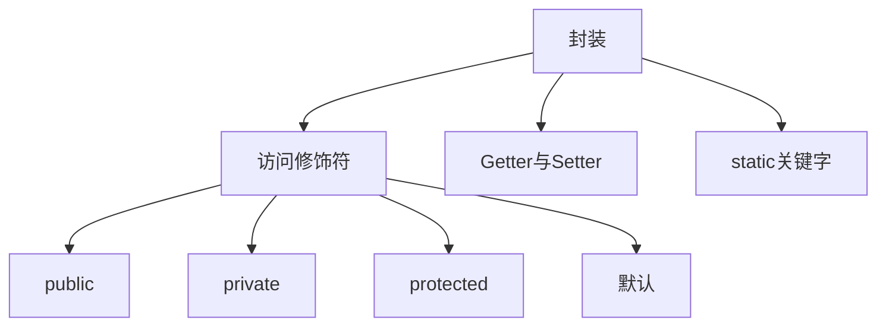

# 第3章-封装与访问控制

> [!abstract] 本章定位
> 本章深入讲解封装的原理和访问控制机制，包括访问修饰符、Getter/Setter方法和static关键字。

> [!info] 前后依赖
> - **前置**：第2章 类与对象基础
> - **后续**：第4章 继承与多态

## 知识点导航

- [[3.1 封装的概念]]：封装的原理和目的
- [[3.2 访问修饰符]]：public、private、protected、默认
- [[3.3 Getter与Setter]]：访问器和修改器方法
- [[3.4 static关键字]]：静态成员的特点和使用

## 本章重点

| 知识点 | 核心内容 | 掌握程度 |
|-------|---------|---------|
| 3.1 封装 | 封装的原理和目的 | 理解 |
| 3.2 访问修饰符 | 四种访问级别 | 掌握 |
| 3.3 Getter/Setter | 访问器和修改器模式 | 掌握 |
| 3.4 static | 静态成员的特点 | 掌握 |

## 学习建议

1. 理解封装的核心思想：**数据隐藏，接口暴露**
2. 掌握四种访问修饰符的作用范围
3. 熟练使用Getter/Setter模式
4. 理解静态成员与实例成员的区别

## 核心概念关系

