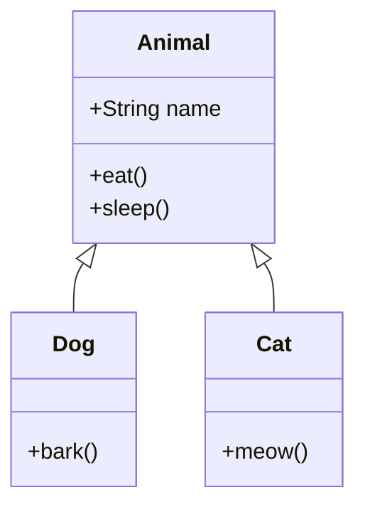
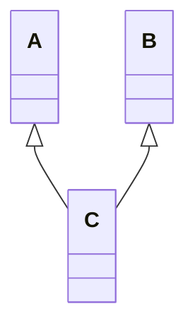
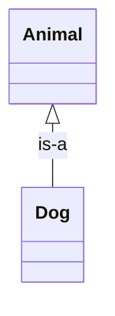
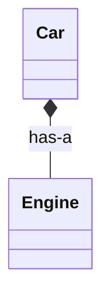

# 4.1 继承的概念

> [!abstract] 定义
> 继承（Inheritance）是面向对象的三大特性之一，指子类（Subclass）从父类（Superclass）获得属性和方法的机制，实现代码复用和层次结构。

## 继承的原理

### "is-a"关系

继承表示"是一个"的关系，子类是父类的一种特殊类型。



### 继承的好处

| 好处 | 说明 |
|-----|------|
| **代码复用** | 子类直接使用父类的属性和方法 |
| **层次结构** | 建立类之间的"is-a"关系 |
| **扩展能力** | 在父类基础上添加新功能 |
| **多态基础** | 为多态提供类型体系支持 |

## Java继承

### 使用extends关键字

> [!example] 示例：Java继承
> ```java
> // 父类（基类）
> public class Animal {
>     protected String name;
>     
>     public Animal(String name) {
>         this.name = name;
>     }
>     
>     public void eat() {
>         System.out.println(name + "吃东西");
>     }
> }
> 
> // 子类（派生类）
> public class Dog extends Animal {
>     public Dog(String name) {
>         super(name);  // 调用父类构造方法
>     }
>     
>     public void bark() {
>         System.out.println(name + "汪汪");
>     }
> }
> ```

### Java继承特点

| 特点 | 说明 |
|-----|------|
| **单继承** | 一个类只能继承一个父类 |
| **多层继承** | 可以形成继承链 |
| **Object类** | 所有类的最终父类 |
| **构造方法** | 子类必须调用父类构造方法 |

## C++继承

### 使用冒号语法

> [!example] 示例：C++继承
> ```cpp
> // 父类
> class Animal {
> protected:
>     std::string name;
> public:
>     Animal(std::string n) : name(n) {}
>     void eat() {
>         std::cout << name << "吃东西" << std::endl;
>     }
> };
> 
> // 子类
> class Dog : public Animal {
> public:
>     Dog(std::string n) : Animal(n) {}
>     void bark() {
>         std::cout << name << "汪汪" << std::endl;
>     }
> };
> ```

### C++继承方式

| 方式 | 说明 |
|-----|------|
| **public继承** | 保持原有访问级别 |
| **protected继承** | public变为protected |
| **private继承** | 所有成员变为private |

## 继承的类型

### 单继承

一个类只继承一个父类。


### 多层继承

形成继承链。


### 多重继承（C++）

一个类继承多个父类（Java不支持）。



## 继承与组合对比

### 继承（is-a）



### 组合（has-a）



| 对比维度 | 继承 | 组合 |
|---------|------|------|
| **关系** | is-a | has-a |
| **耦合度** | 高 | 低 |
| **灵活性** | 低 | 高 |
| **复用方式** | 继承代码 | 组合对象 |
| **适用场景** | 明确的层次关系 | 需要灵活组合 |

## 易错点

> [!warning] 常见误区
> 1. **误区**：继承越多越好
>    **纠正**：过度继承导致层次复杂，优先考虑组合
>
> 2. **误区**：Java支持多重继承
>    **纠正**：Java只支持单继承，通过接口实现多重继承效果
>
> 3. **误区**：子类可以访问父类的private成员
>    **纠正**：子类不能访问父类的private成员，只能访问public和protected

## 关键术语

| 术语 | 英文 | 定义 |
|-----|------|------|
| 继承 | Inheritance | 子类从父类获得属性和方法 |
| 父类 | Superclass | 被继承的类 |
| 子类 | Subclass | 继承其他类的类 |
| extends | - | Java继承关键字 |
| 单继承 | Single Inheritance | 一个类只能继承一个父类 |
| 多重继承 | Multiple Inheritance | 一个类继承多个父类 |