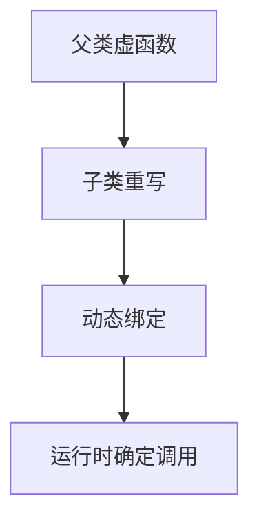

# 4.2 方法重写

> [!abstract] 定义
> 方法重写（Method Overriding）是指子类重新定义父类中已有的方法，实现与父类不同的行为，是实现多态的基础。

## 重写规则

### 必须满足的条件

| 条件 | 说明 |
|-----|------|
| **方法名相同** | 必须与父类方法名完全相同 |
| **参数列表相同** | 参数个数、类型和顺序必须相同 |
| **返回类型** | 必须相同或为父类返回类型的子类型（协变返回） |
| **访问修饰符** | 不能比父类更严格 |
| **异常声明** | 不能声明父类方法没有声明的异常 |

### 重写与重载对比

| 对比维度 | 重写（Override） | 重载（Overload） |
|---------|-----------------|-----------------|
| **位置** | 子类 | 同一类 |
| **方法名** | 相同 | 相同 |
| **参数列表** | 相同 | 不同 |
| **返回类型** | 相同或协变 | 任意 |
| **访问修饰符** | 不能更严格 | 任意 |
| **多态类型** | 运行时多态 | 编译时多态 |

> [!example] 示例：Java方法重写
> ```java
> public class Animal {
>     public void makeSound() {
>         System.out.println("动物发出声音");
>     }
> }
> 
> public class Dog extends Animal {
>     @Override  // 注解标记重写
>     public void makeSound() {
>         System.out.println("汪汪");
>     }
> }
> 
> public class Cat extends Animal {
>     @Override
>     public void makeSound() {
>         System.out.println("喵喵");
>     }
> }
> ```

> [!example] 示例：C++方法重写
> ```cpp
> class Animal {
> public:
>     virtual void makeSound() {
>         std::cout << "动物发出声音" << std::endl;
>     }
> };
> 
> class Dog : public Animal {
> public:
>     void makeSound() override {  // override关键字标记
>         std::cout << "汪汪" << std::endl;
>     }
> };
> 
> class Cat : public Animal {
> public:
>     void makeSound() override {
>         std::cout << "喵喵" << std::endl;
>     }
> };
> ```

## 重写的实现机制

### Java实现

使用`@Override`注解标记，编译器会检查重写规则。

### C++实现

使用`virtual`关键字声明虚函数，`override`关键字标记重写。



## 协变返回类型

### Java协变返回

```java
public class Animal {
    public Animal getBaby() {
        return new Animal();
    }
}

public class Dog extends Animal {
    @Override
    public Dog getBaby() {  // 返回类型是父类返回类型的子类型
        return new Dog();
    }
}
```

### C++协变返回

```cpp
class Animal {
public:
    virtual Animal* getBaby() {
        return new Animal();
    }
};

class Dog : public Animal {
public:
    Dog* getBaby() override {
        return new Dog();
    }
};
```

## final关键字阻止重写

### Java使用final

```java
public class Animal {
    public final void makeSound() {
        // 此方法不能被重写
    }
}
```

### C++使用final

```cpp
class Animal {
public:
    virtual void makeSound() final {
        // 此方法不能被重写
    }
};
```

## 易错点

> [!warning] 常见误区
> 1. **误区**：重写就是参数列表不同
>    **纠正**：重写参数列表必须相同，参数列表不同是重载
>
> 2. **误区**：C++不需要virtual关键字也能实现多态
>    **纠正**：必须使用virtual关键字声明虚函数
>
> 3. **误区**：@Override注解是必须的
>    **纠正**：不是必须的，但建议使用，编译器会检查重写规则

## 关键术语

| 术语 | 英文 | 定义 |
|-----|------|------|
| 方法重写 | Method Overriding | 子类重新定义父类方法 |
| 虚函数 | Virtual Function | C++中支持动态绑定的函数 |
| @Override | - | Java中标记重写的注解 |
| override | - | C++中标记重写的关键字 |
| 协变返回类型 | Covariant Return Type | 返回类型可以是子类型 |