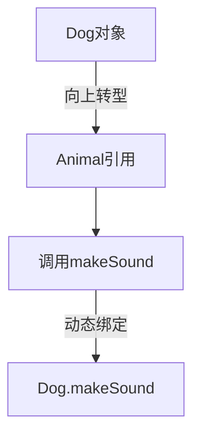

# 4.3 多态的实现

> [!abstract] 定义
> 多态（Polymorphism）是面向对象的三大特性之一，指同一接口（方法）在不同对象上有不同的实现方式，即**一个名字，多种形态**。

## 多态的原理

### 向上转型

将子类对象赋值给父类引用。



> [!example] 示例：Java向上转型
> ```java
> Animal animal = new Dog();  // 向上转型
> animal.makeSound();  // 调用Dog的makeSound方法
> ```

> [!example] 示例：C++向上转型
> ```cpp
> Animal* animal = new Dog();  // 向上转型
> animal->makeSound();  // 调用Dog的makeSound方法
> ```

### 动态绑定

运行时根据对象的实际类型确定调用的方法。

| 绑定类型 | 说明 | 时机 |
|---------|------|------|
| **静态绑定** | 根据引用类型确定 | 编译时 |
| **动态绑定** | 根据对象类型确定 | 运行时 |

## 多态的实现方式

### Java实现

```java
public class Animal {
    public void makeSound() {
        System.out.println("动物发出声音");
    }
}

public class Dog extends Animal {
    @Override
    public void makeSound() {
        System.out.println("汪汪");
    }
}

public class Cat extends Animal {
    @Override
    public void makeSound() {
        System.out.println("喵喵");
    }
}

// 使用多态
Animal[] animals = {new Dog(), new Cat()};
for (Animal a : animals) {
    a.makeSound();  // 自动调用对应实现
}
```

### C++实现

```cpp
class Animal {
public:
    virtual void makeSound() {
        std::cout << "动物发出声音" << std::endl;
    }
};

class Dog : public Animal {
public:
    void makeSound() override {
        std::cout << "汪汪" << std::endl;
    }
};

class Cat : public Animal {
public:
    void makeSound() override {
        std::cout << "喵喵" << std::endl;
    }
};

// 使用多态
Animal* animals[] = {new Dog(), new Cat()};
for (auto a : animals) {
    a->makeSound();
}
```

## 多态的好处

| 好处 | 说明 |
|-----|------|
| **灵活性** | 同一代码处理不同类型对象 |
| **可扩展性** | 添加新类不修改现有代码 |
| **解耦合** | 调用者无需关心具体实现 |
| **代码简洁** | 简化条件判断逻辑 |

## 多态的应用场景

### 替代条件判断

```java
// 不使用多态
if (animal instanceof Dog) {
    ((Dog) animal).bark();
} else if (animal instanceof Cat) {
    ((Cat) animal).meow();
}

// 使用多态
animal.makeSound();
```

### 统一接口处理

```java
public class ShapeProcessor {
    public void drawAll(Shape[] shapes) {
        for (Shape shape : shapes) {
            shape.draw();  // 统一调用，自动适配
        }
    }
}
```

### 回调机制

```java
public interface Callback {
    void onComplete();
}

public class Task {
    private Callback callback;
    
    public void setCallback(Callback callback) {
        this.callback = callback;
    }
    
    public void execute() {
        // 执行任务
        if (callback != null) {
            callback.onComplete();  // 回调
        }
    }
}
```

## 多态与类型转换

### 向上转型（隐式）

```java
Animal animal = new Dog();  // 自动转换
```

### 向下转型（显式）

```java
Animal animal = new Dog();
Dog dog = (Dog) animal;  // 需要显式转换
```

### 类型检查

```java
if (animal instanceof Dog) {
    Dog dog = (Dog) animal;
    dog.bark();
}
```

## 易错点

> [!warning] 常见误区
> 1. **误区**：多态就是方法重载
>    **纠正**：重载是编译时多态，重写才是运行时多态
>
> 2. **误区**：C++不需要virtual关键字也能实现多态
>    **纠正**：必须使用virtual关键字
>
> 3. **误区**：向下转型总是安全的
>    **纠正**：向下转型可能失败，需要类型检查

## 关键术语

| 术语 | 英文 | 定义 |
|-----|------|------|
| 多态 | Polymorphism | 同一接口多种实现 |
| 向上转型 | Upcasting | 子类对象赋值给父类引用 |
| 向下转型 | Downcasting | 父类引用转换为子类类型 |
| 动态绑定 | Dynamic Binding | 运行时确定调用的方法 |
| 静态绑定 | Static Binding | 编译时确定调用的方法 |