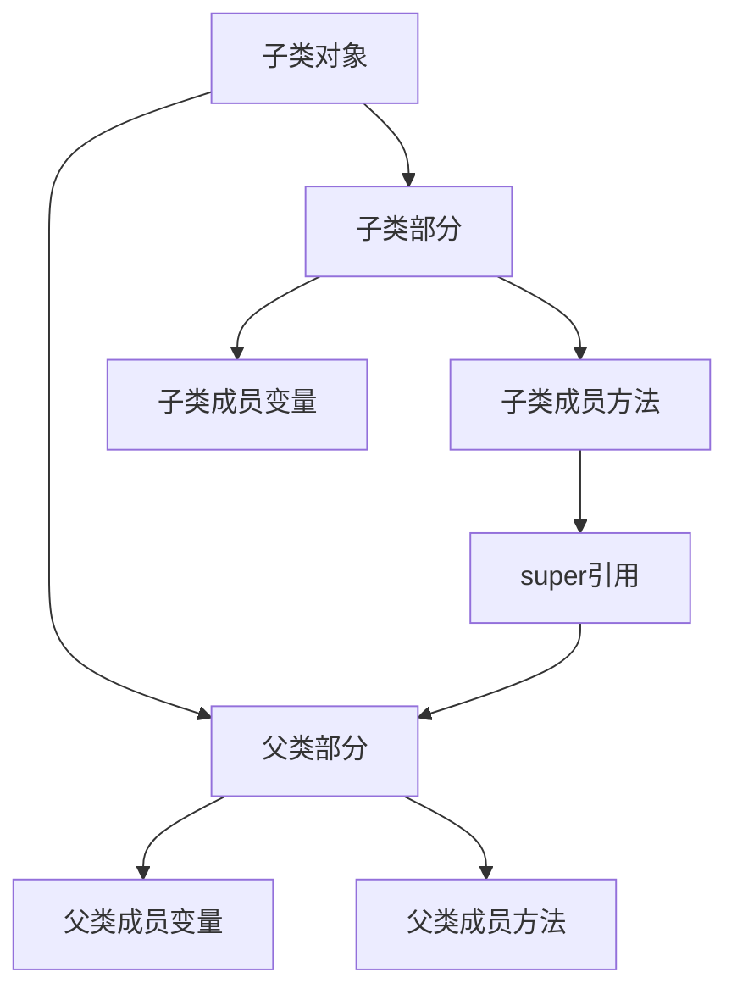

# 4.4 super关键字

> [!abstract] 定义
> `super`是一个引用变量，指向当前对象的**父类对象**，在子类中使用，用于访问父类的成员。

## super的用法

### 用法一：调用父类构造方法

使用`super()`在子类构造方法中调用父类构造方法。

> [!example] 示例：Java调用父类构造方法
> ```java
> public class Animal {
>     protected String name;
>     
>     public Animal(String name) {
>         this.name = name;
>     }
> }
> 
> public class Dog extends Animal {
>     public Dog(String name) {
>         super(name);  // 调用父类构造方法
>     }
> }
> ```

> [!example] 示例：C++调用父类构造方法
> ```cpp
> class Animal {
> protected:
>     std::string name;
> public:
>     Animal(std::string n) : name(n) {}
> };
> 
> class Dog : public Animal {
> public:
>     Dog(std::string n) : Animal(n) {}  // 初始化列表调用
> };
> ```

> [!warning] 注意事项
> - `super()`必须是子类构造方法的第一条语句
> - 如果子类构造方法没有显式调用`super()`，编译器会自动调用父类的无参构造方法
> - 如果父类没有无参构造方法，子类必须显式调用有参构造方法

### 用法二：调用父类的成员变量

使用`super.变量名`访问父类的成员变量。

> [!example] 示例：Java访问父类成员变量
> ```java
> public class Animal {
>     protected String name = "动物";
> }
> 
> public class Dog extends Animal {
>     private String name = "狗";
>     
>     public void showNames() {
>         System.out.println(this.name);   // 输出：狗
>         System.out.println(super.name);  // 输出：动物
>     }
> }
> ```

> [!example] 示例：C++访问父类成员变量
> ```cpp
> class Animal {
> protected:
>     std::string name = "动物";
> };
> 
> class Dog : public Animal {
> private:
>     std::string name = "狗";
> public:
>     void showNames() {
>         std::cout << this->name << std::endl;   // 输出：狗
>         std::cout << Animal::name << std::endl;  // 输出：动物
>     }
> };
> ```

### 用法三：调用父类的成员方法

使用`super.方法名()`调用父类的成员方法。

> [!example] 示例：Java调用父类方法
> ```java
> public class Animal {
>     public void makeSound() {
>         System.out.println("动物发出声音");
>     }
> }
> 
> public class Dog extends Animal {
>     @Override
>     public void makeSound() {
>         super.makeSound();  // 调用父类方法
>         System.out.println("汪汪");
>     }
> }
> ```

> [!example] 示例：C++调用父类方法
> ```cpp
> class Animal {
> public:
>     virtual void makeSound() {
>         std::cout << "动物发出声音" << std::endl;
>     }
> };
> 
> class Dog : public Animal {
> public:
>     void makeSound() override {
>         Animal::makeSound();  // 调用父类方法
>         std::cout << "汪汪" << std::endl;
>     }
> };
> ```

## super的本质



| 特性 | 说明 |
|-----|------|
| **类型** | 父类的引用类型 |
| **值** | 当前对象中父类部分的引用 |
| **作用域** | 子类方法内部 |
| **生命周期** | 与对象相同 |

## super与this对比

| 对比维度 | this | super |
|---------|------|-------|
| **指向** | 当前对象 | 当前对象的父类部分 |
| **使用场景** | 访问当前对象成员 | 访问父类成员 |
| **构造方法** | `this()`调用本类构造 | `super()`调用父类构造 |
| **成员变量** | `this.var` | `super.var` |
| **成员方法** | `this.method()` | `super.method()` |

## 应用场景

| 场景 | 使用super | 理由 |
|-----|----------|------|
| **调用父类构造** | `super()` | 初始化父类部分 |
| **扩展父类方法** | `super.method()` | 在父类基础上添加新功能 |
| **访问被遮蔽的变量** | `super.var` | 区分父子类同名变量 |

## 易错点

> [!warning] 常见误区
> 1. **误区**：super可以在静态方法中使用
>    **纠正**：super和this一样，不能在静态方法中使用
>
> 2. **误区**：C++有super关键字
>    **纠正**：C++没有super关键字，使用`父类名::`代替
>
> 3. **误区**：super()可以在普通方法中使用
>    **纠正**：super()只能在构造方法中使用

## 关键术语

| 术语 | 英文 | 定义 |
|-----|------|------|
| super | - | 当前对象的父类引用 |
| 构造方法链 | Constructor Chain | 构造方法调用链 |
| 变量遮蔽 | Variable Shadowing | 子类变量覆盖父类变量 |
| 方法重写 | Method Overriding | 子类方法覆盖父类方法 |