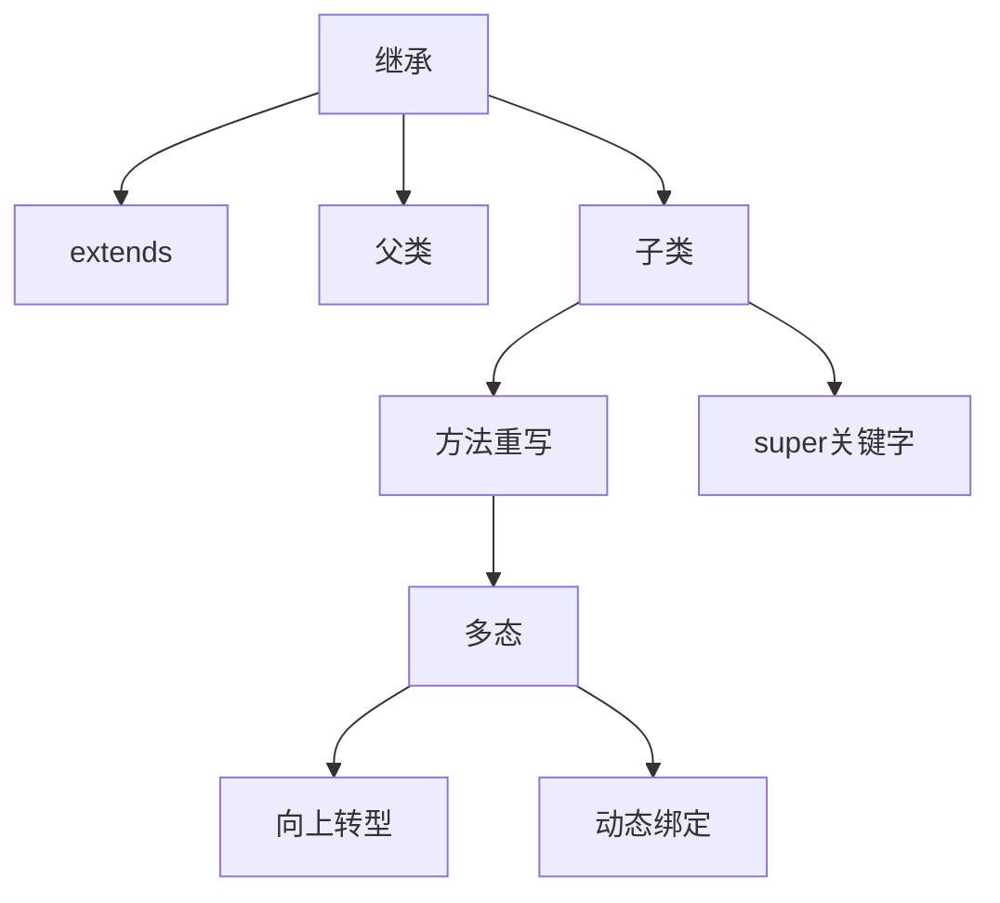

# 第4章-继承与多态

> [!abstract] 本章定位
> 本章深入讲解继承和多态的原理与实现，包括继承的概念、方法重写、多态的实现机制和super关键字。

> [!info] 前后依赖
> - **前置**：第3章 封装与访问控制
> - **后续**：第5章 抽象类与接口

## 知识点导航

- [[4.1 继承的概念]]：extends关键字、父类与子类
- [[4.2 方法重写]]：override的规则和应用
- [[4.3 多态的实现]]：向上转型、动态绑定
- [[4.4 super关键字]]：super的用法和意义

## 本章重点

| 知识点 | 核心内容 | 掌握程度 |
|-------|---------|---------|
| 4.1 继承 | extends关键字、父类子类关系 | 掌握 |
| 4.2 方法重写 | override规则、@Override注解 | 掌握 |
| 4.3 多态 | 向上转型、动态绑定 | 掌握 |
| 4.4 super | super调用父类成员 | 掌握 |

## 学习建议

1. 理解继承的"is-a"关系
2. 掌握方法重写的规则和应用场景
3. 理解多态的实现机制：向上转型+动态绑定
4. 熟练使用super关键字

## 核心概念关系

