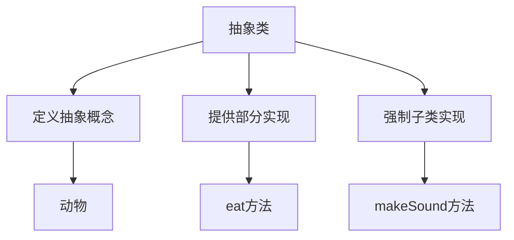

# 5.1 抽象类

> [!abstract] 定义
> 抽象类（Abstract Class）是一种不能被实例化的类，用于定义抽象的概念和接口，包含抽象方法和具体方法，子类必须实现所有抽象方法。

## 抽象类的原理

### 设计目的



### 特点

| 特点 | 说明 |
|-----|------|
| **不能实例化** | 不能使用new创建对象 |
| **包含抽象方法** | 没有实现的方法，必须由子类实现 |
| **包含具体方法** | 可以有已实现的方法 |
| **可以有构造方法** | 用于子类初始化 |
| **可以有成员变量** | 可以有实例变量和静态变量 |

## Java抽象类

### 定义抽象类

> [!example] 示例：Java抽象类
> ```java
> public abstract class Animal {
>     protected String name;
>     
>     public Animal(String name) {
>         this.name = name;
>     }
>     
>     // 抽象方法：没有实现
>     public abstract void makeSound();
>     
>     // 具体方法：有实现
>     public void eat() {
>         System.out.println(name + "吃东西");
>     }
> }
> ```

### 子类实现抽象方法

```java
public class Dog extends Animal {
    public Dog(String name) {
        super(name);
    }
    
    // 必须实现抽象方法
    @Override
    public void makeSound() {
        System.out.println(name + "汪汪");
    }
}
```

## C++抽象类

### 定义抽象类

> [!example] 示例：C++抽象类
> ```cpp
> class Animal {
> protected:
>     std::string name;
> public:
>     Animal(std::string n) : name(n) {}
>     
>     // 纯虚函数：没有实现
>     virtual void makeSound() = 0;
>     
>     // 具体方法：有实现
>     void eat() {
>         std::cout << name << "吃东西" << std::endl;
>     }
> };
> ```

### 子类实现纯虚函数

```cpp
class Dog : public Animal {
public:
    Dog(std::string n) : Animal(n) {}
    
    void makeSound() override {
        std::cout << name << "汪汪" << std::endl;
    }
};
```

## 抽象方法

### 定义

抽象方法（Abstract Method）是没有实现的方法，只有方法声明，没有方法体。

### 特点

| 特点 | 说明 |
|-----|------|
| **没有方法体** | 只有声明，没有实现 |
| **子类必须实现** | 否则子类也是抽象类 |
| **用于定义接口** | 规定子类必须提供的行为 |

## 抽象类的应用场景

| 场景 | 使用抽象类 | 理由 |
|-----|-----------|------|
| **定义抽象概念** | 动物、形状、交通工具 | 不能实例化的概念 |
| **提供默认实现** | 通用方法的默认实现 | 子类可以复用 |
| **强制子类行为** | 通过抽象方法 | 确保子类实现必要功能 |
| **模板方法模式** | 定义算法骨架 | 子类实现具体步骤 |

## 模板方法模式

> [!example] 示例：模板方法模式
> ```java
> public abstract class Game {
>     // 模板方法：定义算法骨架
>     public final void play() {
>         initialize();
>         startPlay();
>         endPlay();
>     }
>     
>     protected abstract void initialize();
>     protected abstract void startPlay();
>     protected abstract void endPlay();
> }
> 
> public class Football extends Game {
>     @Override
>     protected void initialize() {
>         System.out.println("初始化足球比赛");
>     }
>     
>     @Override
>     protected void startPlay() {
>         System.out.println("开始足球比赛");
>     }
>     
>     @Override
>     protected void endPlay() {
>         System.out.println("结束足球比赛");
>     }
> }
> ```

## 易错点

> [!warning] 常见误区
> 1. **误区**：抽象类不能有构造方法
>    **纠正**：抽象类可以有构造方法，用于子类初始化
>
> 2. **误区**：抽象类只能有抽象方法
>    **纠正**：抽象类可以有具体方法
>
> 3. **误区**：抽象类可以被实例化
>    **纠正**：抽象类不能被实例化

## 关键术语

| 术语 | 英文 | 定义 |
|-----|------|------|
| 抽象类 | Abstract Class | 不能实例化的类 |
| 抽象方法 | Abstract Method | 没有实现的方法 |
| 纯虚函数 | Pure Virtual Function | C++中的抽象方法 |
| 模板方法 | Template Method | 定义算法骨架的方法 |