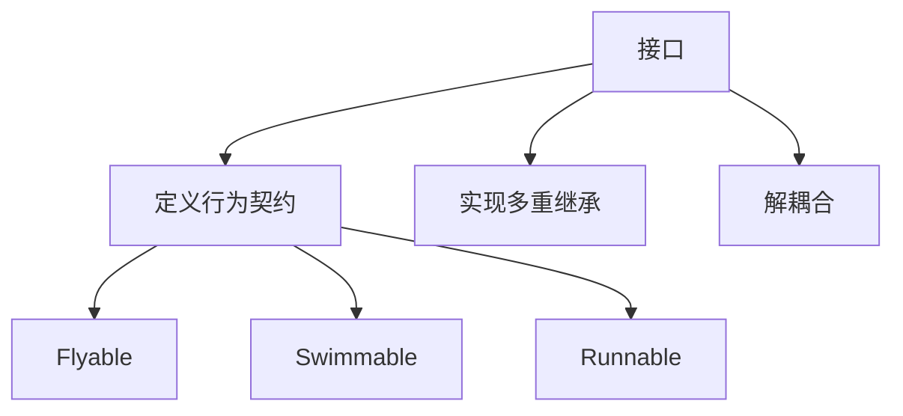

# 5.2 接口

> [!abstract] 定义
> 接口（Interface）是一种纯抽象的类型，只包含抽象方法和常量，用于定义类的行为契约，实现接口的类必须实现所有方法。

## 接口的原理

### 设计目的



### 特点

| 特点 | 说明 |
|-----|------|
| **纯抽象** | 只有抽象方法（Java 8前） |
| **常量** | 所有变量都是public static final |
| **不能实例化** | 不能使用new创建对象 |
| **可以多实现** | 一个类可以实现多个接口 |
| **可以继承** | 接口可以继承其他接口 |

## Java接口

### 定义接口

> [!example] 示例：Java接口
> ```java
> public interface Flyable {
>     // 抽象方法（public abstract可以省略）
>     void fly();
>     
>     // 常量（public static final可以省略）
>     int MAX_HEIGHT = 10000;
> }
> ```

### 实现接口

```java
public class Bird implements Flyable {
    @Override
    public void fly() {
        System.out.println("鸟在飞翔");
    }
}
```

### Java 8+接口新特性

| 特性 | 说明 |
|-----|------|
| **默认方法** | `default`关键字，提供默认实现 |
| **静态方法** | `static`关键字，属于接口本身 |
| **私有方法** | `private`关键字，接口内部使用 |

> [!example] 示例：Java 8接口
> ```java
> public interface Flyable {
>     void fly();
>     
>     // 默认方法
>     default void land() {
>         System.out.println("降落");
>     }
>     
>     // 静态方法
>     static void info() {
>         System.out.println("飞行接口");
>     }
> }
> ```

## C++接口

### 使用抽象类模拟接口

> [!example] 示例：C++接口
> ```cpp
> class Flyable {
> public:
>     virtual void fly() = 0;  // 纯虚函数
>     virtual ~Flyable() = default;  // 虚析构函数
> };
> ```

### 实现接口

```cpp
class Bird : public Flyable {
public:
    void fly() override {
        std::cout << "鸟在飞翔" << std::endl;
    }
};
```

## 接口的应用场景

| 场景 | 使用接口 | 理由 |
|-----|---------|------|
| **定义行为契约** | Flyable、Runnable | 规定类必须实现的行为 |
| **实现多重继承** | Java不支持多继承 | 通过接口实现 |
| **解耦合** | 依赖接口而非具体类 | 降低耦合度 |
| **回调机制** | Callback接口 | 异步回调 |
| **适配器模式** | 适配不同接口 | 统一接口 |

## 适配器模式

> [!example] 示例：适配器模式
> ```java
> public interface Target {
>     void request();
> }
> 
> public class Adaptee {
>     public void specificRequest() {
>         System.out.println("特殊请求");
>     }
> }
> 
> public class Adapter extends Adaptee implements Target {
>     @Override
>     public void request() {
>         specificRequest();
>     }
> }
> ```

## 接口继承

### Java接口继承

```java
public interface Animal {
    void eat();
}

public interface Mammal extends Animal {
    void giveBirth();
}

public class Dog implements Mammal {
    @Override
    public void eat() { /* ... */ }
    
    @Override
    public void giveBirth() { /* ... */ }
}
```

## 易错点

> [!warning] 常见误区
> 1. **误区**：接口可以有成员变量
>    **纠正**：接口的变量都是常量（public static final）
>
> 2. **误区**：接口可以有构造方法
>    **纠正**：接口不能有构造方法
>
> 3. **误区**：Java接口只能有抽象方法
>    **纠正**：Java 8+支持默认方法、静态方法和私有方法

## 关键术语

| 术语 | 英文 | 定义 |
|-----|------|------|
| 接口 | Interface | 纯抽象类型，定义行为契约 |
| 默认方法 | Default Method | Java 8+接口的默认实现 |
| 实现 | Implements | 类实现接口 |
| 接口继承 | Interface Inheritance | 接口继承其他接口 |
| 适配器模式 | Adapter Pattern | 适配不同接口 |