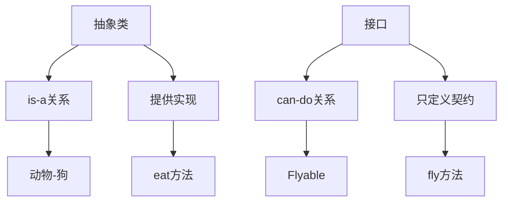
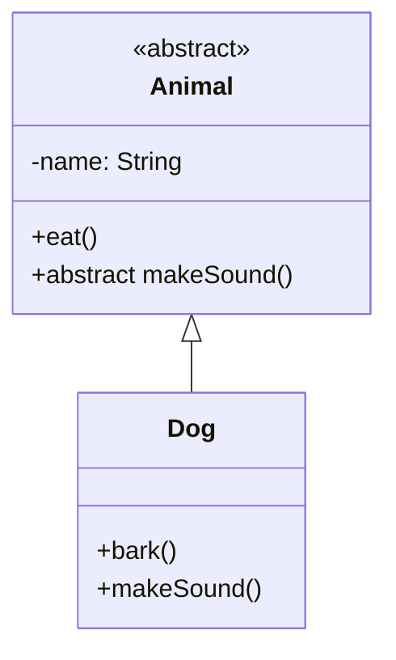

# 5.3 抽象类与接口对比

> [!abstract] 定义
> 抽象类和接口都是面向对象的抽象机制，但设计目的和使用场景不同，需要根据具体情况选择。

## 核心区别

### 对比表

| 对比维度 | 抽象类 | 接口 |
|---------|-------|------|
| **定义** | 不能实例化的类 | 纯抽象类型 |
| **成员** | 抽象方法+具体方法 | 抽象方法（Java 8前） |
| **成员变量** | 可以有实例变量 | 只能是常量 |
| **构造方法** | 可以有 | 不能有 |
| **继承方式** | extends（单继承） | implements（多实现） |
| **设计目的** | 定义抽象概念 | 定义行为契约 |
| **关系** | is-a | has-a/can-do |
| **代码复用** | 通过继承复用 | 通过实现共享接口 |

### 本质区别



## 选择原则

### 使用抽象类的场景

| 场景 | 理由 |
|-----|------|
| **定义抽象概念** | 动物、形状、交通工具等不能实例化的概念 |
| **需要代码复用** | 多个子类共享相同的实现 |
| **有状态需要维护** | 需要实例变量存储状态 |
| **模板方法模式** | 定义算法骨架，子类实现具体步骤 |

### 使用接口的场景

| 场景 | 理由 |
|-----|------|
| **定义行为契约** | 飞行、游泳、奔跑等能力 |
| **实现多重继承** | Java不支持多继承，通过接口实现 |
| **解耦合** | 依赖接口而非具体类 |
| **回调机制** | 异步回调、事件处理 |

## 典型示例

### 抽象类示例



```java
public abstract class Animal {
    protected String name;
    
    public void eat() { /* ... */ }
    public abstract void makeSound();
}

public class Dog extends Animal {
    public void makeSound() { /* ... */ }
}
```

### 接口示例

```mermaid
classDiagram
    interface Flyable {
        <<interface>>
        +fly()
    }
    class Bird {
        +fly()
    }
    Flyable <|.. Bird
```

```java
public interface Flyable {
    void fly();
}

public class Bird implements Flyable {
    public void fly() { /* ... */ }
}
```

## 组合使用

### 抽象类+接口

```mermaid
classDiagram
    class Animal {
        <<abstract>>
        +eat()
    }
    interface Flyable {
        <<interface>>
        +fly()
    }
    class Bird {
        +makeSound()
        +fly()
    }
    Animal <|-- Bird
    Flyable <|.. Bird
```

```java
public abstract class Animal {
    public abstract void eat();
}

public interface Flyable {
    void fly();
}

public class Bird extends Animal implements Flyable {
    @Override
    public void eat() { /* ... */ }
    
    @Override
    public void fly() { /* ... */ }
}
```

## 设计原则

### 里氏替换原则

子类必须能替换父类，抽象类的子类应该是is-a关系。

### 依赖倒置原则

依赖抽象而非具体，优先使用接口。

### 接口隔离原则

客户端不应该依赖它不需要的接口，接口应该小而专。

## 易错点

> [!warning] 常见误区
> 1. **误区**：抽象类和接口可以互换
>    **纠正**：设计目的不同，抽象类是is-a，接口是can-do
>
> 2. **误区**：接口只能有抽象方法
>    **纠正**：Java 8+支持默认方法、静态方法和私有方法
>
> 3. **误区**：接口可以有成员变量
>    **纠正**：接口的变量都是常量

## 关键术语

| 术语 | 英文 | 定义 |
|-----|------|------|
| is-a | - | 继承关系，表示"是一个" |
| can-do | - | 接口关系，表示"能够做" |
| 里氏替换原则 | Liskov Substitution Principle | 子类能替换父类 |
| 依赖倒置原则 | Dependency Inversion Principle | 依赖抽象而非具体 |
| 接口隔离原则 | Interface Segregation Principle | 接口应该小而专 |