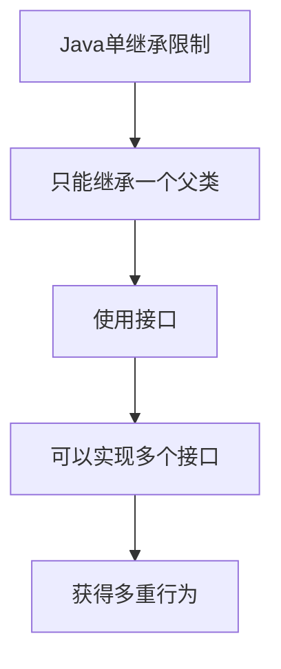
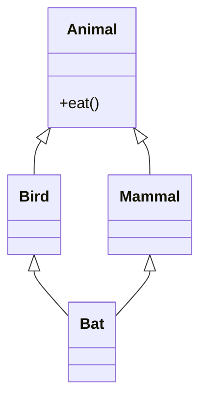

# 5.4 接口的多实现

> [!abstract] 定义
> 接口的多实现（Multiple Interface Implementation）是指一个类可以实现多个接口，从而获得多个接口定义的行为，实现了多重继承的效果。

## 多实现的原理

### 解决单继承限制



### 设计目的

| 目的 | 说明 |
|-----|------|
| **行为组合** | 一个类可以具有多种能力 |
| **多重继承** | 绕过Java单继承限制 |
| **解耦合** | 依赖接口而非具体类 |
| **灵活扩展** | 动态添加行为 |

## Java多实现

### 实现多个接口

> [!example] 示例：Java多实现
> ```java
> public interface Flyable {
>     void fly();
> }
> 
> public interface Swimmable {
>     void swim();
> }
> 
> public interface Runnable {
>     void run();
> }
> 
> // 实现多个接口
> public class Duck implements Flyable, Swimmable, Runnable {
>     @Override
>     public void fly() {
>         System.out.println("鸭子飞翔");
>     }
>     
>     @Override
>     public void swim() {
>         System.out.println("鸭子游泳");
>     }
>     
>     @Override
>     public void run() {
>         System.out.println("鸭子奔跑");
>     }
> }
> ```

### 继承+多实现

```java
public abstract class Animal {
    public abstract void eat();
}

public class Duck extends Animal implements Flyable, Swimmable {
    @Override
    public void eat() { /* ... */ }
    
    @Override
    public void fly() { /* ... */ }
    
    @Override
    public void swim() { /* ... */ }
}
```

## C++多继承

### 继承多个接口

> [!example] 示例：C++多继承
> ```cpp
> class Flyable {
> public:
>     virtual void fly() = 0;
> };
> 
> class Swimmable {
> public:
>     virtual void swim() = 0;
> };
> 
> class Duck : public Flyable, public Swimmable {
> public:
>     void fly() override {
>         std::cout << "鸭子飞翔" << std::endl;
>     }
>     
>     void swim() override {
>         std::cout << "鸭子游泳" << std::endl;
>     }
> };
> ```

### 菱形继承问题



### 使用虚继承解决

```cpp
class Bird : virtual public Animal { /* ... */ };
class Mammal : virtual public Animal { /* ... */ };
class Bat : public Bird, public Mammal { /* ... */ };
```

## 多实现的应用场景

### 适配器模式

```java
public interface Target {
    void request();
}

public interface Adaptee {
    void specificRequest();
}

public class Adapter implements Target {
    private Adaptee adaptee;
    
    public Adapter(Adaptee adaptee) {
        this.adaptee = adaptee;
    }
    
    @Override
    public void request() {
        adaptee.specificRequest();
    }
}
```

### 代理模式

```java
public interface Subject {
    void doSomething();
}

public class RealSubject implements Subject {
    @Override
    public void doSomething() { /* ... */ }
}

public class Proxy implements Subject {
    private Subject realSubject;
    
    @Override
    public void doSomething() {
        // 前置处理
        realSubject.doSomething();
        // 后置处理
    }
}
```

### 装饰器模式

```java
public interface Component {
    void operation();
}

public class ConcreteComponent implements Component {
    @Override
    public void operation() { /* ... */ }
}

public abstract class Decorator implements Component {
    protected Component component;
    
    public Decorator(Component component) {
        this.component = component;
    }
}

public class ConcreteDecorator extends Decorator {
    @Override
    public void operation() {
        component.operation();
        // 添加新功能
    }
}
```

## 默认方法冲突

### Java 8+默认方法冲突处理

```java
public interface A {
    default void doSomething() {
        System.out.println("A");
    }
}

public interface B {
    default void doSomething() {
        System.out.println("B");
    }
}

public class C implements A, B {
    @Override
    public void doSomething() {
        A.super.doSomething();  // 显式调用A的默认方法
    }
}
```

## 易错点

> [!warning] 常见误区
> 1. **误区**：Java支持多重继承
>    **纠正**：Java只支持单继承，通过接口实现多重继承效果
>
> 2. **误区**：接口越多越好
>    **纠正**：接口应该小而专，遵循接口隔离原则
>
> 3. **误区**：C++多继承没有问题
>    **纠正**：菱形继承会导致二义性，需要使用虚继承

## 关键术语

| 术语 | 英文 | 定义 |
|-----|------|------|
| 多实现 | Multiple Implementation | 一个类实现多个接口 |
| 菱形继承 | Diamond Inheritance | 多重继承中的二义性问题 |
| 虚继承 | Virtual Inheritance | C++解决菱形继承的方式 |
| 适配器模式 | Adapter Pattern | 适配不同接口 |
| 代理模式 | Proxy Pattern | 为其他对象提供代理 |
| 装饰器模式 | Decorator Pattern | 动态添加功能 |