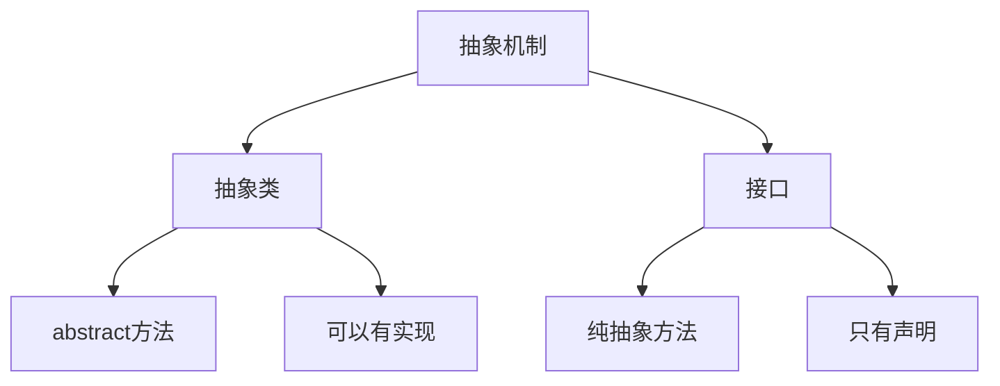

# 第5章-抽象类与接口

> [!abstract] 本章定位
> 本章讲解抽象类和接口的概念、区别和应用，是面向对象设计中重要的抽象机制。

> [!info] 前后依赖
> - **前置**：第4章 继承与多态
> - **后续**：第6章 异常处理

## 知识点导航

- [[5.1 抽象类]]：abstract类和抽象方法
- [[5.2 接口]]：interface的定义和实现
- [[5.3 抽象类与接口对比]]：两者的区别和选择
- [[5.4 接口的多实现]]：Java的接口多重继承

## 本章重点

| 知识点 | 核心内容 | 掌握程度 |
|-------|---------|---------|
| 5.1 抽象类 | abstract类和抽象方法 | 掌握 |
| 5.2 接口 | interface的定义和实现 | 掌握 |
| 5.3 对比 | 抽象类与接口的区别 | 理解 |
| 5.4 多实现 | Java接口多重继承 | 掌握 |

## 学习建议

1. 理解抽象类和接口的设计目的
2. 掌握两者的区别和适用场景
3. 理解Java接口多重继承的原理
4. 学会选择合适的抽象机制

## 核心概念关系

