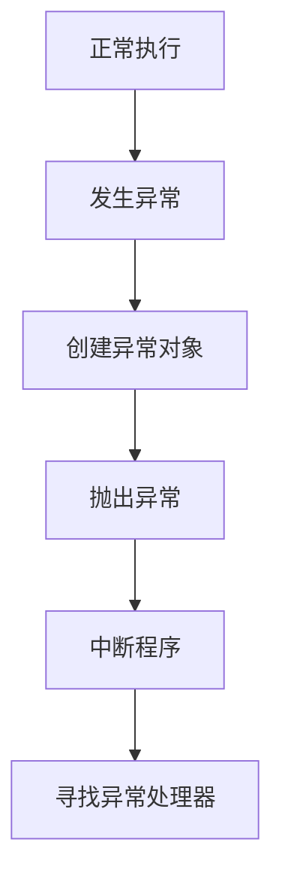
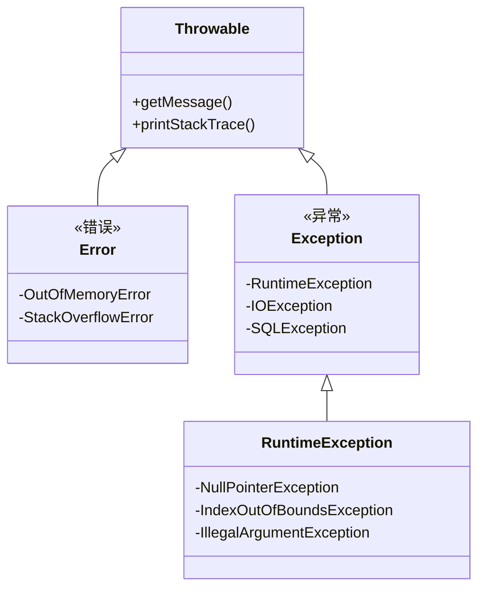

# 6.1 异常的概念

> [!abstract] 定义
> 异常（Exception）是程序运行时发生的不正常情况，会中断程序的正常执行流程，需要特殊处理。

## 异常的原理

### 异常的产生



### 异常处理的目的

| 目的 | 说明 |
|-----|------|
| **优雅处理** | 异常情况下程序不会崩溃 |
| **错误恢复** | 尝试恢复正常执行 |
| **错误记录** | 记录错误信息便于排查 |
| **资源清理** | 确保资源正确释放 |

## Java异常层次结构

### 异常分类



### 分类对比

| 分类 | 说明 | 示例 |
|-----|------|------|
| **Error** | 严重错误，程序无法恢复 | OutOfMemoryError |
| **RuntimeException** | 运行时异常，可避免 | NullPointerException |
| **Checked Exception** | 编译时异常，必须处理 | IOException |

### 常见异常

| 异常类型 | 说明 |
|---------|------|
| **NullPointerException** | 空指针异常 |
| **IndexOutOfBoundsException** | 数组越界异常 |
| **IllegalArgumentException** | 参数非法异常 |
| **ArithmeticException** | 算术异常 |
| **IOException** | IO异常 |
| **SQLException** | 数据库异常 |

## C++异常处理

### C++异常机制

```cpp
try {
    // 可能抛出异常的代码
} catch (std::exception& e) {
    // 处理异常
    std::cout << e.what() << std::endl;
}
```

### C++标准异常

| 异常类型 | 说明 |
|---------|------|
| **std::exception** | 标准异常基类 |
| **std::bad_alloc** | 内存分配失败 |
| **std::out_of_range** | 越界访问 |
| **std::invalid_argument** | 参数无效 |

## 异常处理机制对比

| 对比维度 | Java | C++ |
|---------|------|-----|
| **异常类型** | 继承自Throwable | 任意类型 |
| **Checked异常** | 有 | 无 |
| **异常声明** | throws关键字 | 可选 |
| **析构函数** | 无 | 有，自动调用 |

## 异常处理原则

### 单一职责原则

一个异常处理块只处理一种类型的异常。

### 最小异常原则

只捕获能处理的异常，让其他异常向上传播。

### 资源清理原则

使用finally块或RAII确保资源正确释放。

## 易错点

> [!warning] 常见误区
> 1. **误区**：异常可以处理所有错误
>    **纠正**：Error类型的错误无法恢复，不应捕获
>
> 2. **误区**：异常处理没有性能开销
>    **纠正**：异常抛出时有较大的性能开销
>
> 3. **误区**：可以忽略异常
>    **纠正**：未处理的异常会导致程序崩溃

## 关键术语

| 术语 | 英文 | 定义 |
|-----|------|------|
| 异常 | Exception | 程序运行时的不正常情况 |
| Error | - | 严重错误，程序无法恢复 |
| RuntimeException | - | 运行时异常，可避免 |
| Checked Exception | - | 编译时异常，必须处理 |
| 异常处理 | Exception Handling | 捕获和处理异常的机制 |