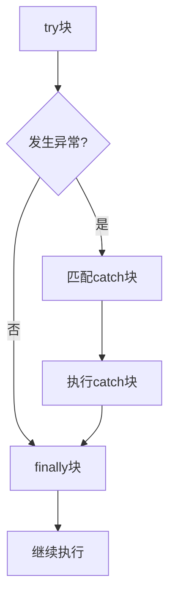

# 6.2 try-catch-finally

> [!abstract] 定义
> `try-catch-finally`是异常处理的核心结构，用于捕获和处理异常，确保资源正确清理。

## 基本结构

### Java语法

```java
try {
    // 可能抛出异常的代码
} catch (ExceptionType1 e1) {
    // 处理ExceptionType1
} catch (ExceptionType2 e2) {
    // 处理ExceptionType2
} finally {
    // 资源清理，无论是否发生异常都会执行
}
```

### C++语法

```cpp
try {
    // 可能抛出异常的代码
} catch (ExceptionType1& e1) {
    // 处理ExceptionType1
} catch (ExceptionType2& e2) {
    // 处理ExceptionType2
}
// C++没有finally，使用RAII替代
```

## 执行流程



## try块

### 作用

包裹可能抛出异常的代码。

### 特点

| 特点 | 说明 |
|-----|------|
| **必须存在** | try-catch结构必须有try块 |
| **可能抛出异常** | 代码可能正常执行或抛出异常 |
| **异常发生后** | 立即跳转到catch块 |

## catch块

### 作用

捕获并处理特定类型的异常。

### 特点

| 特点 | 说明 |
|-----|------|
| **可以有多个** | 按顺序匹配异常类型 |
| **类型匹配** | 只捕获指定类型及其子类 |
| **异常对象** | 包含异常信息 |

### 异常类型匹配顺序

```java
try {
    // 可能抛出多种异常
} catch (NullPointerException e) {
    // 先处理具体异常
} catch (RuntimeException e) {
    // 再处理父类异常
} catch (Exception e) {
    // 最后处理更广泛的异常
}
```

## finally块

### 作用

确保资源正确清理，无论是否发生异常都会执行。

### 特点

| 特点 | 说明 |
|-----|------|
| **可选** | 可以没有finally块 |
| **一定会执行** | 即使try或catch中有return |
| **资源清理** | 关闭文件、释放连接等 |

> [!example] 示例：资源清理
> ```java
> FileInputStream fis = null;
> try {
>     fis = new FileInputStream("file.txt");
>     // 读取文件
> } catch (IOException e) {
>     e.printStackTrace();
> } finally {
>     if (fis != null) {
>         try {
>             fis.close();
>         } catch (IOException e) {
>             e.printStackTrace();
>         }
>     }
> }
> ```

## Java try-with-resources

### 自动资源管理

```java
try (FileInputStream fis = new FileInputStream("file.txt")) {
    // 读取文件
} catch (IOException e) {
    e.printStackTrace();
}
// 自动关闭fis
```

## C++ RAII

### 资源获取即初始化

```cpp
class FileGuard {
private:
    std::ifstream& file;
public:
    FileGuard(std::ifstream& f) : file(f) {}
    ~FileGuard() {
        if (file.is_open()) {
            file.close();
        }
    }
};

void readFile() {
    std::ifstream file("file.txt");
    FileGuard guard(file);  // 自动管理
    // 读取文件
}  // 自动调用析构函数关闭文件
```

## 嵌套try-catch

```java
try {
    try {
        // 内层try
    } catch (Exception e) {
        // 内层catch
        throw;  // 重新抛出
    }
} catch (Exception e) {
    // 外层catch
}
```

## 易错点

> [!warning] 常见误区
> 1. **误区**：catch块顺序无关紧要
>    **纠正**：必须先捕获子类异常，再捕获父类异常
>
> 2. **误区**：finally块一定执行
>    **纠正**：System.exit()会阻止finally执行
>
> 3. **误区**：可以捕获所有异常
>    **纠正**：Error类型的错误不应捕获

## 关键术语

| 术语 | 英文 | 定义 |
|-----|------|------|
| try | - | 包裹可能抛出异常的代码 |
| catch | - | 捕获并处理异常 |
| finally | - | 资源清理，无论是否异常都会执行 |
| try-with-resources | - | Java自动资源管理 |
| RAII | Resource Acquisition Is Initialization | C++资源管理模式 |