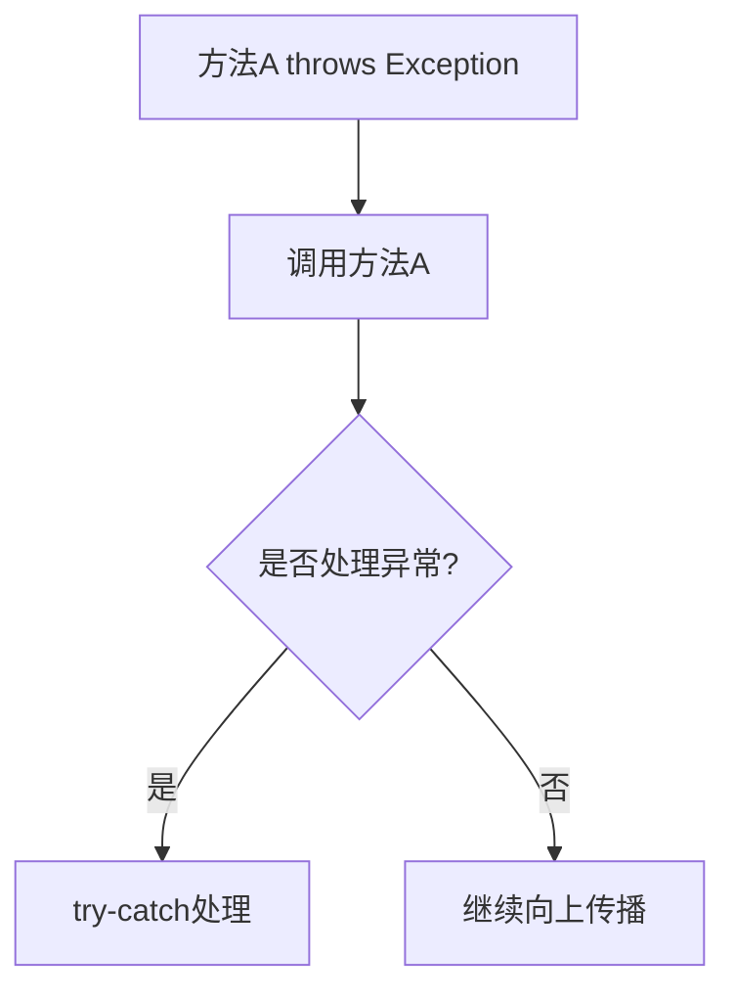

# 6.3 throws关键字

> [!abstract] 定义
> `throws`关键字用于声明方法可能抛出的异常，将异常处理的责任转移给调用者。

## throws的原理

### 异常传播机制



### 设计目的

| 目的 | 说明 |
|-----|------|
| **声明异常** | 告诉调用者可能发生的异常 |
| **转移责任** | 将异常处理责任转移给调用者 |
| **编译检查** | 确保Checked异常被处理 |
| **接口约定** | 定义方法的异常契约 |

## Java throws

### 声明异常

> [!example] 示例：Java throws
> ```java
> public void readFile(String fileName) throws IOException {
>     FileInputStream fis = new FileInputStream(fileName);
>     // 读取文件
>     fis.close();
> }
> ```

### 多个异常声明

```java
public void process(String fileName) throws IOException, SQLException {
    // 可能抛出多种异常
}
```

### 调用者处理

```java
public void handleFile() {
    try {
        readFile("file.txt");
    } catch (IOException e) {
        e.printStackTrace();
    }
}
```

### 继续向上传播

```java
public void handleFile() throws IOException {
    readFile("file.txt");  // 继续向上抛出
}
```

## C++异常声明

### throw声明

```cpp
void readFile(std::string fileName) throw(std::ifstream::failure) {
    std::ifstream file(fileName);
    if (!file) {
        throw std::ifstream::failure("文件打开失败");
    }
}
```

### C++11及以后

```cpp
// 不推荐使用throw声明
void readFile(std::string fileName);
```

## throw关键字

### 手动抛出异常

> [!example] 示例：Java手动抛出异常
> ```java
> public void checkAge(int age) {
>     if (age < 0) {
>         throw new IllegalArgumentException("年龄不能为负数");
>     }
> }
> ```

> [!example] 示例：C++手动抛出异常
> ```cpp
> void checkAge(int age) {
>     if (age < 0) {
>         throw std::invalid_argument("年龄不能为负数");
>     }
> }
> ```

### 重新抛出异常

```java
try {
    // 可能抛出异常
} catch (Exception e) {
    // 处理部分逻辑
    throw;  // 重新抛出原异常
}
```

## throws与try-catch对比

| 对比维度 | throws | try-catch |
|---------|--------|-----------|
| **作用** | 声明异常 | 处理异常 |
| **位置** | 方法签名 | 方法体内 |
| **责任** | 转移给调用者 | 自己处理 |
| **适用场景** | 无法处理时 | 可以处理时 |

## 异常处理策略

### 策略选择

| 场景 | 策略 |
|-----|------|
| **可以恢复** | try-catch处理 |
| **无法恢复** | throws向上传播 |
| **需要记录日志** | try-catch记录后重新抛出 |
| **资源需要清理** | try-finally或try-with-resources |

### 最佳实践

1. **只声明能处理的异常**
2. **使用具体异常类型**
3. **提供有用的异常信息**
4. **避免空catch块**
5. **正确释放资源**

## 易错点

> [!warning] 常见误区
> 1. **误区**：throws可以声明所有异常
>    **纠正**：只声明调用者需要知道的异常
>
> 2. **误区**：throws可以替代try-catch
>    **纠正**：throws只是声明，最终需要有人处理
>
> 3. **误区**：可以抛出RuntimeException而不声明
>    **纠正**：RuntimeException可以不声明，但不推荐

## 关键术语

| 术语 | 英文 | 定义 |
|-----|------|------|
| throws | - | 声明方法可能抛出的异常 |
| throw | - | 手动抛出异常 |
| 异常传播 | Exception Propagation | 异常向上传递 |
| Checked异常 | Checked Exception | 编译时必须处理的异常 |