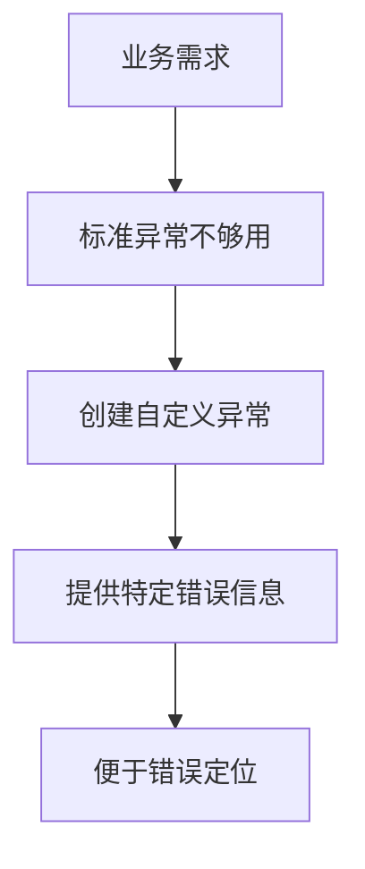
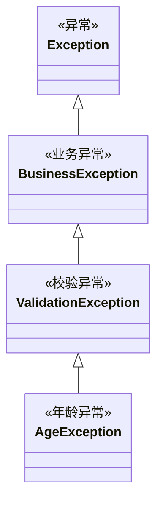

# 6.4 自定义异常

> [!abstract] 定义
> 自定义异常（Custom Exception）是根据业务需求创建的异常类，用于表示特定的错误情况。

## 自定义异常的原理

### 设计目的



### 好处

| 好处 | 说明 |
|-----|------|
| **语义清晰** | 明确表示特定错误类型 |
| **便于定位** | 快速定位问题所在 |
| **携带信息** | 可以携带额外信息 |
| **统一处理** | 可以统一处理一类异常 |

## Java自定义异常

### 创建自定义异常类

> [!example] 示例：Java自定义异常
> ```java
> // 自定义异常类
> public class AgeException extends Exception {
>     private int age;
>     
>     public AgeException(String message) {
>         super(message);
>     }
>     
>     public AgeException(String message, int age) {
>         super(message);
>         this.age = age;
>     }
>     
>     public int getAge() {
>         return age;
>     }
> }
> ```

### 使用自定义异常

```java
public class PersonService {
    public void setAge(int age) throws AgeException {
        if (age < 0 || age > 150) {
            throw new AgeException("年龄无效: " + age, age);
        }
    }
}

// 调用
public class Main {
    public static void main(String[] args) {
        PersonService service = new PersonService();
        try {
            service.setAge(200);
        } catch (AgeException e) {
            System.out.println(e.getMessage());
            System.out.println("输入的年龄: " + e.getAge());
        }
    }
}
```

### 自定义RuntimeException

```java
public class ValidationException extends RuntimeException {
    public ValidationException(String message) {
        super(message);
    }
}
```

## C++自定义异常

### 创建自定义异常类

> [!example] 示例：C++自定义异常
> ```cpp
> #include <stdexcept>
> #include <string>
> 
> class AgeException : public std::exception {
> private:
>     std::string message;
>     int age;
> public:
>     AgeException(const std::string& msg) : message(msg) {}
>     AgeException(const std::string& msg, int a) : message(msg), age(a) {}
>     
>     const char* what() const noexcept override {
>         return message.c_str();
>     }
>     
>     int getAge() const {
>         return age;
>     }
> };
> ```

### 使用自定义异常

```cpp
void setAge(int age) {
    if (age < 0 || age > 150) {
        throw AgeException("年龄无效", age);
    }
}

// 调用
int main() {
    try {
        setAge(200);
    } catch (const AgeException& e) {
        std::cout << e.what() << std::endl;
        std::cout << "输入的年龄: " << e.getAge() << std::endl;
    }
    return 0;
}
```

## 自定义异常的设计原则

### 继承层次



### 设计原则

| 原则 | 说明 |
|-----|------|
| **继承正确基类** | 根据需要选择Exception或RuntimeException |
| **提供有用信息** | 包含错误描述和相关数据 |
| **提供构造方法** | 提供多种构造方式 |
| **保持不可变** | 异常对象创建后不应修改 |

## 异常体系设计

### 分层设计

```java
// 顶层异常
public class AppException extends Exception {}

// 业务异常
public class BusinessException extends AppException {}

// 数据访问异常
public class DataAccessException extends AppException {}

// 网络异常
public class NetworkException extends AppException {}
```

### 使用策略

| 异常类型 | 用途 |
|---------|------|
| **AppException** | 应用级异常基类 |
| **BusinessException** | 业务逻辑异常 |
| **DataAccessException** | 数据库操作异常 |
| **NetworkException** | 网络通信异常 |

## 易错点

> [!warning] 常见误区
> 1. **误区**：自定义异常越多越好
>    **纠正**：只创建确实需要的异常类型
>
> 2. **误区**：自定义异常不需要继承基类
>    **纠正**：必须继承Exception或RuntimeException
>
> 3. **误区**：异常信息可以为空
>    **纠正**：异常信息应该清晰描述错误原因

## 关键术语

| 术语 | 英文 | 定义 |
|-----|------|------|
| 自定义异常 | Custom Exception | 根据业务需求创建的异常类 |
| 异常体系 | Exception Hierarchy | 异常类的继承结构 |
| 业务异常 | Business Exception | 业务逻辑相关的异常 |
| 校验异常 | Validation Exception | 数据校验相关的异常 |