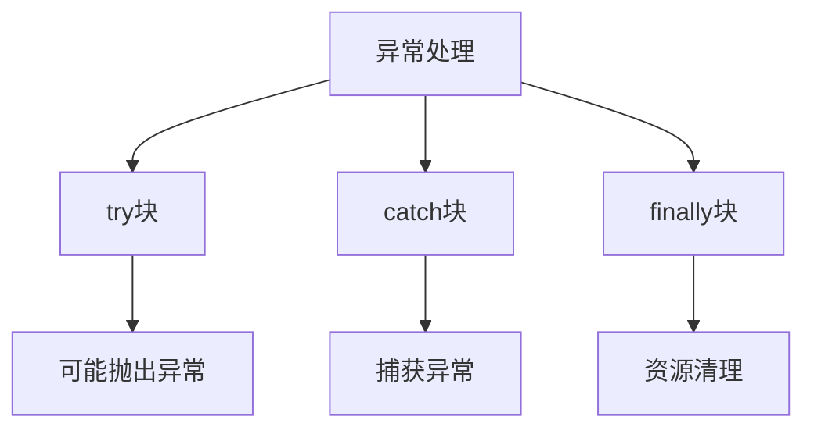

# 第6章-异常处理

> [!abstract] 本章定位
> 本章讲解异常处理的机制，包括异常的概念、分类、捕获处理和自定义异常。

> [!info] 前后依赖
> - **前置**：第5章 抽象类与接口
> - **后续**：第7章 泛型编程

## 知识点导航

- [[6.1 异常的概念]]：异常的分类和层次结构
- [[6.2 try-catch-finally]]：异常捕获和处理
- [[6.3 throws关键字]]：异常声明和传播
- [[6.4 自定义异常]]：自定义异常类的创建

## 本章重点

| 知识点 | 核心内容 | 掌握程度 |
|-------|---------|---------|
| 6.1 异常概念 | 异常分类、层次结构 | 理解 |
| 6.2 try-catch | 异常捕获和处理 | 掌握 |
| 6.2 finally | 资源清理 | 掌握 |
| 6.3 throws | 异常声明和传播 | 掌握 |
| 6.4 自定义异常 | 创建自定义异常类 | 掌握 |

## 学习建议

1. 理解异常处理的目的和机制
2. 掌握try-catch-finally的使用
3. 理解异常的分类和层次结构
4. 学会创建和使用自定义异常

## 核心概念关系

