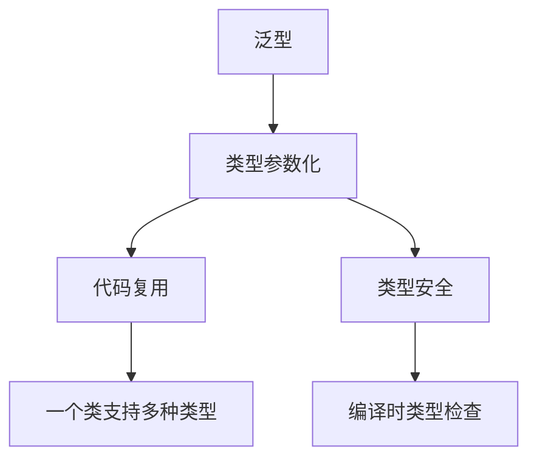

# 7.1 泛型的概念

> [!abstract] 定义
> 泛型（Generic）是一种参数化类型的机制，允许在定义类、接口和方法时使用类型参数，实现类型安全的通用编程。

## 泛型的原理

### 设计目的



### 泛型与Object对比

| 对比维度 | 泛型 | Object |
|---------|------|--------|
| **类型安全** | 编译时检查 | 运行时才发现错误 |
| **强制转换** | 不需要 | 需要显式转换 |
| **代码复用** | 类型安全的复用 | 不安全的复用 |
| **性能** | 编译后擦除，无开销 | 有装箱拆箱开销 |

## 泛型的好处

| 好处 | 说明 |
|-----|------|
| **类型安全** | 编译时检查类型错误 |
| **代码复用** | 一个类支持多种类型 |
| **消除转换** | 不需要显式类型转换 |
| **更好的API** | 类型提示和自动补全 |
| **运行时性能** | 避免装箱拆箱（Java） |

## 泛型的实现方式

### Java泛型

#### 类型擦除

Java泛型在编译后会被擦除，运行时不保留泛型信息。

```java
// 编译前
List<String> list = new ArrayList<>();

// 编译后（类型擦除）
List list = new ArrayList();
```

#### 桥接方法

为了保持多态性，编译器会生成桥接方法。

```java
public class MyList<T> {
    private T element;
    
    public void set(T element) {
        this.element = element;
    }
    
    public T get() {
        return element;
    }
}
```

### C++泛型

#### 模板实例化

C++模板在编译时为每种类型生成独立的代码。

```cpp
template <typename T>
class MyList {
private:
    T element;
public:
    void set(T elem) { element = elem; }
    T get() { return element; }
};

// 编译时生成MyList<int>和MyList<string>的代码
MyList<int> intList;
MyList<std::string> strList;
```

## 泛型的应用场景

### 集合类

```java
List<String> names = new ArrayList<>();
Map<Integer, String> map = new HashMap<>();
```

### 工具类

```java
public class ArrayUtils {
    public static <T> T[] reverse(T[] array) {
        // 反转数组
    }
}
```

### 通用容器

```java
public class Pair<K, V> {
    private K key;
    private V value;
    
    public Pair(K key, V value) {
        this.key = key;
        this.value = value;
    }
}
```

## 泛型与数组

### Java泛型数组限制

```java
// 错误：不能创建泛型数组
List<String>[] lists = new List<String>[10];

// 正确：使用List或通配符
List<List<String>> lists = new ArrayList<>();
```

### C++模板数组

```cpp
template <typename T, size_t N>
T* createArray() {
    return new T[N];
}
```

## 易错点

> [!warning] 常见误区
> 1. **误区**：Java泛型在运行时保留类型信息
>    **纠正**：Java泛型在编译后会被擦除
>
> 2. **误区**：可以创建泛型数组
>    **纠正**：Java不允许创建泛型数组
>
> 3. **误区**：泛型可以使用基本类型
>    **纠正**：Java泛型只能使用引用类型

## 关键术语

| 术语 | 英文 | 定义 |
|-----|------|------|
| 泛型 | Generic | 参数化类型的机制 |
| 类型参数 | Type Parameter | 泛型中的类型变量 |
| 类型擦除 | Type Erasure | Java泛型编译后擦除类型信息 |
| 模板 | Template | C++中的泛型机制 |
| 类型安全 | Type Safety | 编译时类型检查 |