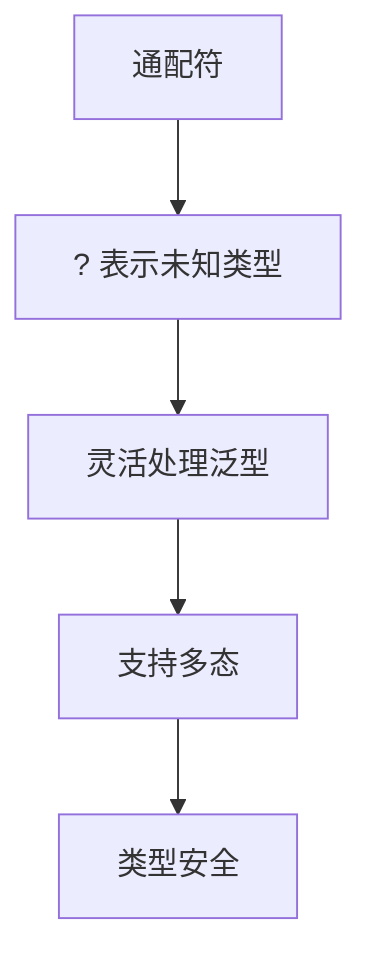

# 7.4 通配符

> [!abstract] 定义
> 通配符（Wildcard）是Java泛型中的特殊语法，使用`?`表示未知类型，用于灵活处理泛型类型。

## 通配符的原理

### 设计目的



### 通配符的作用

| 作用 | 说明 |
|-----|------|
| **灵活匹配** | 匹配任意类型 |
| **类型安全** | 编译时检查 |
| **支持多态** | 父类引用指向子类对象 |

## 无界通配符

### 使用场景

> [!example] 示例：无界通配符
> ```java
> public void printList(List<?> list) {
>     for (Object item : list) {
>         System.out.println(item);
>     }
> }
> ```

### 使用无界通配符

```java
List<String> strList = Arrays.asList("A", "B", "C");
List<Integer> intList = Arrays.asList(1, 2, 3);

printList(strList);  // 正确
printList(intList);  // 正确
```

### 限制

```java
public void addItem(List<?> list, Object item) {
    list.add(item);  // 错误：不能添加元素
}
```

## 上界通配符

### 使用extends关键字

> [!example] 示例：上界通配符
> ```java
> public double sum(List<? extends Number> numbers) {
>     double total = 0;
>     for (Number num : numbers) {
>         total += num.doubleValue();
>     }
>     return total;
> }
> ```

### 使用上界通配符

```java
List<Integer> ints = Arrays.asList(1, 2, 3);
List<Double> doubles = Arrays.asList(1.5, 2.5, 3.5);

double sum1 = sum(ints);     // 正确：Integer extends Number
double sum2 = sum(doubles);  // 正确：Double extends Number
```

### 限制

```java
public void addNumber(List<? extends Number> list) {
    list.add(10);  // 错误：不能添加元素
}
```

## 下界通配符

### 使用super关键字

> [!example] 示例：下界通配符
> ```java
> public void addNumbers(List<? super Integer> list) {
>     list.add(1);
>     list.add(2);
>     list.add(3);
> }
> ```

### 使用下界通配符

```java
List<Integer> ints = new ArrayList<>();
List<Number> nums = new ArrayList<>();
List<Object> objs = new ArrayList<>();

addNumbers(ints);   // 正确：Integer super Integer
addNumbers(nums);   // 正确：Number super Integer
addNumbers(objs);   // 正确：Object super Integer
```

### 限制

```java
public Number getNumber(List<? super Integer> list) {
    return list.get(0);  // 返回类型是Object
}
```

## PECS原则

### Producer Extends, Consumer Super

| 场景 | 通配符 | 理由 |
|-----|-------|------|
| **读取（Producer）** | `? extends T` | 可以读取T类型的对象 |
| **写入（Consumer）** | `? super T` | 可以写入T类型的对象 |

### 示例

```java
// 读取数据（Producer）
public void copyFrom(List<? extends Integer> source, List<Integer> dest) {
    for (Integer item : source) {
        dest.add(item);
    }
}

// 写入数据（Consumer）
public void copyTo(List<Integer> source, List<? super Integer> dest) {
    for (Integer item : source) {
        dest.add(item);
    }
}
```

## 通配符的应用场景

### 集合操作

```java
public class CollectionUtils {
    public static void copy(List<? extends Object> source, List<? super Object> dest) {
        for (Object item : source) {
            dest.add(item);
        }
    }
}
```

### 泛型方法

```java
public static <T> void sort(List<T> list, Comparator<? super T> comparator) {
    // 使用comparator比较T类型的对象
}
```

### 方法参数

```java
public void process(List<? extends Serializable> items) {
    // 处理可序列化的对象
}
```

## 通配符与类型参数对比

| 对比维度 | 通配符 | 类型参数 |
|---------|-------|---------|
| **灵活性** | 更高 | 较低 |
| **类型安全** | 较低 | 较高 |
| **使用场景** | 方法参数 | 类定义、返回类型 |
| **可读性** | 较差 | 较好 |

## 易错点

> [!warning] 常见误区
> 1. **误区**：无界通配符可以添加元素
>    **纠正**：无界通配符不能添加元素，只能读取
>
> 2. **误区**：extends通配符可以添加元素
>    **纠正**：extends通配符不能添加元素，只能读取
>
> 3. **误区**：super通配符可以读取特定类型
>    **纠正**：super通配符只能读取Object类型

## 关键术语

| 术语 | 英文 | 定义 |
|-----|------|------|
| 通配符 | Wildcard | 使用`?`表示未知类型 |
| 无界通配符 | Unbounded Wildcard | `?`匹配任意类型 |
| 上界通配符 | Upper Bounded Wildcard | `? extends T`匹配T及其子类 |
| 下界通配符 | Lower Bounded Wildcard | `? super T`匹配T及其父类 |
| PECS原则 | Producer Extends, Consumer Super | 通配符使用原则 |