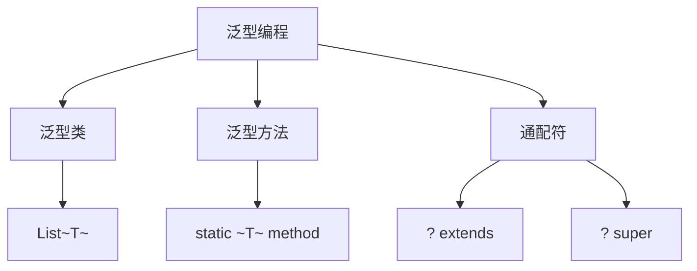

# 第7章-泛型编程

> [!abstract] 本章定位
> 本章讲解泛型编程的概念、泛型类、泛型方法和通配符，是编写类型安全的通用代码的基础。

> [!info] 前后依赖
> - **前置**：第6章 异常处理
> - **后续**：第8章 设计模式入门

## 知识点导航

- [[7.1 泛型的概念]]：泛型的定义和作用
- [[7.2 泛型类]]：泛型类的定义和使用
- [[7.3 泛型方法]]：泛型方法的定义和使用
- [[7.4 通配符]]：?、extends、super

## 本章重点

| 知识点 | 核心内容 | 掌握程度 |
|-------|---------|---------|
| 7.1 泛型概念 | 泛型的定义和作用 | 理解 |
| 7.2 泛型类 | 泛型类的定义和使用 | 掌握 |
| 7.3 泛型方法 | 泛型方法的定义和使用 | 掌握 |
| 7.4 通配符 | ?、extends、super | 理解 |

## 学习建议

1. 理解泛型的目的：类型安全的通用编程
2. 掌握泛型类和泛型方法的定义
3. 理解通配符的使用场景
4. 熟悉泛型的限制和边界

## 核心概念关系

