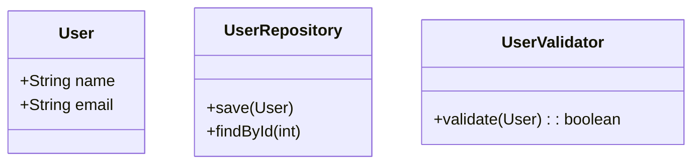
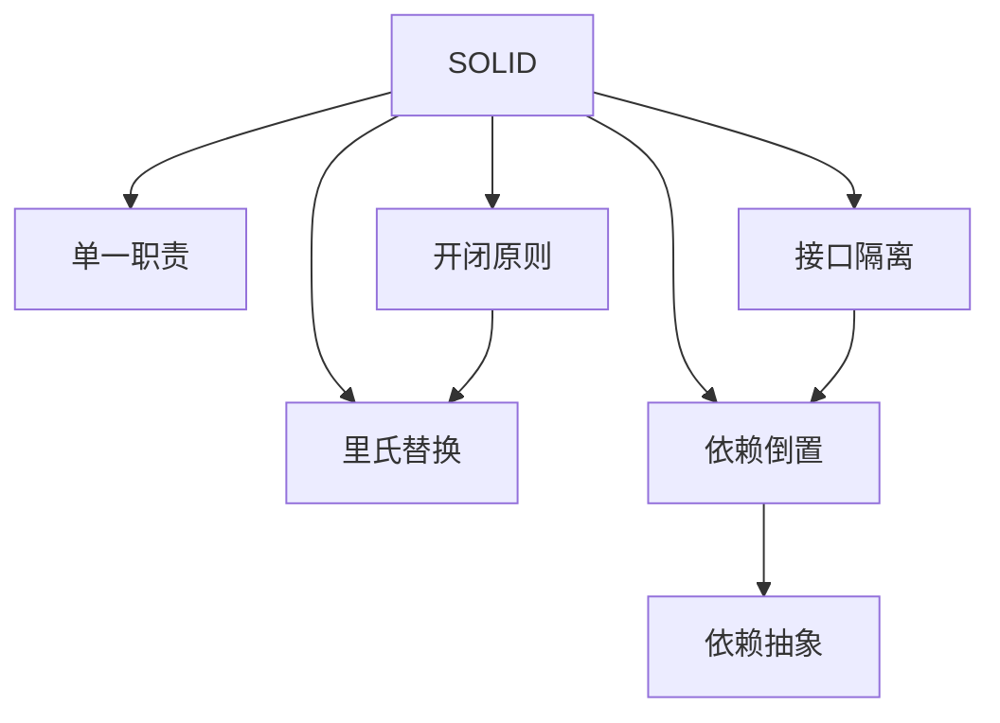

# 8.1 设计原则

> [!abstract] 定义
> 设计原则（Design Principles）是面向对象设计中遵循的指导准则，帮助创建可维护、可扩展、可复用的代码。

## SOLID原则

### 单一职责原则（Single Responsibility Principle）

#### 定义

一个类应该只有一个引起它变化的原因，即只负责一项职责。

#### 示例



```java
// 错误：一个类负责多项职责
public class UserService {
    public void saveUser(User user) { /* 保存用户 */ }
    public boolean validateUser(User user) { /* 验证用户 */ }
    public void sendEmail(User user) { /* 发送邮件 */ }
}

// 正确：每个类负责一项职责
public class UserRepository {
    public void save(User user) { /* 保存用户 */ }
}

public class UserValidator {
    public boolean validate(User user) { /* 验证用户 */ }
}

public class EmailService {
    public void sendEmail(User user) { /* 发送邮件 */ }
}
```

### 开闭原则（Open/Closed Principle）

#### 定义

软件实体应该对扩展开放，对修改关闭。

#### 示例

```java
// 错误：需要修改代码来添加新功能
public class ShapeCalculator {
    public double calculateArea(Object shape) {
        if (shape instanceof Circle) {
            return Math.PI * ((Circle) shape).getRadius() * ((Circle) shape).getRadius();
        } else if (shape instanceof Rectangle) {
            return ((Rectangle) shape).getWidth() * ((Rectangle) shape).getHeight();
        }
        return 0;
    }
}

// 正确：通过继承扩展功能
public abstract class Shape {
    public abstract double calculateArea();
}

public class Circle extends Shape {
    private double radius;
    @Override
    public double calculateArea() {
        return Math.PI * radius * radius;
    }
}

public class Rectangle extends Shape {
    private double width, height;
    @Override
    public double calculateArea() {
        return width * height;
    }
}

public class ShapeCalculator {
    public double calculateArea(Shape shape) {
        return shape.calculateArea();
    }
}
```

### 里氏替换原则（Liskov Substitution Principle）

#### 定义

子类必须能替换父类，而不影响程序的正确性。

#### 示例

```java
// 错误：子类不满足里氏替换原则
public class Rectangle {
    protected double width, height;
    public void setWidth(double width) { this.width = width; }
    public void setHeight(double height) { this.height = height; }
    public double getArea() { return width * height; }
}

public class Square extends Rectangle {
    @Override
    public void setWidth(double width) {
        this.width = width;
        this.height = width;
    }
    @Override
    public void setHeight(double height) {
        this.width = height;
        this.height = height;
    }
}

// 正确：使用组合而非继承
public class Square {
    private double side;
    public void setSide(double side) { this.side = side; }
    public double getArea() { return side * side; }
}
```

### 接口隔离原则（Interface Segregation Principle）

#### 定义

客户端不应该依赖它不需要的接口，接口应该小而专。

#### 示例

```java
// 错误：大接口包含所有方法
public interface Worker {
    void work();
    void eat();
    void sleep();
}

// 正确：小接口只包含必要方法
public interface Workable {
    void work();
}

public interface Eatable {
    void eat();
}

public interface Sleepable {
    void sleep();
}

public class HumanWorker implements Workable, Eatable, Sleepable {
    @Override public void work() { /* ... */ }
    @Override public void eat() { /* ... */ }
    @Override public void sleep() { /* ... */ }
}

public class RobotWorker implements Workable {
    @Override public void work() { /* ... */ }
}
```

### 依赖倒置原则（Dependency Inversion Principle）

#### 定义

依赖抽象而非具体，高层模块不依赖底层模块。

#### 示例

```java
// 错误：依赖具体实现
public class EmailService {
    public void sendEmail(String message) { /* ... */ }
}

public class NotificationService {
    private EmailService emailService = new EmailService();
    public void notify(String message) {
        emailService.sendEmail(message);
    }
}

// 正确：依赖抽象接口
public interface MessageService {
    void send(String message);
}

public class EmailService implements MessageService {
    @Override
    public void send(String message) { /* ... */ }
}

public class SMSService implements MessageService {
    @Override
    public void send(String message) { /* ... */ }
}

public class NotificationService {
    private MessageService messageService;
    
    public NotificationService(MessageService messageService) {
        this.messageService = messageService;
    }
    
    public void notify(String message) {
        messageService.send(message);
    }
}
```

## 其他设计原则

### 迪米特法则（Law of Demeter）

一个对象应该尽可能少地了解其他对象的内部细节。

### 合成复用原则（Composite Reuse Principle）

优先使用组合而非继承实现代码复用。

### 接口优先原则（Interface First Principle）

设计时先定义接口，再实现具体类。

## 设计原则关系



## 易错点

> [!warning] 常见误区
> 1. **误区**：设计原则必须全部遵守
>    **纠正**：设计原则是指导，不是铁律，需要权衡
>
> 2. **误区**：单一职责意味着一个类只有一个方法
>    **纠正**：单一职责是指一个职责，不是一个方法
>
> 3. **误区**：开闭原则意味着永远不修改代码
>    **纠正**：开闭原则是指对扩展开放，不是禁止修改

## 关键术语

| 术语 | 英文 | 定义 |
|-----|------|------|
| SOLID | - | 五个设计原则的缩写 |
| 单一职责 | Single Responsibility | 一个类只有一个职责 |
| 开闭原则 | Open/Closed | 对扩展开放，对修改关闭 |
| 里氏替换 | Liskov Substitution | 子类能替换父类 |
| 接口隔离 | Interface Segregation | 接口应该小而专 |
| 依赖倒置 | Dependency Inversion | 依赖抽象而非具体 |