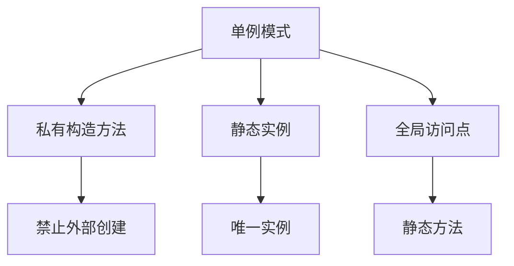

# 8.2 单例模式

> [!abstract] 定义
> 单例模式（Singleton Pattern）是一种创建型设计模式，确保一个类只有一个实例，并提供全局访问点。

## 单例模式的原理

### 设计目的



### 应用场景

| 场景 | 理由 |
|-----|------|
| **资源管理器** | 确保只有一个资源管理器实例 |
| **配置管理器** | 全局配置共享 |
| **日志管理器** | 统一日志输出 |
| **连接池** | 管理数据库连接 |

## Java单例模式

### 饿汉式

> [!example] 示例：饿汉式单例
> ```java
> public class Singleton {
>     // 类加载时创建实例
>     private static final Singleton instance = new Singleton();
>     
>     // 私有构造方法
>     private Singleton() {}
>     
>     // 全局访问点
>     public static Singleton getInstance() {
>         return instance;
>     }
> }
> ```

| 特点 | 说明 |
|-----|------|
| **线程安全** | 是，类加载时创建 |
| **性能** | 好，没有同步开销 |
| **资源占用** | 类加载时就创建，可能浪费 |

### 懒汉式（线程不安全）

```java
public class Singleton {
    private static Singleton instance;
    
    private Singleton() {}
    
    public static Singleton getInstance() {
        if (instance == null) {
            instance = new Singleton();
        }
        return instance;
    }
}
```

### 懒汉式（线程安全）

```java
public class Singleton {
    private static Singleton instance;
    
    private Singleton() {}
    
    public synchronized static Singleton getInstance() {
        if (instance == null) {
            instance = new Singleton();
        }
        return instance;
    }
}
```

### 双重检查锁定

> [!example] 示例：双重检查锁定
> ```java
> public class Singleton {
>     // volatile确保可见性
>     private volatile static Singleton instance;
>     
>     private Singleton() {}
>     
>     public static Singleton getInstance() {
>         if (instance == null) {  // 第一次检查
>             synchronized (Singleton.class) {
>                 if (instance == null) {  // 第二次检查
>                     instance = new Singleton();
>                 }
>             }
>         }
>         return instance;
>     }
> }
> ```

### 静态内部类

> [!example] 示例：静态内部类
> ```java
> public class Singleton {
>     private Singleton() {}
>     
>     // 静态内部类
>     private static class SingletonHolder {
>         private static final Singleton INSTANCE = new Singleton();
>     }
>     
>     public static Singleton getInstance() {
>         return SingletonHolder.INSTANCE;
>     }
> }
> ```

### 枚举单例

> [!example] 示例：枚举单例
> ```java
> public enum Singleton {
>     INSTANCE;
>     
>     public void doSomething() {
>         // 业务逻辑
>     }
> }
> ```

## C++单例模式

### 饿汉式

```cpp
class Singleton {
private:
    static Singleton instance;
    Singleton() {}
public:
    static Singleton& getInstance() {
        return instance;
    }
};

Singleton Singleton::instance;
```

### 懒汉式（线程安全）

```cpp
#include <mutex>

class Singleton {
private:
    static Singleton* instance;
    static std::mutex mutex;
    Singleton() {}
public:
    static Singleton* getInstance() {
        std::lock_guard<std::mutex> lock(mutex);
        if (instance == nullptr) {
            instance = new Singleton();
        }
        return instance;
    }
};

Singleton* Singleton::instance = nullptr;
std::mutex Singleton::mutex;
```

### Meyer's Singleton

```cpp
class Singleton {
private:
    Singleton() {}
public:
    static Singleton& getInstance() {
        static Singleton instance;
        return instance;
    }
};
```

## 单例模式的优缺点

### 优点

| 优点 | 说明 |
|-----|------|
| **全局访问** | 方便访问唯一实例 |
| **资源节约** | 避免重复创建对象 |
| **控制共享** | 控制对共享资源的访问 |

### 缺点

| 缺点 | 说明 |
|-----|------|
| **违反单一职责** | 既负责创建实例，又负责业务逻辑 |
| **测试困难** | 难以进行单元测试 |
| **扩展性差** | 难以扩展为多实例 |
| **线程安全** | 需要额外处理线程安全 |

## 易错点

> [!warning] 常见误区
> 1. **误区**：单例模式一定是线程安全的
>    **纠正**：懒汉式单例需要额外处理线程安全
>
> 2. **误区**：单例模式可以继承
>    **纠正**：单例模式的构造方法是私有的，不能继承
>
> 3. **误区**：枚举单例不能序列化
>    **纠正**：枚举单例天然支持序列化

## 关键术语

| 术语 | 英文 | 定义 |
|-----|------|------|
| 单例模式 | Singleton Pattern | 确保一个类只有一个实例 |
| 饿汉式 | Eager Initialization | 类加载时创建实例 |
| 懒汉式 | Lazy Initialization | 第一次使用时创建实例 |
| 双重检查锁定 | Double-Check Locking | 减少同步开销 |
| 静态内部类 | Static Inner Class | 延迟加载 |