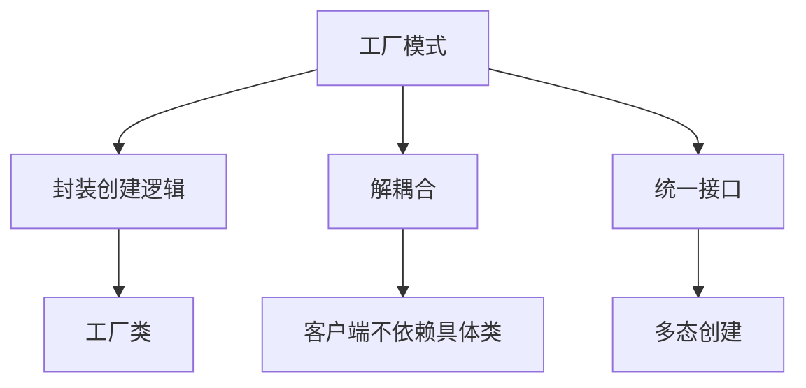

# 8.3 工厂模式

> [!abstract] 定义
> 工厂模式（Factory Pattern）是一种创建型设计模式，将对象的创建过程封装在工厂类中，实现创建逻辑与使用逻辑的分离。

## 工厂模式的原理

### 设计目的



### 应用场景

| 场景 | 理由 |
|-----|------|
| **复杂对象创建** | 对象创建过程复杂 |
| **动态对象创建** | 根据条件创建不同对象 |
| **解耦合** | 客户端不依赖具体类 |
| **统一管理** | 集中管理对象创建 |

## 简单工厂模式

### Java实现

> [!example] 示例：简单工厂模式
> ```java
> public interface Product {
>     void use();
> }
> 
> public class ConcreteProductA implements Product {
>     @Override
>     public void use() {
>         System.out.println("使用产品A");
>     }
> }
> 
> public class ConcreteProductB implements Product {
>     @Override
>     public void use() {
>         System.out.println("使用产品B");
>     }
> }
> 
> public class SimpleFactory {
>     public static Product createProduct(String type) {
>         switch (type) {
>             case "A":
>                 return new ConcreteProductA();
>             case "B":
>                 return new ConcreteProductB();
>             default:
>                 throw new IllegalArgumentException("未知类型");
>         }
>     }
> }
> ```

### 使用简单工厂

```java
Product product = SimpleFactory.createProduct("A");
product.use();  // 输出：使用产品A
```

## 工厂方法模式

### Java实现

> [!example] 示例：工厂方法模式
> ```java
> public interface Product {
>     void use();
> }
> 
> public class ConcreteProductA implements Product {
>     @Override
>     public void use() {
>         System.out.println("使用产品A");
>     }
> }
> 
> public class ConcreteProductB implements Product {
>     @Override
>     public void use() {
>         System.out.println("使用产品B");
>     }
> }
> 
> public abstract class Factory {
>     public abstract Product createProduct();
> }
> 
> public class ConcreteFactoryA extends Factory {
>     @Override
>     public Product createProduct() {
>         return new ConcreteProductA();
>     }
> }
> 
> public class ConcreteFactoryB extends Factory {
>     @Override
>     public Product createProduct() {
>         return new ConcreteProductB();
>     }
> }
> ```

### 使用工厂方法

```java
Factory factory = new ConcreteFactoryA();
Product product = factory.createProduct();
product.use();  // 输出：使用产品A
```

## 抽象工厂模式

### Java实现

> [!example] 示例：抽象工厂模式
> ```java
> public interface ProductA {
>     void use();
> }
> 
> public interface ProductB {
>     void use();
> }
> 
> public class ConcreteProductA1 implements ProductA {
>     @Override
>     public void use() { System.out.println("使用产品A1"); }
> }
> 
> public class ConcreteProductA2 implements ProductA {
>     @Override
>     public void use() { System.out.println("使用产品A2"); }
> }
> 
> public class ConcreteProductB1 implements ProductB {
>     @Override
>     public void use() { System.out.println("使用产品B1"); }
> }
> 
> public class ConcreteProductB2 implements ProductB {
>     @Override
>     public void use() { System.out.println("使用产品B2"); }
> }
> 
> public abstract class AbstractFactory {
>     public abstract ProductA createProductA();
>     public abstract ProductB createProductB();
> }
> 
> public class ConcreteFactory1 extends AbstractFactory {
>     @Override
>     public ProductA createProductA() { return new ConcreteProductA1(); }
>     @Override
>     public ProductB createProductB() { return new ConcreteProductB1(); }
> }
> 
> public class ConcreteFactory2 extends AbstractFactory {
>     @Override
>     public ProductA createProductA() { return new ConcreteProductA2(); }
>     @Override
>     public ProductB createProductB() { return new ConcreteProductB2(); }
> }
> ```

### 使用抽象工厂

```java
AbstractFactory factory = new ConcreteFactory1();
ProductA productA = factory.createProductA();
ProductB productB = factory.createProductB();
productA.use();  // 输出：使用产品A1
productB.use();  // 输出：使用产品B1
```

## C++工厂模式

### 简单工厂

```cpp
#include <iostream>

class Product {
public:
    virtual void use() = 0;
};

class ConcreteProductA : public Product {
public:
    void use() override {
        std::cout << "使用产品A" << std::endl;
    }
};

class ConcreteProductB : public Product {
public:
    void use() override {
        std::cout << "使用产品B" << std::endl;
    }
};

class SimpleFactory {
public:
    static Product* createProduct(std::string type) {
        if (type == "A") {
            return new ConcreteProductA();
        } else if (type == "B") {
            return new ConcreteProductB();
        }
        return nullptr;
    }
};
```

## 工厂模式对比

| 模式 | 适用场景 | 优点 | 缺点 |
|-----|---------|------|------|
| **简单工厂** | 对象类型较少 | 简单 | 违反开闭原则 |
| **工厂方法** | 对象类型较多 | 符合开闭原则 | 类数量增加 |
| **抽象工厂** | 产品族 | 支持产品族 | 复杂度高 |

## 工厂模式的优缺点

### 优点

| 优点 | 说明 |
|-----|------|
| **解耦合** | 客户端不依赖具体类 |
| **可扩展** | 添加新对象只需添加工厂 |
| **统一管理** | 集中管理对象创建 |
| **代码复用** | 创建逻辑复用 |

### 缺点

| 缺点 | 说明 |
|-----|------|
| **类数量增加** | 每个产品需要一个工厂 |
| **复杂度增加** | 抽象工厂模式较复杂 |
| **维护成本** | 需要维护多个工厂类 |

## 易错点

> [!warning] 常见误区
> 1. **误区**：工厂模式只是封装new操作
>    **纠正**：工厂模式的核心是解耦合和多态创建
>
> 2. **误区**：简单工厂模式是标准设计模式
>    **纠正**：简单工厂模式不是GoF设计模式，工厂方法模式才是
>
> 3. **误区**：工厂模式只适用于复杂对象
>    **纠正**：工厂模式也适用于需要统一管理的简单对象

## 关键术语

| 术语 | 英文 | 定义 |
|-----|------|------|
| 工厂模式 | Factory Pattern | 封装对象创建过程 |
| 简单工厂 | Simple Factory | 一个工厂创建所有对象 |
| 工厂方法 | Factory Method | 每个产品一个工厂 |
| 抽象工厂 | Abstract Factory | 创建产品族 |
| 产品族 | Product Family | 相关产品的集合 |