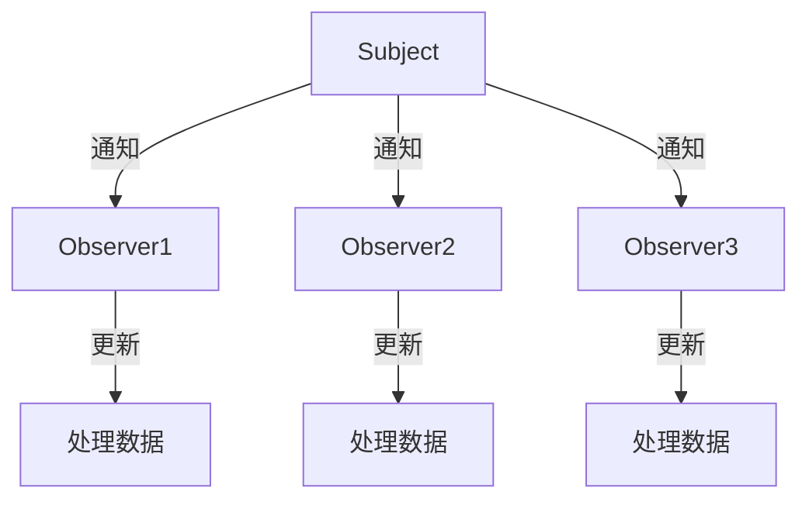

# 8.4 观察者模式

> [!abstract] 定义
> 观察者模式（Observer Pattern）是一种行为型设计模式，定义对象之间的一对多依赖关系，当一个对象状态变化时，所有依赖它的对象都会收到通知并自动更新。

## 观察者模式的原理

### 设计目的



### 应用场景

| 场景 | 理由 |
|-----|------|
| **事件处理** | GUI事件通知 |
| **消息订阅** | 发布-订阅机制 |
| **数据同步** | 多视图同步更新 |
| **日志监控** | 状态变化通知 |

## Java观察者模式

### 手动实现

> [!example] 示例：观察者模式手动实现
> ```java
> import java.util.ArrayList;
> import java.util.List;
> 
> // 主题接口
> public interface Subject {
>     void registerObserver(Observer observer);
>     void removeObserver(Observer observer);
>     void notifyObservers();
> }
> 
> // 观察者接口
> public interface Observer {
>     void update(String message);
> }
> 
> // 具体主题
> public class ConcreteSubject implements Subject {
>     private List<Observer> observers = new ArrayList<>();
>     private String message;
>     
>     @Override
>     public void registerObserver(Observer observer) {
>         observers.add(observer);
>     }
>     
>     @Override
>     public void removeObserver(Observer observer) {
>         observers.remove(observer);
>     }
>     
>     @Override
>     public void notifyObservers() {
>         for (Observer observer : observers) {
>             observer.update(message);
>         }
>     }
>     
>     public void setMessage(String message) {
>         this.message = message;
>         notifyObservers();
>     }
> }
> 
> // 具体观察者
> public class ConcreteObserver implements Observer {
>     private String name;
>     
>     public ConcreteObserver(String name) {
>         this.name = name;
>     }
>     
>     @Override
>     public void update(String message) {
>         System.out.println(name + "收到消息: " + message);
>     }
> }
> ```

### 使用观察者模式

```java
ConcreteSubject subject = new ConcreteSubject();

Observer observer1 = new ConcreteObserver("观察者1");
Observer observer2 = new ConcreteObserver("观察者2");

subject.registerObserver(observer1);
subject.registerObserver(observer2);

subject.setMessage("Hello World");
// 输出：
// 观察者1收到消息: Hello World
// 观察者2收到消息: Hello World
```

### 使用Java内置类

```java
import java.util.Observable;
import java.util.Observer;

public class MySubject extends Observable {
    public void setMessage(String message) {
        setChanged();
        notifyObservers(message);
    }
}

public class MyObserver implements Observer {
    private String name;
    
    public MyObserver(String name) {
        this.name = name;
    }
    
    @Override
    public void update(Observable o, Object arg) {
        System.out.println(name + "收到消息: " + arg);
    }
}
```

## C++观察者模式

### 手动实现

> [!example] 示例：C++观察者模式
> ```cpp
> #include <iostream>
> #include <vector>
> #include <memory>
> 
> class Observer {
> public:
>     virtual void update(std::string message) = 0;
>     virtual ~Observer() = default;
> };
> 
> class Subject {
> private:
>     std::vector<std::shared_ptr<Observer>> observers;
>     std::string message;
> public:
>     void registerObserver(std::shared_ptr<Observer> observer) {
>         observers.push_back(observer);
>     }
>     
>     void removeObserver(std::shared_ptr<Observer> observer) {
>         auto it = std::find(observers.begin(), observers.end(), observer);
>         if (it != observers.end()) {
>             observers.erase(it);
>         }
>     }
>     
>     void notifyObservers() {
>         for (auto observer : observers) {
>             observer->update(message);
>         }
>     }
>     
>     void setMessage(std::string msg) {
>         message = msg;
>         notifyObservers();
>     }
> };
> 
> class ConcreteObserver : public Observer {
> private:
>     std::string name;
> public:
>     ConcreteObserver(std::string n) : name(n) {}
>     
>     void update(std::string message) override {
>         std::cout << name << "收到消息: " << message << std::endl;
>     }
> };
> ```

## 观察者模式的变种

### 推模式（Push）

主题主动推送数据给观察者。

```java
public void update(String message) {
    // 主题推送具体数据
}
```

### 拉模式（Pull）

观察者主动从主题获取数据。

```java
public void update(Subject subject) {
    String message = subject.getMessage();
}
```

## 观察者模式的优缺点

### 优点

| 优点 | 说明 |
|-----|------|
| **解耦合** | 主题和观察者松耦合 |
| **可扩展** | 动态添加观察者 |
| **响应及时** | 状态变化立即通知 |
| **复用性** | 观察者可以复用 |

### 缺点

| 缺点 | 说明 |
|-----|------|
| **通知顺序** | 观察者通知顺序不确定 |
| **资源消耗** | 大量观察者会影响性能 |
| **循环依赖** | 可能导致循环通知 |
| **内存泄漏** | 需要正确注销观察者 |

## 观察者模式与发布-订阅模式对比

| 对比维度 | 观察者模式 | 发布-订阅模式 |
|---------|-----------|--------------|
| **耦合度** | 主题和观察者直接关联 | 通过消息队列解耦 |
| **通信方式** | 同步 | 异步 |
| **扩展性** | 一般 | 更好 |
| **复杂度** | 低 | 高 |

## 易错点

> [!warning] 常见误区
> 1. **误区**：观察者模式只能同步通知
>    **纠正**：可以通过消息队列实现异步通知
>
> 2. **误区**：观察者模式不需要注销
>    **纠正**：不再需要的观察者必须注销，否则会内存泄漏
>
> 3. **误区**：观察者模式只能一对一
>    **纠正**：观察者模式是一对多关系

## 关键术语

| 术语 | 英文 | 定义 |
|-----|------|------|
| 观察者模式 | Observer Pattern | 一对多依赖关系 |
| 主题 | Subject | 被观察的对象 |
| 观察者 | Observer | 接收通知的对象 |
| 推模式 | Push | 主题主动推送数据 |
| 拉模式 | Pull | 观察者主动获取数据 |