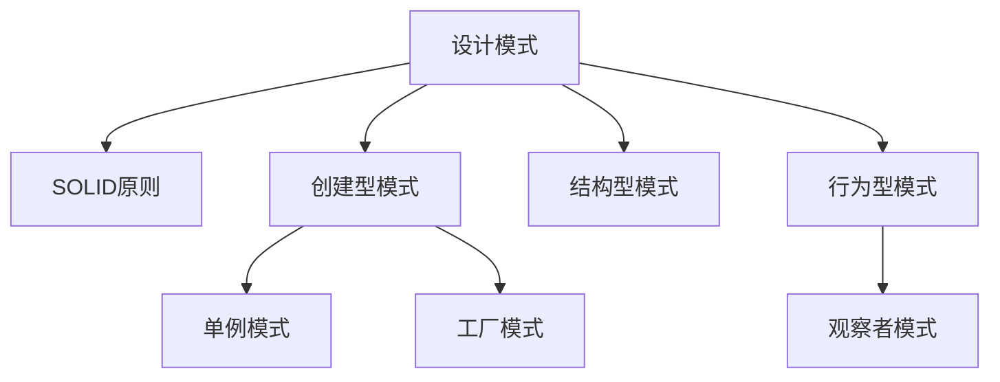

# 第8章-设计模式入门

> [!abstract] 本章定位
> 本章介绍设计模式的基本概念、SOLID原则和常用设计模式，是面向对象设计的进阶内容。

> [!info] 前后依赖
> - **前置**：第7章 泛型编程
> - **后续**：无，本章是课程终点

## 知识点导航

- [[8.1 设计原则]]：SOLID原则
- [[8.2 单例模式]]：Singleton模式的实现
- [[8.3 工厂模式]]：Factory模式的实现
- [[8.4 观察者模式]]：Observer模式的实现

## 本章重点

| 知识点 | 核心内容 | 掌握程度 |
|-------|---------|---------|
| 8.1 设计原则 | SOLID原则 | 理解 |
| 8.2 单例模式 | 确保唯一实例 | 掌握 |
| 8.3 工厂模式 | 对象创建解耦合 | 掌握 |
| 8.4 观察者模式 | 发布-订阅机制 | 掌握 |

## 学习建议

1. 理解设计模式的目的和价值
2. 掌握常用设计模式的实现
3. 理解SOLID原则的应用
4. 学会根据场景选择合适的设计模式

## 核心概念关系

