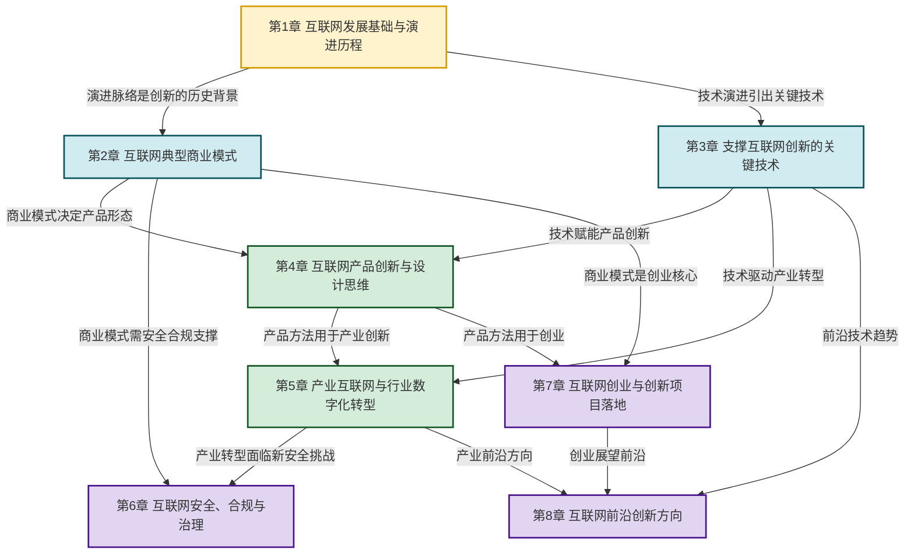

# MOC - 互联网创新

> [!abstract] 课程定位
> 互联网创新是研究**互联网如何改变商业、产业与社会**的综合性课程。它要回答的核心问题是：**互联网技术如何催生了哪些新商业模式？如何驱动产品创新与产业数字化？如何在安全合规框架下实现创新落地？** 本课程在 [[MOC - 计算机网络|计算机网络]]（理解互联网技术底座）基础上，转向**商业与创新**视角，从技术演进、商业模式、产品设计、产业转型、安全治理到创业落地，构建完整的互联网创新知识体系。

## 课程摘要

本课程围绕"**演进—模式—技术—产品—产业—安全—创业—前沿**"八条主线展开：

1. **互联网演进**（第1章）：从 Web1.0→Web2.0→Web3.0 的代际变迁，移动互联网的崛起与下一代互联网趋势；
2. **商业模式**（第2章）：B2B/B2C/C2C/O2O、平台经济、免费模式、订阅经济、社群商业；
3. **关键技术**（第3章）：云计算、大数据、物联网、人工智能、区块链如何赋能互联网创新；
4. **产品创新**（第4章）：用户需求挖掘、MVP、敏捷开发、UX设计、增长思维；
5. **产业互联网**（第5章）：消费互联网→产业互联网、工业互联网、智慧农业/交通/零售/文旅、企业上云；
6. **安全合规**（第6章）：网络风险、数据安全、隐私保护、平台治理、合规设计；
7. **创业落地**（第7章）：选题、商业计划书、市场调研、团队搭建、赛事备赛；
8. **前沿方向**（第8章）：元宇宙、生成式AI、边缘计算、开源生态、绿色低碳互联网。

## 章节结构与依赖关系

## 章节导航

| 章节 | 主题 | 入口 | 小节数 | 核心考点 |
| ---- | ---- | ---- | ------ | -------- |
| 第1章 | 互联网发展基础与演进历程 | [[MOC - 第1章]] | 4 | Web1.0/2.0/3.0 特点、移动互联网变革 |
| 第2章 | 互联网典型商业模式 | [[MOC - 第2章]] | 5 | 平台经济、双边市场、免费模式、订阅经济 |
| 第3章 | 支撑互联网创新的关键技术 | [[MOC - 第3章]] | 5 | 云计算、大数据、物联网、AI、区块链 |
| 第4章 | 互联网产品创新与设计思维 | [[MOC - 第4章]] | 5 | 用户画像、MVP、敏捷、UX、增长思维 |
| 第5章 | 产业互联网与行业数字化转型 | [[MOC - 第5章]] | 5 | 消费vs产业互联网、工业互联网、行业案例 |
| 第6章 | 互联网安全、合规与治理 | [[MOC - 第6章]] | 5 | 数据安全、隐私保护、平台责任、合规设计 |
| 第7章 | 互联网创业与创新项目落地 | [[MOC - 第7章]] | 5 | 选题、商业计划书、竞品分析、团队搭建 |
| 第8章 | 互联网前沿创新方向 | [[MOC - 第8章]] | 5 | 元宇宙、生成式AI、边缘计算、开源生态 |

## 三大核心思想

> [!abstract] 互联网创新的核心思想
> 1. **技术—商业—产品三角驱动**：互联网创新不是单纯的技术进步，而是技术突破（如云计算）、商业模式创新（如平台经济）、产品形态变革（如移动App）三者的协同演进。理解任何一个创新案例，都要从这三个维度展开分析。
>
> 2. **连接—规模—生态的价值跃迁**：互联网的本质是**连接**（人与人、人与信息、人与服务、物与物）。每增加一个连接维度，价值呈指数级增长（梅特卡夫定律）；当连接达到临界规模，便形成**生态**（生态系统具有自组织、自增长、自强化的特性）。
>
> 3. **创新—合规—治理的动态平衡**：互联网创新永远在"突破规则"与"建立新规则"之间摆动。创新先行、监管跟进、规范形成，是互联网治理的基本路径。理解这一点，才能在创新中把握边界、在边界中寻求创新。

## 与先修和后续课程的衔接

- **先修**：[[MOC - 计算机网络|计算机网络]]（互联网技术底座，理解TCP/IP、Web协议、网络安全基础）、市场营销、管理学基础
- **后续**：电子商务、网络营销、数字经济、创业管理
- **跨课程关联**：与 [[MOC - 计算机网络|计算机网络]] 的网络协议、安全内容建立语义链接；与"信息安全技术"的安全治理内容关联

## 章节导航

- 上一级：[[MOC - 网络与安全]]（如有）
- 先修课程：[[MOC - 计算机网络]]
- 配套习题：见各章节 MOC 中的"本章习题"链接

## 相关标签

#互联网创新 #商业模式 #平台经济 #产品设计 #产业互联网 #数字化转型 #网络安全 #创业 #前沿技术
