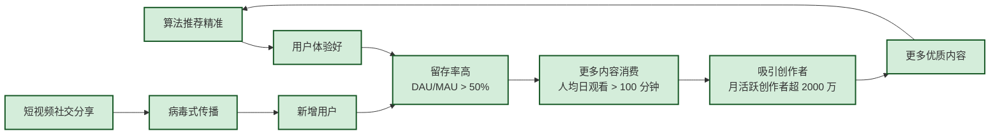

# MOC - 第4章习题 互联网产品创新与设计思维

> [!abstract] 本章习题概览
> 本章习题共 **20 题**，覆盖 [[4.1 用户需求挖掘、用户画像构建|用户需求与画像]]、[[4.2 产品原型、MVP 最小可行产品|原型与 MVP]]、[[4.3 迭代开发、敏捷思想在互联网应用|敏捷开发]]、[[4.4 用户体验 UX、交互设计基础|UX 设计]]、[[4.5 增长思维、用户运营基础|增长思维]] 五个知识板块。题型分布：选择 6 题、填空 4 题、简答 6 题、案例分析 4 题。答案与详解折叠于 `
` 中。

---

## 一、选择题（6 题）

**1.** 下列关于用户需求挖掘的描述，最准确的是（ ）
A. 用户需求挖掘就是做问卷调查
B. 需求挖掘的核心是了解"用户说什么"
C. 定性研究探索"为什么"，定量研究验证"有多少"
D. 用户访谈中应该问"你想要什么功能"

**2.** KANO 模型中，"没有会引起不满，有了也不特别惊喜"的需求属于（ ）
A. 兴奋型需求
B. 基本型需求
C. 期望型需求
D. 反向需求

**3.** 下列关于 MVP 的描述，正确的是（ ）
A. MVP 就是做得简陋的产品
B. MVP 的核心是验证技术可行性
C. MVP 用最少的开发资源验证核心价值假设
D. MVP 必须包含产品的全部功能

**4.** 敏捷开发相对于瀑布模型的核心优势是（ ）
A. 文档更详细
B. 更适合需求稳定的项目
C. 拥抱变化、快速交付可用产品增量
D. 不需要用户参与

**5.** 尼尔森十大可用性原则中，"系统必须在合理时间内告知用户当前状态"对应的是（ ）
A. 原则 2：匹配真实世界
B. 原则 1：系统状态可见
C. 原则 8：极简美学
D. 原则 6：识别而非回忆

**6.** AARRR 海盗指标模型中，"用户首次体验到产品核心价值"这一环节称为（ ）
A. 获客（Acquisition）
B. 留存（Retention）
C. 激活（Activation）
D. 推荐（Referral）

选择题答案

1. **C**。需求挖掘有定性和定量两大方法体系，定性探索"为什么"（用户动机、场景），定量验证"有多少"（规模、比例）。A 错误，问卷调查只是定量研究的一种；B 错误，核心是了解"用户做什么"而非"说什么"；D 错误，正确的访谈技巧是关注行为而非直接询问需求。

2. **B**。基本型需求（Must-be）是"没有就不满，有了也不惊喜"的刚需。A 兴奋型是"没有也不不满，有了超惊喜"；C 期望型是"越好越满意，越差越不满"；D 反向需求是"有了反而不满"。

3. **C**。MVP（最小可行产品）的核心是"用最少的资源验证最核心的价值假设"。A 错误，MVP 不是简陋而是聚焦；B 错误，MVP 验证的是价值假设而非技术可行性；D 错误，MVP 要尽可能精简功能。

4. **C**。敏捷开发的核心优势是拥抱变化、快速迭代交付可用的产品增量。A 错误，敏捷强调可用软件优于详细文档；B 错误，敏捷恰恰适合需求变化快的项目；D 错误，敏捷需要用户持续参与反馈。

5. **B**。原则 1：系统状态可见——系统必须通过适当反馈告知用户当前状态。这是用户信任产品的基础。

6. **C**。激活（Activation）是用户首次体验到核心价值的时刻，区别于简单的"注册完成"。A 获客是用户进入产品；B 留存是用户再次使用；D 推荐是用户主动传播。

---

## 二、填空题（4 题）

**1.** KANO 模型将需求分为五类：基本型、______、兴奋型、______、反向需求。

**2.** 敏捷宣言的四大价值观是：个体与互动、______、客户合作、______。

**3.** Scrum 的三大角色是：______、敏捷教练（Scrum Master）、______。

**4.** AARRR 海盗指标模型的五个环节是：获客（Acquisition）、______、______、推荐（Referral）、______。

填空题答案

1. **期望型需求**、**无差异需求**。KANO 五类需求：基本型（Must-be）、期望型（Performance）、兴奋型（Delight）、无差异（Indifferent）、反向需求（Reverse）。

2. **可工作的软件**、**响应变化**。敏捷宣言四大价值观：个体与互动高于流程与工具、可工作的软件高于详尽的文档、客户合作高于合同谈判、响应变化高于遵循计划。

3. **产品负责人（Product Owner, PO）**、**开发团队（Development Team）**。Scrum 三大角色：PO 负责产品方向和 Backlog 管理；SM 负责流程促进和障碍移除；开发团队负责在 Sprint 内交付产品增量。

4. **激活（Activation）**、**留存（Retention）**、**收入（Revenue）**。AARRR 模型：获客→激活→留存→推荐→收入，是用户从进入产品到变现的完整旅程。

---

## 三、简答题（6 题）

**1.** 简述定性研究与定量研究的核心区别，并说明在产品早期和成熟期如何选择研究方法。

**2.** 什么是 MVP？以 Dropbox 为例说明 MVP 的核心价值。

**3.** 对比瀑布模型与敏捷开发的核心差异，并说明互联网产品为什么更适合敏捷开发。

**4.** 简述尼尔森十大可用性原则中"原则 3：控制与自由"的含义，并举例说明。

**5.** 解释 AARRR 模型中每个环节的核心目标，并说明各环节之间的关系。

**6.** 什么是增长黑客？增长黑客与传统营销的核心区别是什么？

简答题答案

**1. 定性 vs 定量研究**

| 维度 | 定性研究 | 定量研究 |
| ---- | -------- | -------- |
| 核心目标 | 探索"为什么" | 验证"有多少" |
| 典型方法 | 用户访谈、焦点小组 | 问卷调查、数据分析 |
| 样本量 | 小（5-15 人） | 大（100+ 份） |
| 优势 | 深入了解动机、场景 | 统计可靠、可量化 |
| 局限 | 主观性强 | 难以发现未知需求 |

**选择策略：**
- **产品早期**：以定性研究为主，探索用户需求、痛点和使用场景。因为此时对目标用户了解有限，需要深入了解"为什么"。
- **产品成熟期**：以定量研究为主，验证假设、评估功能、衡量效果。此时对用户已有基本了解，需要知道"有多少"用户受到影响。
- **最佳实践**：定性+定量结合，先用定性探索方向，再用定量验证假设。

**2. MVP 与 Dropbox 案例**

> MVP 是**最小可行产品**——用最少的开发资源，构建一个功能足够的产品版本，用来验证最核心的价值假设。

Dropbox 案例：
- Dropbox 创始人 Drew Houston 没有直接开发产品，而是做了一个 3 分钟的演示视频
- 视频展示了 Dropbox 的核心功能（文件云同步、多设备同步）
- 视频发布在 Hacker News 后，24 小时内获得 7 万注册用户
- **核心价值**：用极低的成本（一个视频）验证了"用户确实需要文件云同步"这个核心假设，避免了盲目开发可能带来的巨大浪费

MVP 的本质是**验证假设**而非**构建产品**——在投入大量资源之前，先确认"做的东西是否有人需要"。

**3. 瀑布 vs 敏捷**

| 维度 | 瀑布模型 | 敏捷开发 |
| ---- | -------- | -------- |
| 开发模式 | 线性顺序，一步到位 | 迭代增量，快速循环 |
| 需求变化 | 前期冻结，变化成本高 | 拥抱变化，随时调整 |
| 交付节奏 | 一次性交付完整产品 | 2-4 周交付可用增量 |
| 用户参与 | 主要在需求阶段 | 每个迭代持续参与 |
| 风险控制 | 后期测试，风险集中 | 早期测试，风险分散 |

互联网产品选择敏捷的原因：
1. **需求变化快**：用户需求、竞品动作、技术趋势瞬息万变
2. **用户期望高**：互联网用户习惯了快速更新
3. **试错成本低**：边际成本趋近于零，快速试错优于一次做对
4. **数据反馈快**：每个 Sprint 都能收集真实用户反馈

**4. 尼尔森原则 3：控制与自由**

> **含义**：产品应该提供"撤销"和"重做"功能，给用户后悔的机会。当用户犯错时，应该能轻松恢复。

**好的案例**：
- 微信"撤回"消息（2 分钟内可撤回）
- Photoshop 支持多步撤销（Ctrl+Z）
- Gmail 的"撤销发送"功能
- 微信支付的"延迟到账"设置（2 小时内可撤销）

**差的案例**：
- 删除操作不可恢复
- 提交表单后无法修改
- 转账完成后无法撤销

**设计要点**：
- 破坏性操作（删除、清空）必须提供二次确认
- 提供"撤销"选项，给予用户修改的机会
- 对于重要操作，提供"延迟生效"机制

**5. AARRR 模型各环节详解**

| 环节 | 核心目标 | 关键指标 |
| ---- | -------- | -------- |
| **获客（Acquisition）** | 以最低成本获取高质量用户 | CAC（获客成本）、渠道转化率 |
| **激活（Activation）** | 让用户首次体验核心价值 | 激活率、首次完成核心行为的比例 |
| **留存（Retention）** | 让用户持续使用产品 | 次日/7 日/30 日留存率 |
| **推荐（Referral）** | 让用户主动传播产品 | K 因子、邀请转化率 |
| **收入（Revenue）** | 实现用户价值变现 | ARPU、LTV、付费转化率 |

**各环节关系**：AARRR 是一个**漏斗+飞轮**的关系——
- 前面环节的质量直接影响后面环节的效果（获客质量差→留存率低→推荐动力不足）
- 后面环节又反过来促进前面环节（留存好→口碑传播→获客成本低）
- 核心是形成增长飞轮：价值→留存→推荐→增长→更多价值

**6. 增长黑客 vs 传统营销**

| 维度 | 传统营销 | 增长黑客 |
| ---- | -------- | -------- |
| 核心方法 | 品牌广告、公关活动 | 数据实验、产品迭代 |
| 关注焦点 | 品牌曝光、用户获取 | 全链路增长、留存转化 |
| 决策依据 | 经验、创意 | 数据、实验 |
| 团队构成 | 市场+品牌+内容 | 产品+技术+数据+运营 |
| 周期 | 长期（季度/年度） | 短期（周/双周） |
| 核心思维 | "花钱买流量" | "用产品价值驱动增长" |

**本质区别**：增长黑客将"营销"变成了"工程"——用工程化的方法（数据分析、AB 测试、产品迭代）来驱动增长，而不是依赖创意和投放。增长黑客的核心是**让产品本身成为增长的引擎**，而不是外部推广。

---

## 四、案例分析题（4 题）

**1.（用户需求挖掘案例）** 某在线教育平台想开发一款面向 K12 的 AI 自适应学习产品。请为其设计需求挖掘方案：
(1) 应采用哪些定性研究方法？为什么？
(2) 应采用哪些定量研究方法？为什么？
(3) 如何用 KANO 模型对初步需求进行分类和排序？

案例分析1解答

**(1) 定性研究方法**

| 方法 | 研究对象 | 核心目的 |
| ---- | -------- | -------- |
| **用户访谈** | 家长（决策者）+ 学生（使用者） | 深入了解家长的痛点（辅导焦虑、成绩焦虑）和学生的学习场景（做作业、预习、复习） |
| **日记研究** | 学生 | 让学生记录一周的学习过程，了解真实的学习场景和痛点 |
| **焦点小组** | 家长群体 | 集体讨论，发现共同的焦虑和需求，收集产品期望 |
| **竞品分析** | 产品经理/教研人员 | 分析现有 AI 教育产品的优缺点，找到差异化切入点 |

**为什么？** 产品处于早期探索阶段，需要深入了解"用户为什么使用 AI 学习产品"、"在什么场景下使用"、"核心痛点是什么"等"为什么"的问题。定性研究可以发现未被满足的隐性需求。

**(2) 定量研究方法**

| 方法 | 核心目的 |
| ---- | -------- |
| **在线问卷** | 验证定性研究中发现的需求在多大范围内存在（如：70% 的家长表示辅导孩子数学有困难） |
| **数据分析** | 分析现有产品数据，找到流失率最高的环节、使用频率最高的功能 |
| **A/B 测试** | 对不同需求方案进行对比测试（如：AI 答疑 vs AI 知识点讲解，哪个转化率更高） |

**为什么？** 在定性研究确定方向后，需要用定量方法验证需求的普遍性和优先级，确定投入资源的方向。

**(3) KANO 模型需求分类**

| 需求类型 | 具体需求 | 优先级 |
| -------- | -------- | ------ |
| **基本型** | 题目难度匹配学生水平、答案解释准确 | P0：必须做 |
| **期望型** | 学习报告、错题本、学习进度追踪 | P1：做得越好用户越满意 |
| **兴奋型** | AI 语音互动、游戏化学习、虚拟老师 | P2：差异化竞争力 |
| **无差异型** | 界面皮肤、字体大小调整 | P3：低优先级 |
| **反向需求** | 强制观看广告、收集过多个人信息 | 禁止做 |

**排序逻辑**：先满足基本型需求（确保产品"能用"），再优化期望型需求（让产品"好用"），最后添加兴奋型需求（让产品"惊喜"）。

**2.（MVP 案例分析）** 某初创团队想做一个"宠物社交 App"，让宠物主人可以分享宠物日常、约伴遛弯。请回答：
(1) 该产品的核心价值假设是什么？
(2) 请设计一个 MVP 方案，说明如何验证核心假设。
(3) 该 MVP 可能存在哪些风险？如何应对？

案例分析2解答

**(1) 核心价值假设**

- **价值假设**：宠物主人愿意在一个专门的平台上分享宠物日常、结识其他宠物主人吗？
- **增长假设**：用户会主动邀请身边的宠物主人加入吗？
- **可行性假设**：我们能在 3 个月内用 20 万预算构建一个可用的产品吗？

**(2) MVP 方案**

**第一步：用落地页验证需求（零成本阶段）**
- 做一个精美的落地页，展示产品概念（图片+文案）
- 设置"预约"按钮，收集邮箱/手机号
- 通过小红书、抖音、宠物论坛等渠道推广
- **验证标准**：如果有 500+ 预约，说明有初步需求

**第二步：用最简功能验证核心行为（3-4 周）**
- 用 Bubble/微信小程序快速构建 MVP
- 核心功能只做 3 件事：
  1. 发布宠物动态（文字+图片）
  2. 关注其他宠物主人
  3. 基于地理位置的遛弯约伴
- 邀请 50-100 个真实用户试用
- **验证标准**：
  - 次日留存 > 40%
  - 至少 30% 用户发布过动态
  - 至少 20% 用户使用过遛弯约伴功能

**第三步：手动模拟服务（验证网络效应）**
- 初期用户少，遛弯约伴匹配率低
- 可先用人工方式模拟匹配（后台手动推送附近的遛弯邀请）
- 观察用户对约伴功能的反应

**(3) 风险与应对**

| 风险 | 可能性 | 影响 | 应对策略 |
| ---- | ------ | ---- | -------- |
| 用户活跃度低，内容不足 | 高 | 高 | 初期用优质内容（团队运营）填充，引导用户生产内容 |
| 遛弯约伴匹配率低 | 高 | 中 | 缩小地理范围（先在 1-2 个小区试点），保证匹配密度 |
| 用户不愿意分享宠物隐私 | 中 | 中 | 强调安全保障，提供匿名选项 |
| 社区氛围变差（负面内容、广告） | 中 | 高 | 建立社区规则，初期人工审核内容 |
| 被微信/抖音等大平台挤压 | 高 | 高 | 聚焦细分场景（如特定犬种、高端宠物），建立差异化 |

**3.（敏捷开发案例分析）** 某电商公司原有 200 人研发团队，采用瀑布模型，每半年发布一次大版本。现在公司决定转型为敏捷开发。请分析：
(1) 转型过程中可能遇到的阻力有哪些？
(2) 如何参考 Spotify 模型进行组织架构调整？
(3) 转型后的前 3 个 Sprint 应该关注什么？

案例分析3解答

**(1) 转型阻力分析**

| 阻力来源 | 具体表现 | 应对策略 |
| -------- | -------- | -------- |
| **管理层** | 担心失去对项目的控制，不习惯"透明化"的管理方式 | 进行敏捷培训，用数据证明敏捷的价值（如交付频率提升） |
| **开发团队** | 习惯了"大需求→大开发→大测试"的模式，不适应快速迭代 | 组织 Scrum 培训，提供教练支持，从试点团队开始 |
| **产品经理** | 不习惯"需求随时变化"，担心需求被频繁修改 | 引入 PO 角色，让产品经理专注 Backlog 管理和价值排序 |
| **测试团队** | 不适应"边开发边测试"的模式 | 引入 QA 全程参与，自动化测试提升效率 |
| **外部合作方** | 不适应"频繁变更"的节奏 | 提前沟通敏捷流程，建立定期同步机制 |

**(2) Spotify 模型组织调整**

**第一步：划分部落（Tribe）**——按业务领域划分
- 交易部落：下单、支付、订单
- 商品部落：商品管理、搜索、推荐
- 用户部落：用户中心、会员、积分
- 营销部落：活动、优惠券、推送

**第二步：组建小队（Squad）**——每个小队 6-12 人
- 每个小队由 PO + SM + 开发（4-8人）+ 设计（1人）组成
- 每个小队负责一个独立的产品领域
- 小队自治：自主决定 Sprint 目标和实现方式

**第三步：建立公会（Guild）和分会（Chapter）**
- 公会：前端公会、后端公会、测试公会——跨小队知识共享
- 分会：前端分会、后端分会——同职能职业发展

**关键变化**：
- 从"按职能部门划分"变为"按产品领域划分"
- 从"管理者分配任务"变为"小队自组织"
- 从"按季度/年度考核"变为"按 Sprint 交付考核"

**(3) 前 3 个 Sprint 关注重点**

**Sprint 1（第 1-2 周）：基础设施工建**
- 搭建 Scrum 工具链（Jira、Trello 等）
- 组织全员敏捷培训（Scrum 框架、角色职责）
- 确定首批试点小队（选择一个独立的业务，如"新人注册流程优化"）
- 建立团队协作模式（每日站会、Sprint 规划、评审、回顾）
- **目标**：让团队适应新的工作模式

**Sprint 2（第 3-4 周）：试点验证**
- 试点小队完成第一个 Sprint 目标（如：将新人注册步骤从 5 步简化为 3 步）
- 收集试点经验，识别敏捷落地的障碍
- 调整和优化敏捷流程
- **目标**：产出第一个可用的产品增量，证明敏捷可行

**Sprint 3（第 5-6 周）：扩展与固化**
- 将试点成功经验推广到更多小队
- 建立跨小队协作机制
- 优化敏捷流程（如 Sprint 长度、Backlog 管理方式）
- **目标**：形成稳定的敏捷工作模式，为全面推广打好基础

**4.（增长思维案例分析）** 阅读以下材料，回答问题：
> 抖音 2016 年上线，截至 2024 年 DAU 突破 7 亿。其增长路径被认为是互联网史上最成功的增长案例之一。抖音的增长飞轮包括：
> 1. 算法推荐提升用户体验→提升留存
> 2. 高留存带来更多内容消费→吸引创作者生产内容
> 3. 更多优质内容提升体验→形成正向循环
> 4. 社交分享（短视频、挑战赛）实现病毒式传播
>
> (1) 请用 AARRR 模型分析抖音的增长策略。
> (2) 抖音的增长飞轮是如何形成的？核心驱动力是什么？
> (3) 抖音的增长策略对其他互联网产品有什么启示？

案例分析4解答

**(1) AARRR 模型分析**

| 环节 | 抖音策略 | 核心做法 |
| ---- | -------- | -------- |
| **获客（Acquisition）** | 多渠道铺量+社交裂变 | 1. 信息流广告投放（微信、微博、百度） 2. 明星/网红合作（挑战赛、定制挑战） 3. 跨平台传播（短视频分享到微信/微博） 4. 渠道下沉（三四线城市预装） |
| **激活（Activation）** | 即时价值交付+极简操作 | 1. 打开 App 立即看到推荐视频（无需任何操作） 2. 极简注册（手机号一键/第三方登录） 3. 核心行为：观看 10 条视频、完成首次点赞/关注 |
| **留存（Retention）** | 算法迭代+内容生态 | 1. 每日迭代推荐算法（提升人均观看时长） 2. 丰富内容类型（搞笑、美食、知识、游戏） 3. 创作者激励计划（DOU+、直播分成） 4. 社交功能（评论、私信、合拍、直播） |
| **推荐（Referral）** | 社交裂变+分享激励 | 1. 短视频一键分享到微信/QQ/微博 2. 挑战赛邀请好友参与 3. 邀请好友得奖励（早期） 4. 内容消费驱动自然传播（"这个视频一定要给朋友看"） |
| **收入（Revenue）** | 多元变现体系 | 1. 信息流广告（核心收入） 2. 直播打赏+礼物 3. DOU+（付费推广） 4. 直播电商（GMV 超 5000 亿） 5. 知识付费 |

**(2) 增长飞轮分析**

**核心驱动力**：
1. **算法推荐**：抖音的核心竞争力，让每个用户都能看到自己感兴趣的内容，实现"千人千面"
2. **内容供给**：通过创作者激励计划，保证了内容的持续供给（UUGC 模式：用户生产+专业用户生产）
3. **用户体验**：极简操作（上下滑切换视频）、即时反馈（点赞/评论/关注一键完成）、沉浸式体验（全屏播放）
4. **网络效应**：越多用户→越多内容→越好的体验→越多用户，形成正向循环

**(3) 对其他产品的启示**

**启示一：算法是核心基础设施**
- 抖音的成功很大程度上归功于推荐算法的持续迭代
- 其他产品应重视数据和算法能力建设，而非单纯依赖运营手段

**启示二：内容/供给是增长的根基**
- 抖音的增长不是靠"花钱买流量"，而是靠"优质内容留住用户"
- 产品必须保证供给侧的质量和数量（无论是内容、商品还是服务）

**启示三：体验驱动增长**
- 抖音的获客成本远低于行业平均，因为体验好带来了自然传播
- 把资源投入在"提升核心体验"上，比"花钱获客"更高效

**启示四：飞轮思维**
- 不要追求"线性增长"，而要构建"增长飞轮"
- 飞轮的核心是找到一个可以自我强化的正向循环，并持续投入资源加速它

**启示五：下沉市场策略**
- 抖音率先深耕三四线城市，实现了人口红利的最大化
- 其他产品应重视不同层级市场的特点，制定差异化策略

---

## 考点统计表

| 知识点 | 涉及题号 | 题数 | 难度分布 |
| :--- | :--- | :---: | :--- |
| [[4.1 用户需求挖掘、用户画像构建\|需求挖掘与画像]] | 选择1、填空1、简答1、案例1 | 4 | 易-中 |
| [[4.2 产品原型、MVP 最小可行产品\|原型与 MVP]] | 选择3、简答2、案例2 | 3 | 中 |
| [[4.3 迭代开发、敏捷思想在互联网应用\|敏捷开发]] | 选择4、填空2、填空3、简答3、案例3 | 5 | 中-难 |
| [[4.4 用户体验 UX、交互设计基础\|UX 设计]] | 选择2、选择5、简答4 | 3 | 中 |
| [[4.5 增长思维、用户运营基础\|增长思维]] | 选择6、填空4、简答5、简答6、案例4 | 5 | 中-难 |
| 合计 | — | 20 | — |

> [!tip] 复习建议
> - **用户需求挖掘**重点掌握定性/定量研究的区别和 KANO 模型的五类需求分类
> - **MVP 核心**是"验证假设"而非"构建产品"，Dropbox 视频 MVP 和 Zapier 手动 MVP 是必须掌握的经典案例
> - **敏捷开发**重点掌握 Scrum 框架（三大角色、三大工件、五大事件）和 Spotify 模型，理解敏捷 vs 瀑布的核心差异
> - **尼尔森十大原则**是 UX 设计的"宪法"，建议逐条理解并能用自己的话复述
> - **AARRR 模型**是增长思维的核心框架，要理解每个环节的目标、指标和策略，以及各环节之间的关系
> - 案例分析题要学会用"框架"分析——用 AARRR 分析增长、用 KANO 分析需求、用敏捷框架分析开发模式
> - 产品方法论的学习要结合**中国互联网公司的实战案例**（抖音、拼多多、美团、微信），不要只看国外案例

## 章节导航

> [!nav] 导航
> [[MOC - 第4章|第4章 知识点目录]] · [[MOC - 互联网创新|课程总览]] · 下一章习题：[[MOC - 第5章习题|第5章 产业互联网与行业数字化转型习题]]