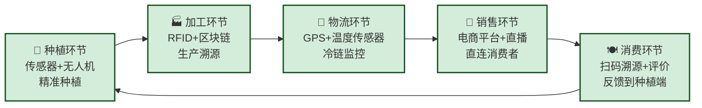

# MOC - 第5章习题 产业互联网与行业数字化转型

> [!abstract] 本章习题概览
> 本章习题共 **20 题**，覆盖 [[5.1 消费互联网与产业互联网区别|消费vs产业互联网]]、[[5.2 工业互联网平台架构|工业互联网架构]]、[[5.3 智慧农业、智慧交通数字化案例|智慧农业与交通]]、[[5.4 新零售、数字文旅创新模式|新零售与数字文旅]]、[[5.5 企业上云与数字化改造路径|企业上云路径]] 五个知识板块。题型分布：选择 6 题、填空 4 题、简答 6 题、案例分析 4 题。答案与详解折叠于 `
` 中。

---

## 一、选择题（6 题）

**1.** 下列关于消费互联网与产业互联网核心区别的描述，最准确的是（ ）
A. 消费互联网连接人与人，产业互联网连接机器与机器
B. 消费互联网以"流量"为核心，产业互联网以"价值"为核心
C. 消费互联网面向C端用户，产业互联网面向B端用户，两者完全独立
D. 消费互联网是互联网的低级形态，产业互联网是高级形态

**2.** 工业互联网的三层架构中，负责数据采集和设备连接的是（ ）
A. 应用层
B. 平台层
C. 边缘层
D. 网络层

**3.** 下列关于海尔COSMOPlat的描述，错误的是（ ）
A. 是全球最大的工业互联网平台之一
B. 其核心模式是"人单合一"
C. 主要服务家电行业，不涉及其他行业
D. 实现了C2M（用户反向定制）的生产模式

**4.** 新零售的核心"三通"是指（ ）
A. 人通、货通、场通
B. 资金通、物流通、信息流
C. 线上通、线下通、跨界通
D. 数据通、业务通、组织通

**5.** 企业上云过程中，"Rehost"策略指的是（ ）
A. 用SaaS替代原有应用
B. 直接将应用搬上云，不改变架构
C. 对应用进行云原生架构重构
D. 淘汰老旧应用

**6.** 智慧交通中V2X技术的核心是（ ）
A. 车辆与车辆之间的通信
B. 车辆与路侧设备之间的通信
C. 车辆与一切事物之间的通信
D. 车辆与网络之间的通信

选择题答案

1. **B**。消费互联网以"流量思维"为核心（用户规模×转化率），产业互联网以"价值思维"为核心（数据驱动×效率提升）。A错误，消费互联网不仅连接人与人，还连接人与信息/服务；C错误，两者并非完全独立，而是融合互补；D错误，两者是不同范式，没有高低级之分。

2. **C**。边缘层（Edge Layer）是工业互联网的"感官系统"，负责连接现场设备、采集原始数据、进行初步处理。A应用层提供行业解决方案；B平台层负责数据管理和分析；D网络层不是工业互联网的标准三层架构。

3. **C**。COSMOPlat已从海尔内部平台演变为开放的生态平台，覆盖食品、服装、装备等15个行业的生态方，并非仅限家电行业。

4. **A**。新零售的核心"三通"：人通（用户数据通）、货通（商品供应链通）、场通（消费场景通）。这是新零售实现线上线下融合的核心。

5. **B**。Rehost（搬迁）是指直接将应用搬上云，不改变架构，适用于简单应用的快速上云。A是Repurchase；C是Refactor；D是Retire。

6. **C**。V2X（Vehicle-to-Everything）是车辆与一切事物之间的通信技术，包括V2V（车与车）、V2I（车与路）、V2P（车与人）、V2N（车与网络）等，涵盖了所有车联网通信场景。

---

## 二、填空题（4 题）

**1.** 产业互联网的三大核心特征是：以企业为中心、______、______。

**2.** 工业互联网的三层架构包括：边缘层（Edge）、______、______。

**3.** 新零售的核心模式是"线上+线下+______"三位一体的深度融合。

**4.** 企业上云的五步路径是：评估→______→______→优化→创新。

填空题答案

1. **以价值链为载体**、**以"生产"环节为核心**。产业互联网的三大特征：以企业为中心（服务B端用户）、以价值链为载体（覆盖全链条）、以生产环节为核心（区别于消费互联网聚焦消费）。

2. **平台层（PaaS）**、**应用层（SaaS）**。工业互联网三层架构：边缘层（设备连接与数据采集）→平台层（IaaS基础设施+PaaS数据分析）→应用层（SaaS行业应用）。

3. **物流**。新零售的核心模式是"线上+线下+物流"三位一体，即盒马鲜生模式——线上APP下单、线下门店体验、30分钟极速送达。

4. **规划**、**迁移**。企业上云五步路径：评估（摸清家底）→规划（制定策略）→迁移（分阶段实施）→优化（持续改进）→创新（释放云价值）。

---

## 三、简答题（6 题）

**1.** 简述消费互联网与产业互联网的核心区别，并说明两者的关系。

**2.** 简述工业互联网三层架构中各层的核心功能与关键技术。

**3.** 什么是C2M？以海尔COSMOPlat为例说明C2M的价值和挑战。

**4.** 简述新零售的核心"三通"含义，并以盒马鲜生为例说明新零售的创新实践。

**5.** 简述企业上云的五步路径，并说明各阶段的核心任务。

**6.** 智慧农业和智慧交通的技术路线有何异同？请从数据来源、核心技术、服务对象等角度进行对比。

简答题答案

**1. 消费互联网 vs 产业互联网**

| 维度 | 消费互联网 | 产业互联网 |
| ---- | ---------- | ---------- |
| 用户定位 | C端个人用户 | B端企业/产业用户 |
| 核心目标 | 提升消费体验 | 提升生产效率 |
| 核心逻辑 | 流量思维 | 价值思维 |
| 连接对象 | 人与人、人与信息 | 机器与机器、企业与企业 |
| 关键技术 | 移动互联网、推荐算法 | 物联网、工业大数据、AI |
| 商业模式 | 广告、佣金、会员 | 设备+平台+服务、解决方案 |

**两者关系：** 消费互联网和产业互联网是互联网的两个发展方向，并非对立关系，而是融合互补。消费互联网为产业互联网提供了用户基础和数据积累，产业互联网为消费互联网提供了供给侧的效率提升。未来趋势是两者深度融合，形成"消费-产业"一体化的互联网生态。

**2. 工业互联网三层架构**

**边缘层（Edge Layer）：**
- 核心功能：设备接入、数据采集、协议转换、边缘计算、数据传输
- 关键技术：OPC UA、边缘网关、5G/WiFi6、边缘计算、数字孪生

**平台层（PaaS Layer）：**
- 核心功能：数据接入、数据存储（时序数据库/数据湖）、数据治理、数据分析（实时/离线/预测）、AI算法、微服务
- 关键技术：云计算（IaaS）、大数据平台、AI/机器学习、微服务架构

**应用层（SaaS Layer）：**
- 核心功能：预测性维护、生产质量优化、供应链协同、能耗优化、柔性生产调度、设备远程运维
- 关键技术：行业应用开发、低代码/可视化建模、工业App生态

**3. C2M与海尔案例**

> C2M（Consumer-to-Manufacturer）是用户反向定制的生产模式，用户需求直接驱动工厂生产计划。

**海尔COSMOPlat的C2M实践：**
- 用户通过海尔智家APP定制冰箱颜色、洗衣机容量等
- 订单通过COSMOPlat平台直接传递到柔性工厂
- 工厂快速调整生产线完成定制化生产
- 冰箱定制化率从5%提升到35%，研发周期缩短60%

**核心价值：**
- 用户：个性化定制，价格与标准化产品相当
- 企业：零库存、精准匹配需求、研发周期缩短
- 产业：供应链协同、柔性生产能力提升

**核心挑战：**
- 柔性生产能力要求高
- 需要强大的数据分析能力
- 供应链协同难度大
- 需要足够大的用户基数支撑

**4. 新零售"三通"与盒马实践**

> 新零售的核心"三通"：人通、货通、场通。

**人通**：线上线下用户身份统一，全渠道用户画像整合。盒马通过支付宝/淘宝账号实现会员统一，采集全渠道消费数据。

**货通**：商品全生命周期数字化，全渠道库存共享。盒马实现商品直采比例80%+，门店即为仓库，30分钟送达。

**场通**：线上线下无缝衔接，多场景融合。盒马线下门店即线上仓库，"生鲜+餐饮"双业态融合，APP下单30分钟送达。

**盒马创新成果：**
- 坪效是传统超市的2-3倍
- 毛利率22-25%（传统超市15-20%）
- 线上订单占比30-50%
- 库存周转天数15-20天（传统超市30-45天）

**5. 企业上云五步路径**

**① 评估阶段：** 摸清IT家底，评估现状与目标。核心任务：IT资产盘点、成本分析、架构评估、业务目标对齐。

**② 规划阶段：** 制定上云策略。核心任务：部署模式选择（公有云/私有云/混合云）、应用迁移策略制定（6R策略）、迁移路线规划。

**③ 迁移阶段：** 分阶段实施迁移。核心任务：环境搭建、数据迁移（全量+增量同步）、应用迁移（先易后难）、双轨并行确保业务连续性。

**④ 优化阶段：** 持续优化改进。核心任务：成本优化（FinOps）、性能优化（微服务/容器化）、安全优化（数据分级、零信任）。

**⑤ 创新阶段：** 释放云价值。核心任务：云原生创新（AI/大数据/物联网）、组织变革（DevOps/敏捷团队）、业务模式创新。

**6. 智慧农业 vs 智慧交通技术路线对比**

| 维度 | 智慧农业 | 智慧交通 |
| ---- | -------- | -------- |
| 数据来源 | 土壤传感器、气象站、无人机、卫星遥感 | GPS/北斗、摄像头、手机信令、V2X |
| 核心技术 | 物联网、AI图像识别、区块链溯源 | 车联网(V2X)、AI预测、大数据分析 |
| 服务对象 | 农民、农业企业、政府农业部门 | 司机、乘客、交通管理部门 |
| 核心价值 | 提升产量、降低成本、保障食品安全 | 提升通行效率、减少事故、改善出行 |
| 技术难点 | 恶劣环境下的设备可靠性、AI识别准确率 | 实时性要求高、网络覆盖、隐私保护 |
| 代表企业 | 中农互联、极飞科技、大北农 | 高德、滴滴、华为、百度Apollo |

**异同分析：**
- 相同点：都依赖物联网+大数据+AI技术，都是数据驱动的精准决策，都需要政策支持和生态合作
- 不同点：智慧农业关注的是"静态自然环境"（农田、作物），智慧交通关注的是"动态人流车流"（车辆、乘客）；智慧农业对实时性要求相对较低，智慧交通对实时性要求极高（毫秒级）

---

## 四、案例分析题（4 题）

**1.（工业互联网案例）** 阅读以下材料，回答问题：
> 三一重工的根云平台连接了超过120万台工程机械，通过实时数据采集和AI分析，实现了设备远程监控、故障预测、智能服务调度等功能。根云平台还为客户提供融资租赁风控、数字孪生工厂等增值服务。
>
> (1) 根云平台的边缘层、平台层、应用层分别承担了哪些功能？
> (2) 根云平台的商业模式创新体现在哪些方面？
> (3) 根云平台对三一重工的核心价值是什么？

案例分析1解答

**(1) 三层架构功能**

| 层次 | 根云平台功能 | 具体实现 |
| ---- | ------------ | -------- |
| **边缘层** | 设备连接与数据采集 | 给120万台设备加装GPS、传感器（振动、温度、电流），实时采集位置、工况、油耗、故障数据 |
| **平台层** | 数据存储与智能分析 | 构建工业数据中台，存储海量设备数据；AI算法进行故障预测（准确率95%+）、油耗优化、产能预测 |
| **应用层** | 行业解决方案 | 设备远程监控、故障预警、智能服务调度、融资租赁风控、数字孪生工厂 |

**(2) 商业模式创新**

| 传统模式 | 根云创新模式 | 创新价值 |
| -------- | ------------ | -------- |
| 卖设备（硬件一次性收入） | 卖"设备+服务"（硬件+持续服务费） | 从交易型转向关系型，服务收入占比从5%提升到25% |
| 售后服务为成本中心 | 售后服务为利润中心 | 远程诊断减少现场服务成本，增值服务创造新收入 |
| 设备价值在交付时确定 | 设备价值在使用中持续创造 | 设备全生命周期价值最大化 |
| 与客户交易结束即关系结束 | 通过平台与客户持续连接 | 形成数据驱动的生态壁垒 |

**(3) 核心价值**

① **效率提升**：维修响应时间从48小时缩短到2小时，服务效率提升60%
② **成本降低**：故障预测减少设备停机时间，油耗优化平均节油15%
③ **收入增长**：增值服务（数据分析、金融服务）快速增长，服务收入占比25%
④ **生态壁垒**：120万台设备的数据沉淀形成竞争壁垒，客户粘性极高
⑤ **品牌升级**：从传统设备制造商升级为"智能服务提供商"

**2.（新零售案例）** 某传统连锁超市面临线上线下渠道割裂的问题：线上流量增长遇到瓶颈，线下门店客流持续下滑。请为其设计新零售转型方案：
(1) 应如何构建"人通、货通、场通"的三通体系？
(2) 技术架构上需要做哪些改造？
(3) 可能遇到的风险是什么？如何应对？

案例分析2解答

**(1) 三通体系构建**

**人通：**
- 统一会员体系：打通线上APP、线下门店、小程序的会员ID
- 全渠道数据整合：采集线上浏览、搜索、购买数据和线下消费、行为数据
- 构建360°用户画像：基于全渠道数据，形成完整的用户画像
- 精准营销：根据用户画像实现全渠道精准推荐和营销

**货通：**
- 商品全生命周期数字化：从采购、仓储到销售全程可追溯
- 全渠道库存共享：实现线上线下"一盘货"管理，库存实时同步
- C2M反向定制：基于用户需求数据，反向定制商品
- 供应商协同：打通供应商数据，实现协同采购和补货

**场通：**
- 门店即仓库：线下门店同时作为线上订单的履约点
- 多场景融合：超市+餐饮+体验融合，打造"生活方式"场景
- 全渠道一致体验：线上线下商品、价格、服务完全一致
- 30分钟极速送达：基于前置仓/门店的快速配送体系

**(2) 技术架构改造**

| 改造方向 | 具体内容 |
| -------- | -------- |
| **中台建设** | 用户中台（会员/画像/标签）、商品中台（SKU/价格/库存）、订单中台（全渠道订单）、营销中台 |
| **全渠道系统** | 重构POS系统支持全渠道交易、建设OMS（订单管理系统）、WMS升级支持全渠道库存管理 |
| **数据平台** | 建设数据中台，汇聚全渠道数据，构建实时数据分析能力 |
| **AI能力** | 智能选品（千店千面）、智能定价、智能推荐、智能调度 |
| **物流系统** | 建设前置仓/门店配送系统，支持30分钟送达 |

**(3) 风险与应对**

| 风险 | 应对策略 |
| ---- | -------- |
| **系统改造风险**：新旧系统切换可能导致业务中断 | 分阶段实施，双轨并行，灰度发布 |
| **成本超支**：中台建设和全渠道改造投入大 | 制定详细预算，分阶段投入，优先投资ROI明确的场景 |
| **组织阻力**：传统部门利益格局调整困难 | 高层推动，成立跨部门项目组，绩效考核与新体系对齐 |
| **数据安全**：全渠道数据整合带来的数据安全挑战 | 数据分级分类、加密存储、访问控制、安全审计 |
| **用户体验**：转型期可能出现体验不一致 | 成立体验小组，持续监控和优化全渠道体验 |
| **合作伙伴关系**：原有供应商可能不适应新模式 | 提前沟通，建立新的合作激励机制 |

**3.（企业上云案例）** 某大型制造企业IT现状如下：
- 自有IDC机房，服务器500台，主要承载ERP、CRM、OA等核心系统
- IT成本年均8000万元，其中硬件折旧占40%，运维人力占30%
- 业务部门反映系统响应慢、上线周期长（平均6个月）
- 希望通过上云实现降本增效和数字化转型

请为其设计上云方案：
(1) 选择哪种部署模式？为什么？
(2) 设计迁移策略和路线图
(3) 预期能获得哪些收益？可能面临什么风险？

案例分析3解答

**(1) 部署模式选择：混合云**

**选择理由：**
- 企业规模大，有敏感数据需求，需要私有云保障安全
- 同时需要公有云的弹性能力应对业务波动（如双十一、订单高峰）
- 混合云可以平衡安全与弹性，是大型制造企业的主流选择
- 参考海尔、美的等同行经验，均采用混合云架构

**具体方案：**
- **私有云**：部署核心业务系统（ERP、MES、PLM），承载敏感数据
- **公有云**：部署互联网业务（电商、官网）、大数据分析、AI训练、视频会议等
- **混合云连接**：通过专线实现公有云与私有云的安全互联

**(2) 迁移策略与路线图**

**第一阶段（0-3个月）：评估与规划**
- IT资产盘点，梳理500台服务器上的所有应用
- 数字化成熟度评估，明确上云目标（降本50%、上线周期缩短80%）
- 选择云服务商（阿里云+华为云双活）
- 制定应用迁移策略（6R分析）

**第二阶段（3-6个月）：非核心系统上云**
- 优先迁移OA、邮件、HR等非核心系统（Rehost策略）
- 建设私有云IaaS平台（基于华为Stack）
- 公有云部署测试环境和开发环境
- 积累迁移经验和团队技能

**第三阶段（6-12个月）：核心系统迁移**
- CRM系统迁移到公有云（Replatform策略，做少量优化）
- ERP系统分模块迁移到私有云（Replatform+Refactor策略）
- 双轨并行3个月，确保业务连续性
- 建设数据中台，打通全系统数据

**第四阶段（12-18个月）：优化与创新**
- 微服务架构改造，应用容器化（Docker+Kubernetes）
- 建设AI中台，实现智能推荐、预测分析
- 物联网平台接入生产设备，实现生产过程监控
- 组织变革：IT部门转型为数字化部门，推行DevOps

**(3) 预期收益与风险**

**预期收益：**

| 指标 | 现状 | 预期 | 提升幅度 |
| ---- | ---- | ---- | -------- |
| IT成本 | 8000万/年 | 3500-4000万/年 | 降低50% |
| 业务上线周期 | 6个月 | 2-3周 | 缩短85% |
| 系统可用性 | 99% | 99.99% | 提升显著 |
| 数据利用率 | 15% | 60%+ | 提升4倍 |
| 设备联网率 | 10% | 80%+ | 提升8倍 |

**主要风险：**

| 风险 | 概率 | 影响 | 应对策略 |
| ---- | ---- | ---- | -------- |
| 数据安全 | 低 | 极高 | 敏感数据私有云、加密传输、零信任架构 |
| 业务中断 | 低 | 极高 | 双轨并行、灰度发布、完善回滚方案 |
| 成本超支 | 中 | 中 | 制定详细预算、分阶段投入、FinOps监控 |
| 人才短缺 | 高 | 中 | 内部培训+外部引进+云服务商赋能 |
| 组织阻力 | 高 | 中 | 高层推动、绩效考核对齐、文化变革 |

**4.（智慧产业综合案例）** 阅读以下材料，回答问题：
> 某农业科技公司计划打造"智慧农业+农产品电商"一体化平台。平台将整合传感器数据、无人机遥感、AI图像识别等技术，为农民提供精准种植方案，同时通过电商渠道直连消费者。
>
> (1) 请分析该平台的技术架构，说明各层的核心功能和关键技术。
> (2) 该平台如何实现从"田间到餐桌"的全链路数字化？
> (3) 该平台的商业模式有哪些创新？与传统农业模式相比有何优势？

案例分析4解答

**(1) 技术架构**

| 层次 | 核心功能 | 关键技术 |
| ---- | -------- | -------- |
| **感知层** | 农田数据采集 | 土壤传感器、气象站、无人机遥感、卫星遥感、RFID标签 |
| **数据层** | 数据处理与分析 | 物联网关（NB-IoT/5G传输）、农业大数据平台、AI图像识别（病虫害/作物长势）、区块链（溯源） |
| **服务层** | 精准决策服务 | 精准灌溉/施肥方案、病虫害预警、产量预测、农产品溯源查询 |
| **应用层** | C2B/C2C应用 | 农民APP（种植管理）、消费者APP（溯源查询/电商下单）、管理后台 |

**(2) "田间到餐桌"全链路数字化**

**全链路数字化实现：**
1. **种植端**：传感器实时采集土壤、气象数据，AI分析生成精准灌溉/施肥方案
2. **加工端**：RFID标签绑定每批次产品，区块链记录加工信息
3. **物流端**：GPS+温度传感器监控冷链运输全过程
4. **销售端**：电商平台直连消费者，直播带货减少中间环节
5. **消费端**：消费者扫码查看全链路溯源信息，评价数据反馈到种植端优化生产

**(3) 商业模式创新**

| 维度 | 传统农业模式 | 智慧农业+电商模式 |
| ---- | ------------ | ----------------- |
| **生产方式** | 经验驱动，粗放生产 | 数据驱动，精准生产 |
| **流通方式** | 5-6层中间商，利润被压缩 | 直连消费者，减少中间环节 |
| **价值分配** | 农民获得10-20%利润 | 农民获得40-60%利润 |
| **产品溢价** | 无品牌溢价 | 品牌溢价20-30%（溯源+品质保障） |
| **风险控制** | 靠天吃饭，风险不可控 | 数据预警，风险可控 |
| **数据资产** | 无数据积累 | 全链路数据沉淀，持续优化 |

**核心创新：**
1. **C2M反向定制**：基于消费者需求数据，指导农民种植市场需要的农产品
2. **数据变现**：农业数据（土壤、气象、作物）作为商品出售给农资企业、保险公司
3. **生态闭环**：从生产到消费的全链路数据闭环，持续优化生产效率和消费者体验
4. **品牌化运营**：通过溯源和品质保障打造区域公共品牌，提升溢价能力

---

## 考点统计表

| 知识点 | 涉及题号 | 题数 | 难度分布 |
| :--- | :--- | :---: | :--- |
| [[5.1 消费互联网与产业互联网区别\|消费vs产业互联网]] | 选择1、选择3、简答1、简答3 | 4 | 易-中 |
| [[5.2 工业互联网平台架构\|工业互联网架构]] | 选择2、选择6、填空2、简答2、案例1 | 5 | 中-难 |
| [[5.3 智慧农业、智慧交通数字化案例\|智慧农业与交通]] | 填空3、填空4、简答6、案例4 | 4 | 中 |
| [[5.4 新零售、数字文旅创新模式\|新零售与数字文旅]] | 选择4、简答4、案例2 | 3 | 中 |
| [[5.5 企业上云与数字化改造路径\|企业上云路径]] | 选择5、填空1、简答5、案例3 | 4 | 中-难 |
| 合计 | — | 20 | — |

> [!tip] 复习建议
> - **消费vs产业互联网**重点掌握两者的核心区别对比表，理解"流量思维"vs"价值思维"的差异
> - **工业互联网架构**必须熟练掌握三层架构（边缘层/平台层/应用层）的功能和技术，理解海尔、三一、徐工的案例
> - **智慧产业案例**要掌握智慧农业的"天空地"体系和智慧交通的V2X技术，对比两者的技术路线异同
> - **新零售**重点掌握"三通"（人通/货通/场通）含义和盒马鲜生的实践；数字文旅重点理解故宫的数字化路径
> - **企业上云**要掌握五步路径（评估→规划→迁移→优化→创新）和6R迁移策略，理解海尔、美的的数字化改造案例
> - 案例分析题要学会用"框架"分析——用三层架构分析工业互联网、用三通分析新零售、用五步路径分析上云方案
> - 产业互联网的学习要紧密结合**中国行业龙头的实战案例**（海尔、三一、徐工、盒马、故宫），不要只看概念

## 章节导航

> [!nav] 导航
> [[MOC - 第5章|第5章 知识点目录]] · [[MOC - 互联网创新|课程总览]] · 下一章习题：[[MOC - 第6章习题|第6章 互联网安全、合规与治理习题]]