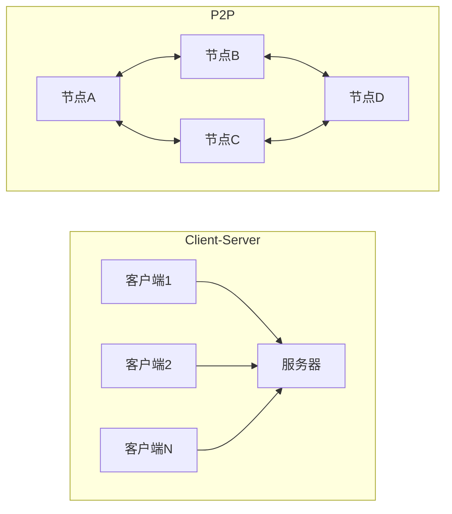

# 1.1 互联网、局域网、广域网基础概念

> [!abstract] 本节概述
> 互联网创新的前提是理解"互联网是什么"。本节从网络的基本分类（局域网、城域网、广域网）出发，建立"互联网是网络的网络"这一核心概念，介绍互联网的组成架构与 TCP/IP 协议栈，为后续商业模式与产品创新讨论奠定技术底座。

## 一、什么是互联网

> [!definition] 互联网（Internet）
> 互联网是**全球最大的计算机网络**，由无数局域网、城域网、广域网通过路由器互联而成的"网络的网络"。它的核心是 **TCP/IP 协议族**，使不同厂商、不同类型、不同规模的网络能够互联互通。

互联网的三个核心特征：
1. **全球性**：覆盖全球 200+ 国家和地区；
2. **开放性**：任何组织和个人都可以接入，无中心控制；
3. **分布式**：数据和服务分布在全球数百万台服务器上。

## 二、网络的分类

### 2.1 按覆盖范围分类

| 类型 | 覆盖范围 | 典型速率 | 典型应用 |
| ---- | -------- | -------- | -------- |
| 局域网（LAN） | 几十米～几公里 | 10Mbps～10Gbps | 家庭、办公室、校园网 |
| 城域网（MAN） | 几十公里 | 100Mbps～10Gbps | 城市有线电视网、城市光纤网 |
| 广域网（WAN） | 几百～几千公里 | 2Mbps～100Gbps | 骨干网、跨区域企业网 |

> [!example] 网络层级关系
> 一个典型的网络层级：个人电脑→家庭/办公室 LAN→ISP 的 MAN→骨干 WAN→全球互联网。每一层通过路由器和交换机互联。

### 2.2 按网络功能分类

> [!tip] 从功能角度看互联网
> - **接入网**：用户接入互联网的最后一公里（光纤、DSL、4G/5G、WiFi）；
> - **骨干网**：连接各大区域的高速传输网络（光纤、卫星）；
> - **数据中心**：集中存放服务器、存储和网络设备的场所（云计算的物理基础）。

## 三、互联网的组成

### 3.1 互联网的两大组成部分

> [!definition] 互联网的组成
> 互联网由**边缘部分**和**核心部分**组成：
> - **边缘部分**：由所有连接在互联网上的主机（端系统）组成，用户直接使用的应用（Web、Email、App）都运行在边缘部分；
> - **核心部分**：由大量路由器和通信链路组成，负责分组的存储转发，是互联网的"传输骨干"。

### 3.2 互联网协议栈（TCP/IP）

> [!note] TCP/IP 四层模型
> ```
> 应用层    → HTTP, HTTPS, FTP, SMTP, DNS
> 运输层    → TCP, UDP
> 网际层    → IP, ICMP, ARP
> 网络接口层 → Ethernet, WiFi, 4G/5G
> ```
>
> 数据从应用层向下封装，到达目的主机后逐层解封。每一层利用下一层提供的服务，向上一层提供服务。

### 3.3 Client-Server 与 P2P

> [!definition] 两种服务模式
> - **Client-Server（客户-服务器）**：服务器集中提供服务，客户端请求服务。典型应用：Web 浏览、Email、视频点播；
> - **P2P（对等模式）**：各主机既是客户端也是服务器，资源分布在所有节点上。典型应用：BT 下载、区块链、即时通讯。



## 四、互联网创新与网络基础的关系

> [!example] 理解网络基础对创新的意义
> 1. **带宽决定应用形态**：早期拨号上网（56Kbps）只能支持文本网页；宽带（Mbps）使视频流成为可能；光纤/5G（Gbps）催生了 4K/8K 视频、AR/VR；
> 2. **协议支持创新**：HTTP 协议使 Web 成为可能；HTTPS 使在线交易成为可能；WebSocket 使实时应用成为可能；
> 3. **网络结构影响商业模式**：中心化的 Client-Server 模式对应中心化的平台经济；P2P 模式为 Web3.0 去中心化应用提供了技术基础。

## 五、易错点

> [!warning] 易错点
> 1. **互联网 ≠ 万维网**：万维网（WWW）是互联网上的一个应用，基于 HTTP 协议；互联网是更大的概念，包含 Email、FTP、P2P 等所有应用；
> 2. **局域网也能互联**：互联网不限于广域网，任何两个网络互联都可视为互联网的一部分；
> 3. **TCP/IP 是协议族不是单一协议**：它包含上百个协议，每个协议解决特定的通信问题；
> 4. **IPv4 vs IPv6**：IPv4 地址约 43 亿，已耗尽；IPv6 地址约 $3.4\times10^{38}$，为物联网万物互联提供了地址基础。

## 六、与其他小节的联系

- 互联网的代际演进（Web1.0→2.0→3.0）见 [[1.2 Web1.0、Web2.0、Web3.0 演进特点]]；
- 移动互联网是互联网在移动场景的延伸，见 [[1.3 移动互联网诞生与发展变革]]；
- TCP/IP 协议与网络安全的深入讨论见 [[MOC - 计算机网络|计算机网络]] 课程。

## 章节导航

- 上一级：[[MOC - 第1章]]
- 下一节：[[1.2 Web1.0、Web2.0、Web3.0 演进特点]]
- 习题：[[MOC - 第1章习题]]
