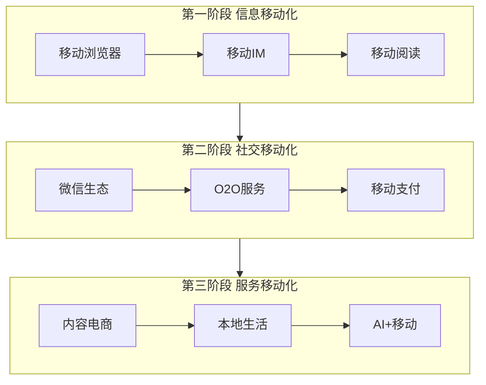

# 1.3 移动互联网诞生与发展变革

> [!abstract] 本节概述
> 移动互联网是继 PC 互联网之后最深刻的变革，它不仅是"互联网在移动端的延伸"，更从根本上改变了互联网的使用场景、商业模式和产业格局。本节梳理移动互联网的发展三阶段，分析其对商业、生活和社会的深远影响。

## 一、移动互联网的定义

> [!definition] 移动互联网
> 移动互联网是**以移动终端（智能手机、平板电脑）为主要接入设备，以移动通信网络（4G/5G）为传输通道的互联网**。它的核心特征是"**随时随地、场景感知、实时在线**"。

移动互联网与传统互联网的根本区别：

| 维度 | 传统互联网（PC） | 移动互联网 |
| ---- | --------------- | ---------- |
| **接入方式** | 固定地点、有线为主 | 随时随地、无线为主 |
| **使用时长** | 集中时段（工作/学习时间） | 全天候、碎片化 |
| **屏幕尺寸** | 大屏幕（15–30英寸） | 小屏幕（5–7英寸） |
| **交互方式** | 鼠标+键盘 | 触控+语音+摄像头 |
| **定位能力** | 通常无 | GPS+北斗+WiFi定位 |
| **传感器** | 有限 | 加速度/陀螺仪/指纹/人脸 |
| **商业模式** | 广告、电商 | 场景化服务、O2O、移动支付 |

## 二、移动互联网的发展三阶段

### 2.1 第一阶段：信息移动化（2008–2013）

> [!example] 第一阶段特征
> - **核心驱动力**：3G 网络普及、智能手机出现（iPhone 2007、Android 2008）；
> - **典型应用**：移动浏览器（UC Web）、移动IM（飞信、QQ）、移动阅读（起点、掌阅）；
> - **商业模式**：延续 PC 互联网的广告模式，变现效率低；
> - **局限**：网络速度慢、资费高、屏幕小导致体验受限。

### 2.2 第二阶段：社交移动化（2013–2018）

> [!example] 第二阶段特征
> - **核心驱动力**：4G 网络普及、微信生态、移动支付；
> - **典型应用**：微信（社交+支付+公众号+小程序）、微博/抖音（短视频）、滴滴/美团（O2O）；
> - **商业模式**：移动支付打通交易闭环，O2O 模式爆发（线上获客、线下服务）；
> - **标志事件**：2014 年微信红包上线，彻底改变了移动支付格局。

### 2.3 第三阶段：服务移动化（2018–至今）

> [!example] 第三阶段特征
> - **核心驱动力**：5G 预研、AI、IoT 融合、超级 App；
> - **典型应用**：抖音/TikTok（内容电商）、拼多多（社交电商）、美团/饿了么（本地生活）、钉钉/飞书（移动办公）；
> - **商业模式**：场景化服务、订阅经济、私域流量运营；
> - **新趋势**：直播带货、社区团购、AI 助理、元宇宙社交。

## 三、移动互联网的核心创新

### 3.1 App 经济

> [!tip] App 经济的本质
> App 经济是移动互联网的**生态基础**：
> - **分发**：App Store（苹果）、Google Play（安卓）、各大手机厂商应用商店；
> - **变现**：免费下载+应用内购买、付费下载、订阅模式、广告；
> - **生态**：开发者、用户、平台形成三方生态，平台抽成 30%（Apple Tax）。

### 3.2 O2O 模式

> [!definition] O2O（Online to Offline）
> O2O 是**线上获客、线下交付**的商业模式，是移动互联网最核心的商业模式创新之一。

**O2O 的四种形态：**

| 形态 | 流程 | 代表案例 |
| ---- | ---- | -------- |
| 线上到线下 | 线上下单→线下消费 | 美团外卖、大众点评 |
| 线下到线上 | 线下体验→线上购买 | 优衣库线下扫码购买 |
| 线上到线下再到线上 | 线上引流→线下体验→线上支付 | 宜家（线下逛+线上买） |
| 线下到线上再到线下 | 线下扫码→线上互动→线下使用 | 景区扫码导览 |

### 3.3 移动支付

> [!example] 移动支付的创新意义
> 移动支付是移动互联网的**"操作系统级"基础设施**：
> - **降低交易成本**：从现金/银行卡到手机支付，交易成本下降 90%+；
> - **实时交易**：24/7 实时到账，不受银行营业时间限制；
> - **数据沉淀**：每一笔交易都可追溯，为信用评估、精准营销提供数据基础；
> - **金融普惠**：为无银行账户的人群提供金融服务（支付宝"普惠金融"）。

## 四、移动互联网对传统行业的冲击

> [!example] 移动互联网的颠覆效应
> 1. **零售业**：电商→移动电商→社交电商→直播电商，传统线下零售份额持续被蚕食；
> 2. **出行行业**：出租车→网约车→共享单车→共享汽车，出行模式全面数字化；
> 3. **餐饮行业**：堂食→外卖→半成品→预制菜，餐饮边界被打破；
> 4. **金融业**：银行柜台→网银→手机银行→互联网金融，金融服务民主化；
> 5. **教育行业**：线下培训→在线教育→AI 自适应学习，教育资源重新分配。

## 五、易错点

> [!warning] 易错点
> 1. **移动互联网 ≠ PC 互联网的附属**：移动互联网不是 PC 互联网的简单延伸，而是一个全新的生态（移动优先 Mobile-First）；
> 2. **O2O ≠ 线上+线下**：O2O 的核心是**移动支付打通闭环**，没有移动支付的"线上+线下"只是"线上展示+线下交易"，不是真正的 O2O；
> 3. **App 经济 ≠ 移动互联网全部**：微信小程序、H5 页面正在分流原生 App，"轻应用"趋势明显；
> 4. **中国特色**：中国移动互联网市场规模全球最大，但监管环境与欧美不同，创新需考虑合规要求。

## 六、与其他小节的联系

- 移动互联网的商业模式创新见 [[2.1 B2B、B2C、C2C、O2O 模式解析]]；
- 移动支付背后的安全问题见 [[6.1 互联网常见网络风险、数据安全风险]]；
- 移动互联网正在进入 5G+AI 新阶段，见 [[1.4 下一代互联网技术发展趋势]]。

## 章节导航

- 上一级：[[MOC - 第1章]]
- 下一节：[[1.4 下一代互联网技术发展趋势]]
- 习题：[[MOC - 第1章习题]]
