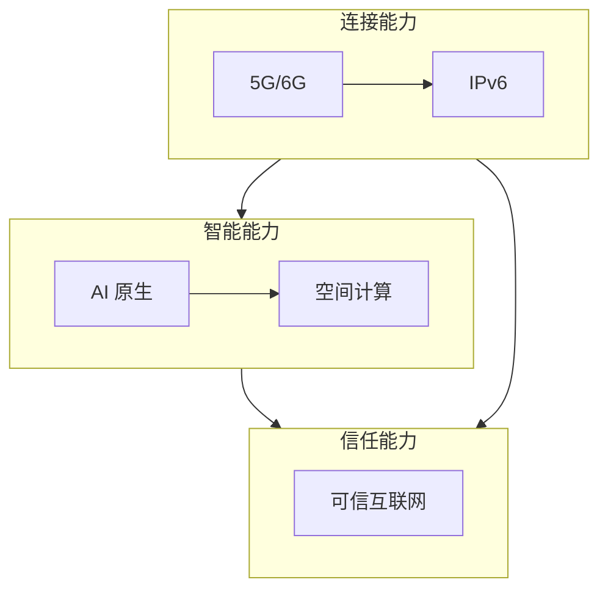

# 1.4 下一代互联网技术发展趋势

> [!abstract] 本节概述
> 下一代互联网正从"连接信息"向"连接万物、连接价值、连接空间"演进。本节梳理五大核心趋势：5G 与 6G、IPv6 与万物互联、可信互联网、空间计算、AI 原生互联网，描绘未来互联网的技术图景与创新机遇。

## 一、趋势一：5G 与 6G——连接能力的跃升

### 1.1 5G 的核心能力

> [!definition] 5G 三大场景
> | 场景 | 关键指标 | 典型应用 |
> | ---- | -------- | -------- |
> | **eMBB（增强移动宽带）** | 峰值速率 20Gbps | 4K/8K 视频、VR/AR、云游戏 |
> | **URLLC（超可靠低时延通信）** | 时延 <1ms、可靠性 99.999% | 工业控制、自动驾驶、远程医疗 |
> | **mMTC（海量机器类通信）** | 连接密度 100 万/km² | 物联网、智慧城市、环境监测 |

> [!example] 5G 对创新的意义
> 1. **云游戏**：手机无需高性能 GPU，远程运行 3A 游戏（延迟 <20ms）；
> 2. **工业互联网**：实时控制工厂设备，实现柔性制造；
> 3. **远程医疗**：实时高清手术直播、远程操控手术机器人；
> 4. **自动驾驶**：V2X（车联网）通信，实现车辆与车辆、车辆与基础设施的实时交互。

### 1.2 6G 展望

> [!tip] 6G 前瞻（2030 年左右）
> - **太赫兹通信**：频段 0.1–10THz，速率 1Tbps+；
> - **智能超表面**：可编程电磁表面，实现信号的智能调控；
> - **通信感知一体化**：网络同时完成通信和感知（雷达功能）；
> - **空天地一体化**：卫星-地面-海洋通信融合。

## 二、趋势二：IPv6 与万物互联

### 2.1 IPv6 基础

> [!definition] IPv6
> IPv6 地址长度为 128 位，地址空间约 $3.4\times10^{38}$，是 IPv4（$2^{32}\approx43$ 亿）的 79 亿倍。它为万物互联提供了充足的地址空间。

**IPv6 相对 IPv4 的优势：**
- 地址空间极大扩展，每个设备都能获得公网地址；
- 地址自动配置（SLAAC），无需 DHCP 服务器；
- 内置 IPSec 安全协议；
- 简化的报文头，转发效率更高。

### 2.2 物联网（IoT）

> [!example] 物联网的规模
> 全球物联网设备数量已超过 150 亿台，预计 2030 年将达到 500 亿台。IPv6 是支撑这一规模的关键技术。

**物联网的典型应用场景：**

| 领域 | 应用 | 创新价值 |
| ---- | ---- | -------- |
| 智能家居 | 智能音箱、扫地机器人、温控器 | 生活便利、能耗节约 |
| 智能城市 | 交通监控、环境监测、公共安全 | 城市治理效率提升 |
| 智慧农业 | 土壤监测、气象站、自动化灌溉 | 精准农业、增产节能 |
| 工业物联网 | 设备监控、预测性维护、产线优化 | 提升良品率、降低停机时间 |
| 可穿戴设备 | 智能手表、健康监测、运动追踪 | 个人健康管理 |

## 三、趋势三：可信互联网

> [!definition] 可信互联网
> 可信互联网是**以可信为核心设计理念的新一代互联网架构**，解决当前互联网"不可信"的根本问题。

**核心技术方向：**
1. **区块链技术**：分布式账本、不可篡改、可追溯；
2. **隐私计算**：联邦学习、同态加密、安全多方计算，实现"数据可用不可见"；
3. **零信任架构（ZTA）**：永不信任、始终验证，每次访问都需认证授权；
4. **可信执行环境（TEE）**：在硬件隔离环境中处理敏感数据。

## 四、趋势四：空间计算

> [!definition] 空间计算（Spatial Computing）
> 空间计算是**将计算从屏幕扩展到物理空间**的新一代计算范式，让数字信息与物理世界无缝融合。

**空间计算的技术组成：**
- **AR（增强现实）**：在真实世界上叠加数字信息（如导航指引）；
- **VR（虚拟现实）**：创建完全沉浸式的数字环境（如虚拟会议）；
- **MR（混合现实）**：真实与虚拟物体共存并可交互（如虚拟家具摆放）；
- **数字孪生**：物理实体的高精度数字映射（如城市数字孪生）。

> [!example] 空间计算的代表产品
> - Apple Vision Pro（2024）：空间计算平台，支持无限画布、环境感知、人物分身；
> - Meta Quest 3：MR 头显，支持透视真实环境；
> - 数字孪生城市：如上海"城市之眼"、新加坡"虚拟新加坡"。

## 五、趋势五：AI 原生互联网

> [!definition] AI 原生互联网
> AI 原生互联网是**以 AI 为核心驱动力的互联网**，AI 不再是附加功能，而是互联网的"操作系统"。

**关键方向：**
1. **生成式 AI**：大模型生成文本、图像、视频、代码；
2. **AI Agent**：自主感知、推理、决策、执行任务的 AI 智能体；
3. **AI 基础设施**：GPU 集群、AI 芯片（NVIDIA H100、华为昇腾）、AI 云服务；
4. **垂直领域 AI**：AI 医疗、AI 法律、AI 教育、AI 金融。

> [!example] AI 原生互联网的创新
> - **搜索引擎 → AI 搜索**：Perplexity、Google SGE，直接给出答案而非链接列表；
> - **社交网络 → AI 社交**：Character.AI、Chai，与 AI 角色互动；
> - **内容创作 → AI 创作**：Midjourney（AI 绘图）、Sora（AI 视频）、GitHub Copilot（AI 编程）；
> - **电商 → AI 电商**：AI 导购、AI 定价、AI 供应链优化。

## 六、五大趋势的协同关系

> [!tip] 创新机遇
> 下一代互联网的每一个趋势都孕育着巨大的创新机遇：
> - **5G 时代**：云游戏、工业互联网、车联网；
> - **IPv6 时代**：物联网平台、智能家居、智慧农业；
> - **可信互联网**：DeFi、数据要素市场、隐私计算服务；
> - **空间计算**：AR 教育、VR 培训、数字孪生；
> - **AI 原生**：AI Agent、AI 搜索、AI 创作工具。

## 七、易错点

> [!warning] 易错点
> 1. **5G ≠ 只是更快的 4G**：5G 的核心变革是**从"人机通信"到"万物通信"**，海量连接场景才是 5G 区别于 4G 的关键；
> 2. **IPv6 ≠ IPv4 的简单升级**：IPv6 带来的不仅是地址空间扩展，还包括协议简化、内置安全等架构革新；
> 3. **空间计算 ≠ VR/AR**：VR/AR 是空间计算的**呈现层**，空间计算还包括感知、理解、交互、渲染等完整技术栈；
> 4. **AI 原生 ≠ AI + 互联网**：AI 原生互联网是从架构层面重新设计，而非在现有互联网上叠加 AI 功能。

## 八、与其他小节的联系

- 云计算是 5G 和 AI 的基础设施，见 [[3.1 云计算、虚拟化与资源共享]]；
- 物联网的核心技术见 [[3.3 物联网与万物互联应用]]；
- 区块链技术基础见 [[3.5 区块链基础与互联网价值创新]]；
- 前沿方向的深入讨论见 [[8.1 元宇宙、沉浸式互联网应用]]、[[8.2 生成式 AI 驱动互联网产品变革]]。

## 章节导航

- 上一级：[[MOC - 第1章]]
- 上一节：[[1.3 移动互联网诞生与发展变革]]
- 习题：[[MOC - 第1章习题]]
