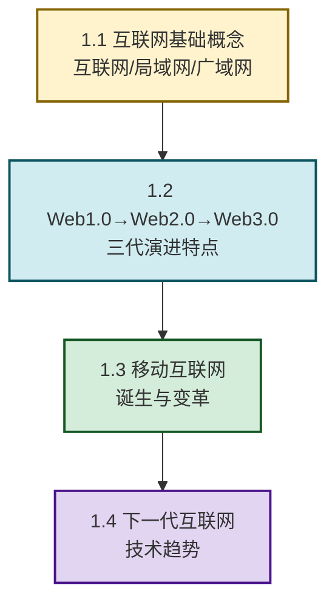

# MOC - 第1章 互联网发展基础与演进历程

> [!info] 本章定位
> 本章是互联网创新的**历史与宏观背景章**。它要回答的核心问题是：**互联网从何而来？经历了怎样的代际变迁？Web1.0、Web2.0、Web3.0 的本质区别是什么？移动互联网带来了哪些深刻变革？下一代互联网将走向何方？** 理解演进脉络，才能看清创新的历史规律与未来趋势。本章是后续 [[MOC - 第2章|第2章 互联网典型商业模式]]（各商业模式对应不同Web时代）和 [[MOC - 第8章|第8章 互联网前沿创新方向]]（前沿方向是演进的延伸）的时间坐标。

## 学习路线图

## 知识点导航

| 小节 | 标题 | 核心内容 | 关键概念 |
| ---- | ---- | -------- | -------- |
| [[1.1 互联网、局域网、广域网基础概念\|1.1]] | 互联网基础概念 | 互联网定义、LAN/WAN/MAN、互联网组成与架构、TCP/IP 基础 | 网络互联、协议栈、Client-Server |
| [[1.2 Web1.0、Web2.0、Web3.0 演进特点\|1.2]] | Web 三代演进 | Web1.0 只读→Web2.0 读写→Web3.0 读写拥有；代际特征、典型应用 | 只读网页、用户生成内容、去中心化 |
| [[1.3 移动互联网诞生与发展变革\|1.3]] | 移动互联网变革 | 移动互联网的三个阶段、App 经济、移动支付、场景化服务 | 移动优先、O2O、场景连接 |
| [[1.4 下一代互联网技术发展趋势\|1.4]] | 下一代互联网 | 5G、IPv6、物联网、Web3.0、空间计算、可信互联网 | 万物互联、去中心化、沉浸式 |

## 核心考点

> [!summary] 本章核心考点（7 点）
> 1. **互联网与网络的区别**：互联网是"网络的网络"，由无数局域网、城域网、广域网互联而成，核心是 TCP/IP 协议实现异构网络互联；
> 2. **Web1.0 vs Web2.0 的本质区别**：Web1.0 是"只读"（少数人发布、多数人浏览），Web2.0 是"读与写"（用户既是消费者也是生产者，UGC 是核心特征）；
> 3. **Web3.0 的核心理念**：去中心化、用户拥有数据、基于区块链的价值互联网；与 Web2.0 的"平台中心化"形成对比；
> 4. **移动互联网的三次浪潮**：信息获取（移动Web）→社交娱乐（App生态）→生活服务（O2O/移动支付），每一波都催生了新的商业模式；
> 5. **移动互联网 vs 传统互联网的本质差异**：从"人机交互"到"场景连接"，从"固定时长"到"碎片时间"，从"信息对称"到"实时在线"；
> 6. **下一代互联网的核心驱动力**：5G（连接能力）、IPv6（地址空间）、AI（智能能力）、区块链（信任机制）、空间计算（沉浸体验）；
> 7. **互联网演进的底层规律**：每一代 Web 都是"技术突破→规模扩张→商业模式创新→生态形成"的循环，理解这个规律比记住具体特征更重要。

## 章节导航

> [!nav] 导航
> 上级：[[MOC - 互联网创新|课程总览]]
> 先修：[[MOC - 计算机网络|计算机网络]]（互联网技术底座）
> 下一章：[[MOC - 第2章|第2章 互联网典型商业模式]]
> 配套习题：[[MOC - 第1章习题|第1章 习题]]
