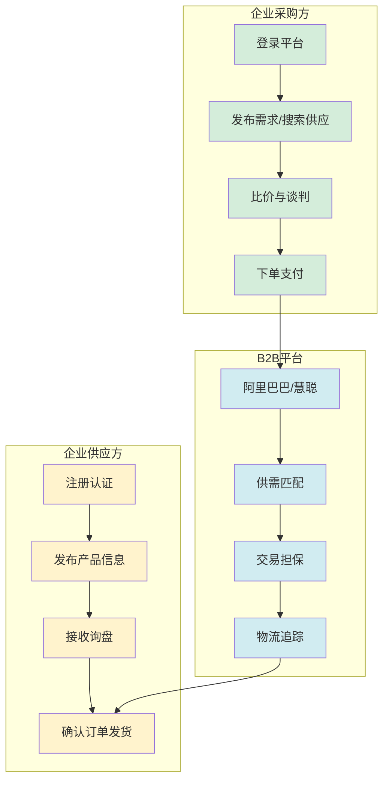
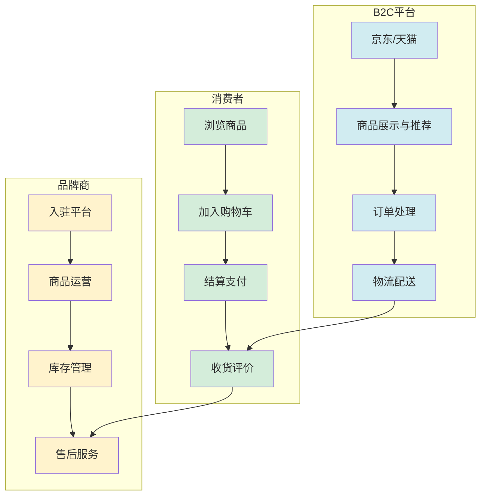
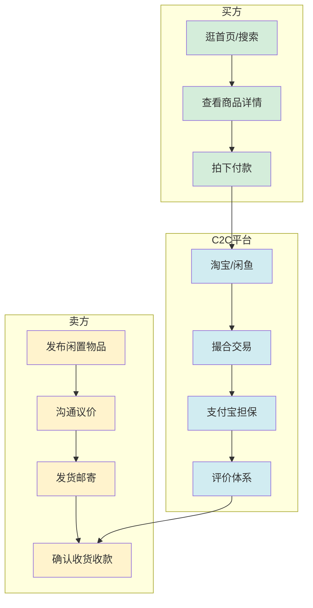
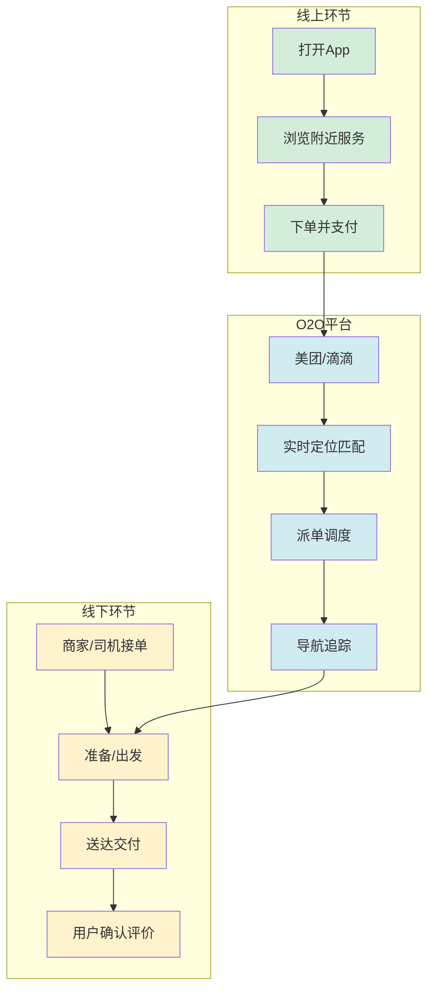

# 2.1 B2B、B2C、C2C、O2O 模式解析

> [!abstract] 本节概述
> 互联网商业模式的基础是**交易主体的变迁**。本节从最基本的四种交易模式——B2B、B2C、C2C、O2O——出发，剖析每种模式的核心逻辑、交易流程与代表企业，帮助读者建立"互联网如何重构交易"的基础认知，为后续平台经济、免费模式等进阶内容奠定基础。

## 一、四种交易模式的定义

> [!definition] B2B（Business to Business）
> **企业对企业**的电子商务模式。交易双方均为企业或组织，通过互联网完成采购、供应、合作等商业活动。核心特征是**交易金额大、决策链条长、关系稳定**。

> [!definition] B2C（Business to Consumer）
> **企业对消费者**的电子商务模式。企业通过互联网直接向终端消费者销售商品或服务。核心特征是**交易金额小、频次高、决策快**。

> [!definition] C2C（Consumer to Consumer）
> **消费者对消费者**的电子商务模式。个人之间通过互联网平台进行商品或服务交易。核心特征是**平台中介、个人卖家、长尾供给**。

> [!definition] O2O（Online to Offline）
> **线上到线下**的电子商务模式。通过线上渠道（App、网站）获取用户，线下完成服务交付。核心特征是**线上获客、线下体验、闭环交易**。

## 二、四种模式的核心逻辑对比

| 维度 | B2B | B2C | C2C | O2O |
| ---- | --- | --- | --- | --- |
| **交易主体** | 企业↔企业 | 企业→消费者 | 消费者↔消费者 | 线上获客→线下交付 |
| **核心价值** | 降低采购成本、提高供应链效率 | 海量选择、便捷购物体验 | 闲置资源流通、个性化供给 | 线上便捷+线下体验 |
| **典型代表** | 阿里巴巴、慧聪网 | 京东、天猫、小米商城 | 淘宝、闲鱼、eBay | 美团、滴滴、饿了么 |
| **客单价** | 高（万元～百万元级） | 中高（百元～千元级） | 低（元～百元级） | 中（十元～百元级） |
| **决策周期** | 长（数周～数月） | 短（分钟～小时） | 短（分钟～小时） | 极短（分钟级） |
| **核心壁垒** | 供应链资源、企业客户关系 | 品牌、物流、流量 | 网络效应、治理能力 | 线下资源、调度能力 |

> [!tip] 四种模式的演进关系
> 从互联网发展历程看，四种模式大致经历了 **B2B（1999年前后）→ B2C（2004年前后）→ C2C（2003年前后）→ O2O（2013年前后）** 的演进。每一种新模式的出现都解决了前一种模式的痛点，同时催生了新的商业机会。

## 三、交易流程图

### 3.1 B2B 交易流程

### 3.2 B2C 交易流程

### 3.3 C2C 交易流程

### 3.4 O2O 交易流程

## 四、中国特色案例分析

### 4.1 B2B：阿里巴巴

> [!example] 阿里巴巴的 B2B 帝国
> 阿里巴巴 1999 年成立，最初以 B2B 业务起家，连接全球买家与中国供应商。其核心模式是：
> - **信息撮合**：提供供需信息发布和搜索服务，收取会员费（诚信通）；
> - **交易闭环**：通过支付宝担保交易，解决跨境交易信任问题；
> - **生态扩展**：从 B2B 延伸至 B2C（天猫）、C2C（淘宝）、云计算（阿里云），形成完整生态。
> 如今阿里巴巴已从单一 B2B 平台演变为涵盖 B2B、B2C、C2C 的综合电商生态。

### 4.2 B2C：京东

> [!example] 京东的自营 B2C 模式
> 京东的核心特色是**自营物流**：
> - 自建仓储和配送体系（211 限时达、极速达），解决了电商最大痛点——物流体验；
> - 以"正品行货、快速配送"为核心价值，定位中高端消费者；
> - 从 3C 数码起家，逐步扩展至全品类；
> - 近年来开放第三方商家入驻（POP 模式），向平台化转型。

### 4.3 C2C：闲鱼

> [!example] 闲鱼的社交化 C2C
> 闲鱼是阿里巴巴旗下的闲置交易平台，代表了 C2C 模式的进化方向：
> - **社交化**：交易双方可见真实身份和主页，降低交易不信任；
> - **场景化**：基于地理位置的"附近闲置"，促进线下交易；
> - **智能化**：AI 估价、智能推荐，提高交易效率；
> - 从"二手交易"扩展至"同城服务""租房"等场景。

### 4.4 O2O：美团外卖

> [!example] 美团外卖的 O2O 闭环
> 美团外卖是中国 O2O 模式的标杆：
> - **线上入口**：App + 小程序，覆盖 1 亿+ 月活用户；
> - **智能调度**：AI 派单系统实时匹配骑手与订单，缩短配送时间；
> - **线下交付**：自建骑手网络，提供 30 分钟达承诺；
> - **生态延伸**：从外卖扩展至到店（美团点评）、酒旅、打车、买菜，形成"本地生活"生态。

## 五、易错点

> [!warning] 易错点
> 1. **B2C ≠ 传统零售**：B2C 是"互联网+零售"，核心变革是**去掉中间商、直接连接品牌与消费者**，而非仅仅是"把商店搬到网上"；
> 2. **C2C ≠ 个人对个人的简单交易**：C2C 平台的价值在于**信任体系**（支付宝担保、评价系统、身份认证），没有平台治理的 C2C 会沦为"柠檬市场"；
> 3. **O2O ≠ 线上交易+线下体验**：O2O 的核心是**移动定位技术和实时调度系统**，没有移动互联网就没有真正的 O2O；
> 4. **四种模式并非泾渭分明**：现实中企业往往同时运营多种模式，如阿里巴巴既有 B2B（1688）、又有 B2C（天猫）、又有 C2C（淘宝）、还有 O2O（饿了么）。

## 六、与其他小节的联系

- 四种交易模式是**平台经济**的基础，见 [[2.2 平台经济、双边市场理论]]；
- O2O 模式是**免费模式**的重要应用场景，见 [[2.3 免费模式、流量变现机制]]；
- 京东的 PLUS 会员、美团的红包是**订阅经济**的雏形，见 [[2.4 订阅经济、社群商业模式]]；
- 拼多多的 C2M 模式、抖音的兴趣电商是四种模式的创新融合，见 [[2.5 互联网商业模式案例分析]]。

## 章节导航

- 上一级：[[MOC - 第2章]]
- 下一节：[[2.2 平台经济、双边市场理论]]
- 习题：[[MOC - 第2章习题]]