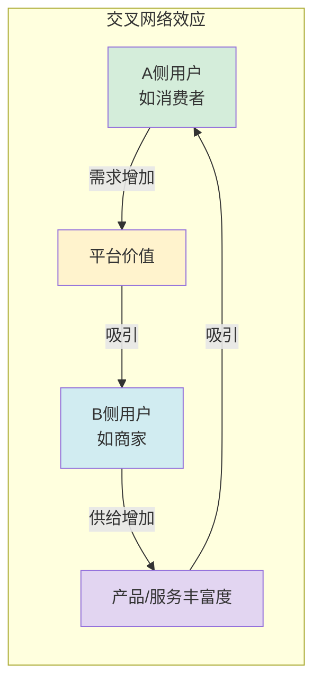
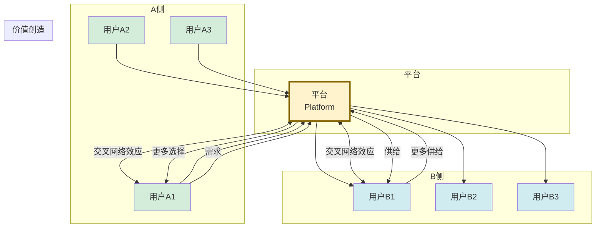

# 2.2 平台经济、双边市场理论

> [!abstract] 本节概述
> 如果说交易模式是互联网商业模式的"细胞"，那么平台经济就是"器官"。本节深入解析**双边市场理论**——平台经济的核心经济学基础，阐述交叉网络效应的运作机制、平台治理的核心挑战与策略，并以滴滴、Airbnb、淘宝为案例，揭示"平台为何赢者通吃"的底层逻辑。

## 一、什么是平台经济

> [!definition] 平台经济（Platform Economy）
> 平台经济是由**平台**作为交易中介，连接两个或多个不同类型的用户群体（如买家与卖家、乘客与司机），通过促进交易或互动创造价值的经济模式。平台本身不生产产品或服务，而是提供**连接与匹配**的基础设施。

> [!note] 平台经济的崛起
> 平台经济是 Web2.0 时代的标志性商业模式。根据哈佛大学商学院教授 Geoffrey Parker 的研究，全球最大的 100 家公司中有 76 家的收入来自平台经济。苹果的 App Store、谷歌的 Android、阿里巴巴的淘宝、腾讯的微信都是典型的平台。

## 二、双边市场的核心理论

### 2.1 双边市场定义

> [!definition] 双边市场（Two-sided Market）
> 双边市场是指有两个不同的用户群体通过**平台**进行交互，且**一方用户的数量/质量会影响另一方用户的价值**的市场结构。这两个群体通常被称为"买方"和"卖方"，但在平台经济中更准确的说法是"用户 A 侧"和"用户 B 侧"。

> [!example] 典型的双边市场
> | 平台 | A 侧用户 | B 侧用户 | 价值连接 |
> | ---- | -------- | -------- | -------- |
> | 淘宝 | 消费者 | 商家 | 消费者越多→商家越愿意入驻→商品越丰富→吸引更多消费者 |
> | 滴滴 | 乘客 | 司机 | 乘客越多→司机越愿意接单→等待时间越短→吸引更多乘客 |
> | Airbnb | 房客 | 房东 | 房客越多→房东越愿意出租→房源越丰富→吸引更多房客 |
> | 微信 | 用户 | 公众号/小程序开发者 | 用户越多→开发者越愿意入驻→功能越丰富→用户越多 |
> | 抖音 | 观众 | 内容创作者 | 观众越多→创作者越愿意生产→内容越精彩→吸引更多观众 |

### 2.2 交叉网络效应

> [!definition] 交叉网络效应（Cross-side Network Effect）
> 交叉网络效应是双边市场的核心动力：**A 侧用户数量增加会提升 B 侧用户的价值，反之亦然**。这种正反馈循环一旦启动，就会形成"赢家通吃"的市场格局。

> [!tip] 网络效应的两种类型
> - **同边网络效应**：同一侧用户之间的影响。如微信用户越多，每个用户的社交价值越大（同边正反馈）；
> - **跨边网络效应**：不同侧用户之间的影响。如淘宝消费者越多，商家越愿意入驻（跨边正反馈）。
> 平台经济的核心是**跨边网络效应**，而同边网络效应往往出现在社交媒体等单边市场。

### 2.3 双边市场的三大特征

> [!info] 双边市场的经济学特征
> 1. **需求互补性**：两侧用户的需求是互补的，没有 A 侧，B 侧的价值就不存在，反之亦然；
> 2. **价格非中性**：平台对一侧的定价会影响另一侧的需求。例如淘宝对消费者免费，对商家收费，这种倾斜定价是双边市场的常见策略；
> 3. **网络外部性**：一侧用户规模越大，另一侧用户获得的价值越高，且这种价值增加是**指数级**的（梅特卡夫定律）。

## 三、平台治理的核心挑战

> [!warning] 平台治理的三大核心问题
> 平台经济并非"建个平台就万事大吉"，它面临三大核心治理挑战：

### 3.1 质量保障

> [!example] 质量保障挑战
> 平台上的产品/服务质量参差不齐，直接影响用户体验和信任。
> - **淘宝**：建立"皇冠信用"评价体系、商家保证金、消费者保障服务；
> - **Airbnb**：引入双向评价系统、Superhost 认证、专业摄影服务；
> - **美团**：商家评分、骑手评分、AI 图像识别保障食品安全。

### 3.2 负外部性

> [!example] 负外部性挑战
> 平台的网络效应可能带来负面影响：
> - **滴滴**：乘客越多，司机为了接单可能出现疲劳驾驶、违规竞争，带来安全隐患；
> - **抖音**：用户越多，内容同质化、低俗化问题越严重，算法"信息茧房"加剧；
> - **淘宝**：商家过多导致"劣币驱逐良币"，假货问题一度非常严重。

### 3.3 生态激励

> [!example] 生态激励挑战
> 平台需要持续激励两侧用户参与：
> - **淘宝**：商家扶持计划（直通车、钻展等营销工具）、新商家补贴；
> - **微信**：公众号/小程序开发者激励计划、流量分成；
> - **抖音**：创作者激励计划、直播分成、电商佣金。

## 四、平台经济结构图

## 五、典型案例分析

### 5.1 滴滴：出行平台

> [!example] 滴滴的双边市场运作
> 滴滴连接乘客（A 侧）和司机（B 侧），核心是**实时调度算法**：
> - **冷启动**：早期通过补贴同时激励乘客（优惠券）和司机（现金奖励），快速启动双边网络效应；
> - **定价策略**：对乘客动态定价（高峰溢价），对司机阶梯奖励（时段补贴），实现两侧最优匹配；
> - **治理体系**：人脸识别、行程分享、一键报警保障安全；司机评分、乘客评价保障质量；
> - **生态扩展**：从快车→专车→代驾→共享单车→外卖，构建"出行平台"生态。

### 5.2 Airbnb：住宿平台

> [!example] Airbnb 的全球双边市场
> Airbnb 连接房客（A 侧）和房东（B 侧），核心是**信任体系和文化体验**：
> - **信任机制**：双向评价、身份验证、房东 Superhost 认证、Airbnb 保障计划（最高 100 万美元）；
> - **文化赋能**：鼓励房东提供"本地化体验"（如烹饪课、城市漫步），创造差异化价值；
> - **全球化**：本土化运营（中国市场与携程合作），国际化产品（多语言、多货币）；
> - **价值创造**：房东获得额外收入，房客获得独特体验，Airbnb 收取 3% 服务费。

### 5.3 淘宝：电商平台

> [!example] 淘宝的超级双边市场
> 淘宝是中国最大的 C2C/B2C 混合平台，连接消费者（A 侧）和商家（B 侧）：
> - **网络效应**：消费者 8 亿+，商家 1000 万+，形成极强的跨边网络效应；
> - **治理体系**：支付宝担保交易、评价体系、天猫品质背书、消费者保障；
> - **生态系统**：从交易平台延伸至阿里云（技术）、菜鸟（物流）、支付宝（金融）、UC 浏览器（流量），形成完整生态；
> - **数据价值**：通过大数据分析消费行为，赋能商家精准运营（如生意参谋、钻展）。

## 六、易错点

> [!warning] 易错点
> 1. **双边市场 ≠ 单边市场**：社交媒体（如微信）是单边市场（所有用户都是同一角色），而平台经济是双边市场（两侧用户角色不同）。但有些平台兼具两种属性（如抖音既有观众-创作者的双边市场，又有用户-用户的社交属性）；
> 2. **网络效应 ≠ 规模经济**：传统规模经济是"成本随规模下降"，网络效应是"价值随规模上升"。谷歌的搜索广告业务同时具有规模经济（数据越多算法越好）和网络效应（用户越多广告主越愿意投放）；
> 3. **平台不只是"中介"**：平台的价值远不止撮合交易，更在于**规则制定**和**生态治理**。淘宝制定了"七天无理由退货"规则，滴滴制定了"高峰溢价"规则，这些规则本身就是平台的核心竞争力；
> 4. **赢者通吃 ≠ 垄断**：平台经济的"赢者通吃"是网络效应的自然结果，但并不意味着垄断。新平台可以通过**差异化定位**切入市场（如拼多多用下沉市场切入，抖音用内容电商切入）。

## 七、与其他小节的联系

- 平台经济的**免费定价策略**（对一侧免费）见 [[2.3 免费模式、流量变现机制]]；
- Airbnb 的订阅式房东服务、淘宝的"88VIP"会员是**订阅经济**的应用，见 [[2.4 订阅经济、社群商业模式]]；
- 平台经济的完整商业模式画布分析见 [[2.5 互联网商业模式案例分析]]。

## 章节导航

- 上一级：[[MOC - 第2章]]
- 下一节：[[2.3 免费模式、流量变现机制]]
- 习题：[[MOC - 第2章习题]]