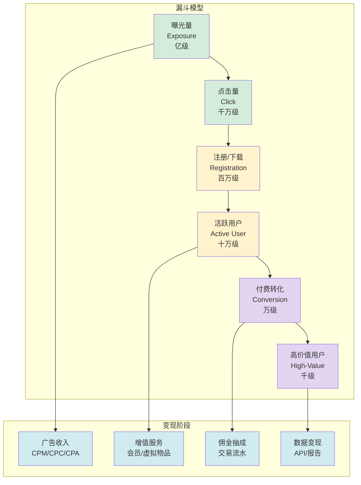
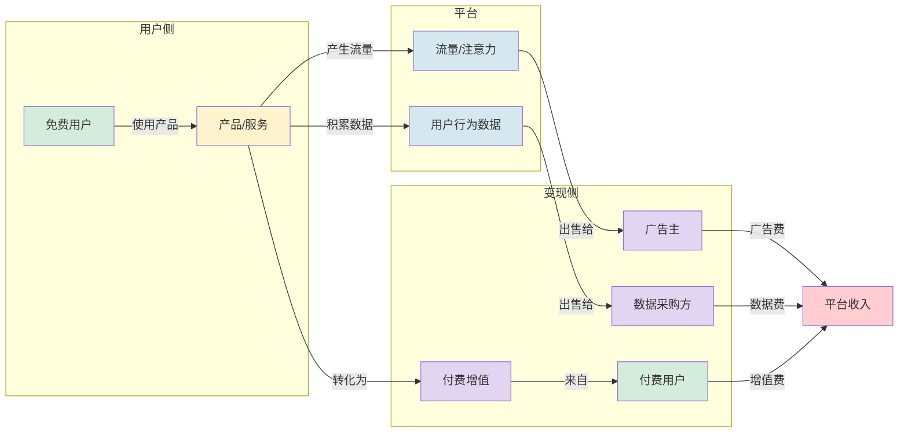

# 2.3 免费模式、流量变现机制

> [!abstract] 本节概述
> "免费"是互联网最迷人也最令人困惑的现象。本节揭示免费模式的本质——它不是慈善，而是一种**聪明的商业策略**：通过零价格获取用户注意力，再通过多元路径实现变现。我们将探讨免费模式的四种变现路径、分析经典的漏斗模型，并以百度、腾讯、字节跳动为案例，剖析"免费如何赚到钱"的底层逻辑。

## 一、免费模式的本质

> [!definition] 免费模式（Free Model）
> 免费模式是指企业以**零或极低价格**向用户提供产品或服务，通过其他方式实现收入的商业模式。它的本质是**用"免费"降低用户门槛，用"规模"创造变现可能**。

> [!note] 克里斯·安德森的"免费经济学"
> 克里斯·安德森（Chris Anderson）在《免费：商业的未来》一书中指出：互联网时代的"免费"与传统经济的"免费"有本质区别。传统免费是"交叉补贴"（如剃须刀免费、刀片收费），而互联网免费是"**注意力经济**"——用户的注意力本身就是最珍贵的资源，可以被打包出售给广告主或转化为付费服务。

### 1.1 免费模式的四种类型

| 类型 | 含义 | 核心逻辑 | 典型代表 |
| ---- | ---- | -------- | -------- |
| **交叉补贴** | 免费提供基础产品，付费购买耗材或升级 | 锁定用户后通过关联产品盈利 | 吉列剃须刀+刀片、打印机+墨盒 |
| **第三方付费** | 用户免费使用，广告主付费 | 把用户注意力卖给广告主 | 百度搜索、腾讯视频、抖音 |
| **免费增值** | 基础功能免费，高级功能付费 | 用免费获取用户，用增值服务变现 | Dropbox（2GB免费+付费扩容）、Notion |
| **双边补贴** | 对一侧用户免费/补贴，向另一侧收费 | 启动双边市场网络效应 | 滴滴补贴乘客、美团补贴商家 |

> [!tip] 四种类型的关系
> 这四种免费类型并非孤立，而是经常组合使用。例如腾讯视频同时使用：第三方付费（广告）+ 免费增值（VIP会员）+ 交叉补贴（付费内容）。

## 二、流量变现机制

### 2.1 从流量到收入的漏斗

### 2.2 四种变现路径详解

> [!definition] 广告变现
> 通过展示广告、搜索广告、信息流广告等形式，将用户的注意力（浏览、点击、转化）打包出售给广告主。这是最古老也最主流的免费变现方式。
> - **CPM（Cost Per Mille）**：每千次展示成本，适合品牌广告；
> - **CPC（Cost Per Click）**：每次点击成本，适合效果广告；
> - **CPA（Cost Per Action）**：每次行动（注册/购买）成本，适合精准营销。

> [!definition] 增值服务变现
> 基础功能免费，高级功能或虚拟物品收费。这是 Freemium 模式的核心。
> - **会员订阅**：腾讯视频 VIP、爱奇艺黄金会员、B站大会员；
> - **虚拟物品**：QQ 秀、王者荣耀皮肤、抖音打赏；
> - **功能升级**：WPS 会员、百度网盘超级会员。

> [!definition] 佣金抽成变现
> 平台从交易流水中抽取一定比例作为服务费用。这是电商和 O2O 平台的核心变现方式。
> - **淘宝/天猫**：技术服务费（2-5%）+ 佣金；
> - **美团**：从每笔订单中抽取 20-30% 的佣金；
> - **滴滴**：从每单车费中抽取 25-35%。

> [!definition] 数据变现
> 将积累的用户行为数据经过脱敏和分析后，以 API、报告、模型等形式出售给第三方。这是大数据时代的新兴变现方式。
> - **百度**：百度统计、百度指数；
> - **阿里**：阿里指数、数据银行；
> - **抖音**：巨量算数、巨量引擎。

## 三、免费模式的运作机制图

## 四、典型案例分析

### 4.1 百度：搜索免费，广告变现

> [!example] 百度的"竞价排名"模式
> 百度是中国最大的搜索引擎，核心商业模式是**"搜索免费+竞价排名广告"**：
> - 用户免费使用搜索服务，百度积累海量搜索数据；
> - 广告主通过"竞价排名"购买关键词，按点击付费（CPC）；
> - 百度收入 = 搜索流量 × 广告点击率 × 单次点击价格；
> - 此外还有百度联盟（展示广告）、百度地图（LBS 广告）、百度网盘（增值服务）等多元变现。

### 4.2 腾讯：社交免费，生态变现

> [!example] 腾讯的"连接一切"生态
> 腾讯是中国最大的社交和游戏公司，核心商业模式是**"社交免费+生态变现"**：
> - **微信**：10 亿+ 月活用户，免费使用。变现方式：微信支付（手续费）、公众号/小程序（生态佣金）、朋友圈广告、视频号打赏；
> - **QQ**：早期通过 QQ 秀（虚拟物品）、QQ 会员（增值服务）变现；
> - **游戏**：腾讯游戏是全球最大的游戏公司（王者荣耀、和平精英、英雄联盟），游戏收入占腾讯总营收的 50%+；
> - **投资**：腾讯投资了 800+ 公司（京东、拼多多、B站、美团等），形成"投资生态"。

### 4.3 字节跳动：内容免费，智能变现

> [!example] 字节跳动的"算法+内容"变现
> 字节跳动是全球增长最快的互联网公司，核心商业模式是**"内容免费+算法分发+广告变现"**：
> - **今日头条**：基于算法的资讯 App，用户免费阅读，信息流广告变现；
> - **抖音**：短视频 App，用户免费观看，信息流广告+直播打赏+电商佣金变现；
> - **TikTok**：抖音海外版，同样的模式复制到全球市场；
> - 字节跳动的核心优势是**算法推荐技术**——越懂用户，广告精准度越高，广告单价越高。

## 五、免费模式的风险与陷阱

> [!warning] 免费模式的四大陷阱
> 1. **变现不及时导致资金链断裂**：免费模式需要大量烧钱获取用户，如果不能及时建立变现渠道，可能导致资金枯竭。历史上很多"烧钱"的互联网公司（如 ofo、WeWork）都因变现不及时而失败；
> 2. **用户质量低导致变现效率差**：免费用户的付费意愿通常较低，如何筛选高价值用户并转化是关键难题；
> 3. **补贴依赖症**：过度依赖补贴获取用户，一旦停止补贴用户就流失，无法建立真正的用户粘性；
> 4. **监管风险**：免费模式中的"大数据杀熟""算法歧视""隐私侵犯"等问题越来越受到监管关注。

> [!info] 成功的免费模式三要素
> 1. **强大的产品价值**：免费产品本身必须足够好用，能真正解决用户痛点；
> 2. **清晰的变现路径**：在获取用户之前就想清楚如何赚钱，不能"先烧钱再说"；
> 3. **规模效应**：免费模式的变现效率与用户规模正相关，需要达到一定的用户量级才能实现盈利。

## 六、易错点

> [!warning] 易错点
> 1. **免费 ≠ 无成本**：用户看似免费使用，但实际上支付了**注意力**（被广告打扰）和**数据**（行为被收集）。互联网时代的"免费"本质是"用注意力/数据作为货币"；
> 2. **广告变现 ≠ 低俗**：现代广告越来越精准，信息流广告、原生广告等形式尽可能降低对用户体验的干扰。关键在于**广告技术**（推荐算法）和**广告密度**；
> 3. **增值服务 ≠ 涨价**：好的 Freemium 模式中，免费版和付费版的差异应该是"功能层级"而非"体验层级"——免费版体验不能太差，否则用户根本不会留下来看付费版；
> 4. **双边补贴 ≠ 永久补贴**：补贴是双边市场冷启动的策略，不是常态。当网络效应形成后，应逐步减少补贴，依靠生态自增长。

## 七、与其他小节的联系

- 免费模式中的**双边补贴**是双边市场启动的核心策略，见 [[2.2 平台经济、双边市场理论]]；
- 免费增值（Freemium）是**订阅经济**的基础，见 [[2.4 订阅经济、社群商业模式]]；
- 字节跳动的综合商业模式分析见 [[2.5 互联网商业模式案例分析]]。

## 章节导航

- 上一级：[[MOC - 第2章]]
- 下一节：[[2.4 订阅经济、社群商业模式]]
- 习题：[[MOC - 第2章习题]]