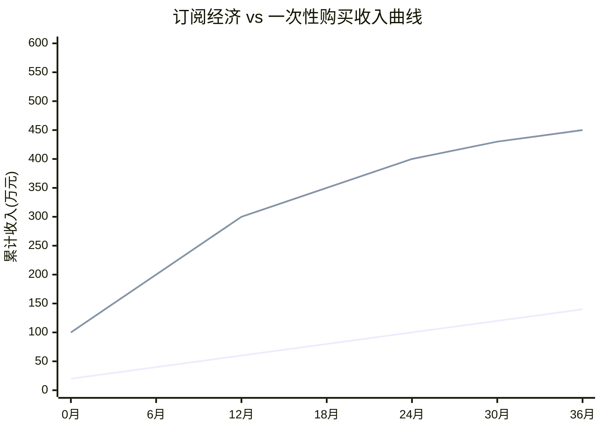
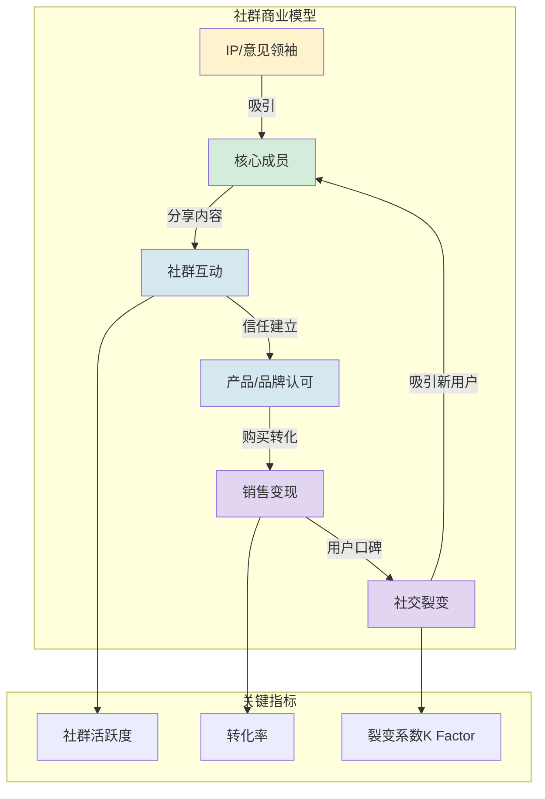

# 2.4 订阅经济、社群商业模式

> [!abstract] 本节概述
> 从"一次性交易"到"长期连接"是互联网商业模式的重要升级。本节聚焦**订阅经济**（用持续服务锁定用户）和**社群商业**（用信任与认同构建生态）两种进阶模式，探讨它们的核心运作机制、关键指标与适用场景，并以 Netflix、得到、元气森林为案例，揭示"长期主义"如何转化为商业价值。

## 一、订阅经济

### 1.1 什么是订阅经济

> [!definition] 订阅经济（Subscription Economy）
> 订阅经济是指用户通过**定期付费**（按月、按年）获得产品或服务的使用权，而非一次性购买所有权的商业模式。它的核心是**从"交易关系"转向"服务关系"**，企业持续为用户创造价值，用户持续为价值付费。

> [!note] 订阅经济的崛起
> 根据 SaaS 公司 Zuora 的研究，全球订阅经济年增长率约为 **18%**，是传统商品经济增速的 3 倍。这一趋势的背后是：
> - 消费者从"拥有"转向"使用"的观念变化；
> - 云计算和移动互联网使"按需计费"成为可能；
> - 产品更新迭代加快，用户不想拥有过时的产品。

### 1.2 订阅经济的核心指标

> [!info] 订阅经济的关键指标
> | 指标 | 含义 | 重要性 |
> | ---- | ---- | ------ |
> | **MRR（月度经常性收入）** | 每月来自订阅用户的稳定收入 | 衡量业务健康度的核心 |
> | **ARR（年度经常性收入）** | MRR × 12，年化的经常性收入 | 衡量业务规模的核心 |
> | **Churn Rate（流失率）** | 每月取消订阅的用户比例 | 越低越好，理想 <5% |
> | **LTV（客户生命周期价值）** | 单个用户在订阅周期内贡献的总收入 | 衡量用户长期价值 |
> | **CAC（获客成本）** | 获取一个新用户的平均成本 | CAC < LTV 的 1/3 为健康 |
> | **NPS（净推荐值）** | 用户推荐意愿的指标 | >50 为优秀 |

### 1.3 订阅经济收入曲线

> [!tip] 订阅经济的收入特征
> 从上图可以看出：
> - **一次性购买**（虚线）：前期收入高，但增长停滞；
> - **订阅经济**（实线）：前期收入低，但持续增长，长期来看会超过一次性购买；
> - 关键是**降低流失率**——用户留存时间越长，LTV 越高。

### 1.4 订阅经济的四种类型

| 类型 | 含义 | 典型代表 |
| ---- | ---- | -------- |
| **SaaS 订阅** | 软件即服务，按年/月付费使用 | Adobe Creative Cloud、飞书文档、Notion |
| **内容订阅** | 按月/年付费获取内容访问权 | Netflix、爱奇艺黄金会员、得到会员 |
| **商品订阅** | 定期收到实物商品 | Dollar Shave Club（剃须刀）、青桔单车月卡 |
| **服务订阅** | 定期获得某种服务 | 京东 PLUS 会员、美团外卖会员、Apple One |

## 二、社群商业模式

### 2.1 什么是社群商业

> [!definition] 社群商业（Community-based Business）
> 社群商业是指以**社群**为载体，通过构建用户之间的社交关系、信任和身份认同，实现产品销售、品牌传播和用户留存的商业模式。它的核心是**"信任背书"和"社交裂变"**。

> [!note] 社群商业的兴起
> 社群商业是 Web2.0 用户生成内容和社交关系链的延伸。在中国，微信生态（公众号+微信群+小程序）为社群商业提供了天然的土壤。根据腾讯的研究，社群商业的获客成本比传统电商低 **60%**，复购率高 **30%**。

### 2.2 社群商业的核心要素

> [!info] 社群商业的四大要素
> 1. **IP/意见领袖**：社群的核心凝聚力，通常是创始人、行业专家或 KOL；
> 2. **共同话题/价值观**：吸引用户加入社群的理由，如育儿、健身、投资等；
> 3. **高频互动**：保持社群活跃度，包括讨论、分享、活动等；
> 4. **信任背书**：通过真实的产品体验和口碑传播建立信任。

### 2.3 社群商业的运作模型

## 三、订阅经济 vs 社群商业

| 维度 | 订阅经济 | 社群商业 |
| ---- | -------- | -------- |
| **核心价值** | 持续服务价值 | 信任与身份认同 |
| **收入模式** | 定期订阅费 | 产品销售+会员费 |
| **用户关系** | 企业→用户（服务关系） | 用户↔用户（社交关系） |
| **核心指标** | 流失率、LTV、MRR | 活跃度、转化率、裂变系数 |
| **获客方式** | 营销投放、口碑传播 | 社交裂变、邀请制 |
| **适用场景** | 标准化服务（内容、软件） | 个性化产品、高客单价 |
| **代表企业** | Netflix、Adobe、得到 | 元气森林、完美日记、樊登读书 |

> [!tip] 两者的融合趋势
> 越来越多的企业同时使用订阅经济和社群商业：
> - **得到**：订阅内容（年度会员）+ 社群讨论（学习社群）；
> - **樊登读书**：订阅内容 + 线下读书会；
> - **元气森林**：产品销售 + 用户社群（"元气森林"官方社区让用户参与新品研发）。

## 四、典型案例分析

### 4.1 Netflix：内容订阅的标杆

> [!example] Netflix 的订阅帝国
> Netflix 是全球最大的流媒体平台，订阅经济的标杆：
> - **模式**：用户按月付费（7.99-15.99 美元），无广告观看内容；
> - **内容策略**：重金投入自制内容（《纸牌屋》《黑镜》），形成内容壁垒；
> - **数据驱动**：基于用户观看数据推荐内容、指导内容投资；
> - **全球化**：覆盖 190+ 国家，2.2 亿+ 订阅用户；
> - **关键指标**：流失率仅 3-4%，LTV 约 500-800 美元。

### 4.2 得到：知识订阅的创新

> [!example] 得到的知识付费订阅
> 得到（原"得到 App"）是中国最大的知识付费平台之一：
> - **模式**：年度会员 199 元，获取 5000+ 课程的阅读权限；
> - **内容体系**：从经济学、管理学等到个人成长、人工智能，覆盖各领域；
> - **社群运营**：每个课程都有学习社群，用户讨论、打卡、分享；
> - **IP 孵化**：罗辑思维、薛兆丰经济学、刘润商业评论等知名 IP；
> - **关键指标**：注册用户 5000 万+，付费用户 1000 万+，续费率约 60%。

### 4.3 元气森林：社群商业的标杆

> [!example] 元气森林的社群营销
> 元气森林是中国新兴的无糖气泡水品牌，用社群商业快速崛起：
> - **冷启动**：通过微信公众号、小红书、抖音等平台吸引"无糖饮料爱好者"；
> - **社群运营**：建立官方用户社群，让用户参与新品口味投票、设计包装；
> - **社交裂变**：用户分享产品到社交平台获得奖励（优惠券、周边）；
> - **口碑传播**：依靠"0 糖 0 脂 0 卡"的精准定位和用户口碑，3 年做到 50 亿营收；
> - **私域流量**：通过小程序和企业微信运营私域用户，复购率达 40%+。

## 五、订阅经济与社群商业的结合

### 5.1 会员制：两者的融合形态

> [!info] 会员制是订阅经济和社群商业的融合
> 会员制同时具备订阅经济（定期付费）和社群商业（专属权益、身份认同）的特征：
> - **京东 PLUS**：年费 149 元→购物折扣+运费券+专属客服+读书/影音会员；
> - **淘宝 88VIP**：淘气值 1000+ 可开通→天猫 9.5 折+品牌专享+阿里系全家桶；
> - **爱奇艺 VIP**：年费 198 元→免广告+高清画质+多设备登录+会员专属内容。

### 5.2 私域流量：社群商业的核心资产

> [!definition] 私域流量（Private Domain Traffic）
> 私域流量是指品牌可以**免费、自由、反复利用**的用户流量，如微信群、企业微信、公众号粉丝、小程序用户等。与之相对的"公域流量"是指需要付费购买的流量（如淘宝直通车、百度竞价、抖音信息流）。

> [!tip] 私域流量的价值
> - **低成本**：免费触达用户，无需为每次曝光付费；
> - **高粘性**：与用户建立长期关系，信任度高；
> - **可运营**：可以通过内容、活动、服务等方式持续激活用户；
> - **可裂变**：用户自然传播，带来新用户。

## 六、易错点

> [!warning] 易错点
> 1. **订阅经济 ≠ 降价**：订阅经济不是靠低价吸引用户，而是靠**持续的价值交付**让用户愿意长期付费。Netflix 的定价并不低，但用户愿意为无广告、高质量内容持续付费；
> 2. **社群 ≠ 微信群**：微信群只是社群的一种载体，社群的核心是**共同的价值观和信任关系**。没有共同话题和价值的微信群很快会变成"僵尸群"；
> 3. **社群商业 ≠ 传销**：社群商业的本质是**产品和服务的价值交换**，而传销是靠"拉人头"的金字塔结构。合法的社群商业必须有真实的产品/服务；
> 4. **私域流量 ≠ 一次性流量**：私域流量的核心是"运营"——持续提供价值、保持互动、建立信任，而不是一次性推销产品。

## 七、与其他小节的联系

- 订阅经济是**免费增值模式**的延伸，见 [[2.3 免费模式、流量变现机制]]；
- 社群商业中的"双边关系"是**双边市场**的具体应用，见 [[2.2 平台经济、双边市场理论]]；
- 元气森林的完整商业模式画布分析见 [[2.5 互联网商业模式案例分析]]。

## 章节导航

- 上一级：[[MOC - 第2章]]
- 下一节：[[2.5 互联网商业模式案例分析]]
- 习题：[[MOC - 第2章习题]]