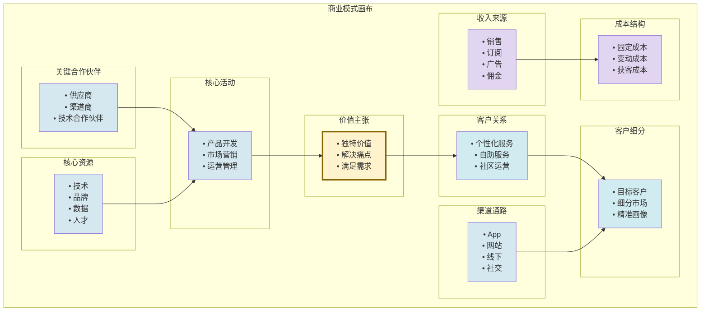

# 2.5 互联网商业模式案例分析

> [!abstract] 本节概述
> 本节将前四节的理论融会贯通，以**拼多多**和**抖音**两个具有代表性的中国互联网企业为对象，运用**商业模式画布**工具进行深度拆解，揭示其核心壁垒与创新逻辑，并讨论互联网商业模式的设计方法与评估框架。

## 一、商业模式画布

### 1.1 什么是商业模式画布

> [!definition] 商业模式画布（Business Model Canvas）
> 商业模式画布是由瑞士商业模型家 **Alexander Osterwalder** 开发的可视化工具，用一张图描述企业的完整商业模式。它包含**九大要素**，覆盖了从价值创造到价值获取的全过程。

### 1.2 九大要素详解

> [!info] 商业模式画布九大要素
> | 要素 | 含义 | 核心问题 |
> | ---- | ---- | -------- |
> | **客户细分** | 企业服务的目标客户群体 | 为谁创造价值？ |
> | **价值主张** | 为客户提供的独特价值 | 创造了什么价值？ |
> | **渠道通路** | 接触客户的方式 | 如何传递价值？ |
> | **客户关系** | 与客户建立和维护的关系 | 如何保持关系？ |
> | **收入来源** | 从客户获取收入的方式 | 如何获取价值？ |
> | **核心资源** | 实现商业模式所需的关键资源 | 需要什么资源？ |
> | **关键活动** | 实现价值主张需要做的关键活动 | 需要做什么？ |
> | **关键合作伙伴** | 外部合作方网络 | 谁是合作伙伴？ |
> | **成本结构** | 所有需要付出的成本 | 成本是什么？ |

### 1.3 商业模式画布图

## 二、拼多多案例分析

### 2.1 拼多多的商业模式画布

> [!example] 拼多多商业模式画布

| 要素 | 拼多多的具体做法 |
| ---- | --------------- |
| **客户细分** | 下沉市场用户（三四线城市、农村）、对价格敏感的消费者、喜欢社交购物的用户 |
| **价值主张** | "多实惠、多乐趣"——极致低价+社交乐趣，满足下沉市场用户的性价比需求 |
| **渠道通路** | 微信小程序（零安装门槛）、App、社交分享链接、线下推广 |
| **客户关系** | 社交关系链（好友拼团）、游戏化运营（种树、浇水、砍价）、下沉运营团队 |
| **收入来源** | 交易佣金（0.6%）、营销服务费（商家推广）、在线广告 |
| **核心资源** | 微信生态流量、下沉运营团队、大数据算法、品牌认知 |
| **关键活动** | 商品选品与品控、商家招商与管理、用户运营与增长、基础设施建设 |
| **关键合作伙伴** | 微信（流量入口）、品牌方与工厂、物流服务商、支付机构 |
| **成本结构** | 获客成本（下沉市场补贴）、运营成本（地推团队）、技术研发、合规成本 |

### 2.2 拼多多的核心创新

> [!info] 拼多多的三大创新
> 1. **社交电商模式**：利用微信社交关系链实现"病毒式传播"，用户通过"拼团"实现低价购物，同时成为免费的推广渠道；
> 2. **C2M 模式**：直接对接制造商（Customer to Manufacturer），省去中间环节，实现极致低价。拼多多的"新品牌计划"让工厂直接为消费者生产定制产品；
> 3. **下沉市场深耕**：深入三四线城市和农村，通过"百亿补贴"建立正品心智，通过"多实惠、多乐趣"的定位占领用户心智。

### 2.3 拼多多的核心壁垒

> [!warning] 拼多多的风险与挑战
> 1. **品控问题**：低价模式导致假货和次品问题一度非常严重，"砍一刀"的广告也饱受争议；
> 2. **增长天花板**：下沉市场用户规模有限，正在向一二线城市渗透（百亿补贴），但面临京东、天猫的激烈竞争；
> 3. **监管风险**：社交媒体的过度营销（如"砍一刀"的强制分享）受到监管关注；
> 4. **盈利模式**：低佣金率（0.6%）和高获客成本（百亿补贴）导致盈利能力面临挑战。

## 三、抖音案例分析

### 3.1 抖音的商业模式画布

> [!example] 抖音商业模式画布

| 要素 | 抖音的具体做法 |
| ---- | ------------- |
| **客户细分** | 内容消费者（全年龄段）、内容创作者（个人/机构）、广告主（品牌/效果广告）、电商商家 |
| **价值主张** | "记录美好生活"——基于算法的个性化短视频/直播内容，同时承载娱乐、社交、电商功能 |
| **渠道通路** | App、抖音极速版、网页版、小程序、电视端（抖音TV） |
| **客户关系** | 算法推荐（AI 个性化）、关注/私信（社交关系）、创作者激励、直播互动 |
| **收入来源** | 信息流广告（主要）、直播打赏/礼物、电商佣金（GMV 抽成）、会员订阅 |
| **核心资源** | 算法推荐技术、海量内容库、品牌影响力、全球用户基础 |
| **关键活动** | 内容审核与推荐、广告销售与投放、创作者运营、电商生态建设、全球化拓展 |
| **关键合作伙伴** | 创作者/MCN、广告代理、品牌方、支付机构、监管部门 |
| **成本结构** | 内容审核（人工+AI）、服务器与带宽、创作者激励、全球化运营、合规成本 |

### 3.2 抖音的核心创新

> [!info] 抖音的四大创新
> 1. **算法推荐驱动**：基于深度学习的推荐算法，实现"千人千面"的内容分发，用户停留时间远超传统内容平台；
> 2. **内容+电商融合**：从"内容消费"到"内容种草"到"直播带货"，形成"内容即流量、流量即交易"的闭环；
> 3. **全球化复制**：抖音模式成功复制到海外（TikTok），覆盖 150+ 国家，是少数成功出海的中国互联网产品；
> 4. **创作者生态**：通过创作者激励计划、直播分成、电商佣金等方式，吸引 5000 万+ 创作者入驻，形成内容供给生态。

### 3.3 抖音的核心壁垒

> [!warning] 抖音的风险与挑战
> 1. **监管风险**：内容审核、青少年沉迷、算法"信息茧房"等问题受到国内外监管关注；
> 2. **竞争加剧**：快手、视频号、B 站等平台的竞争，以及用户时长的天花板；
> 3. **商业化边界**：广告过多影响用户体验，电商业务与品牌方的利益平衡；
> 4. **地缘政治**：TikTok 面临的国际政治风险（美国、印度等市场的监管限制）。

## 四、两大模式对比与启示

### 4.1 拼多多 vs 抖音商业模式对比

| 维度 | 拼多多 | 抖音 |
| ---- | ------ | ---- |
| **核心模式** | 社交电商（C2C/C2M） | 内容电商（内容+社交+交易） |
| **流量来源** | 微信社交关系链 | 算法推荐的信息流 |
| **价值主张** | 极致低价 | 娱乐+种草+交易 |
| **变现方式** | 交易佣金+营销服务费 | 信息流广告+直播打赏+电商佣金 |
| **核心壁垒** | 下沉市场运营能力、微信生态 | 算法技术、内容生态、全球化 |
| **用户画像** | 下沉市场为主，价格敏感 | 全年龄段，追求品质与娱乐 |
| **国际化** | 拓速较慢（ Temu 为跨境电商） | TikTok 成功全球化 |

### 4.2 互联网商业模式设计方法论

> [!tip] 设计互联网商业模式的五个步骤
> 1. **定义客户痛点**：通过用户调研（访谈、问卷、数据分析）找到真实、刚性的痛点；
> 2. **选择商业模式类型**：根据痛点选择合适的商业模式（B2B/B2C/C2C/O2O/平台/订阅/社群等）；
> 3. **验证价值主张**：用 MVP（最小可行产品）验证价值主张是否成立，用户是否愿意为之付费；
> 4. **设计增长引擎**：确定获客渠道、转化路径、留存机制，形成"获客→转化→留存→传播"的增长闭环；
> 5. **规划变现路径**：在用户增长的同时设计清晰的变现路径，避免"烧钱无以为继"。

### 4.3 商业模式评估框架

> [!info] 评估互联网商业模式的五大维度
> | 维度 | 核心问题 | 关键指标 |
> | ---- | -------- | -------- |
| **价值性** | 是否创造了真实的用户价值？ | NPS、用户满意度、留存率 |
| **可行性** | 是否具备实现的资源和能力？ | 团队能力、资金实力、技术储备 |
| **增长性** | 是否具备规模化增长的潜力？ | 市场规模、获客成本、网络效应 |
| **盈利性** | 是否具备清晰的盈利路径？ | LTV/CAC、毛利率、回收周期 |
| **护城河** | 是否具备可持续的竞争壁垒？ | 网络效应、转换成本、品牌、数据 |

## 五、综合案例分析

### 5.1 从 0 到 1 的互联网创业：一个框架

> [!example] 创业项目商业模式分析示例
> 假设某团队计划做一个"AI+健身"的互联网产品，帮助用户制定个性化健身计划。我们可以用商业模式画布分析：
>
> | 要素 | 设计方案 |
> | ---- | -------- |
> | **客户细分** | 25-40 岁都市白领、健身新手、产后恢复人群 |
> | **价值主张** | AI 个性化健身计划（视频+语音指导）、社区打卡、营养师在线咨询 |
> | **渠道通路** | App、小程序、抖音/小红书内容种草、健身房合作 |
> | **客户关系** | 社群运营、AI 教练 7×24 陪伴、真人营养师 1V1 |
> | **收入来源** | 年度会员（299 元）、营养师 1V1 咨询（199 元/次）、健身器材电商 |
> | **核心资源** | AI 算法、健身内容库、营养师团队、用户数据 |
> | **关键活动** | AI 算法研发、内容生产、用户运营、品牌推广 |
> | **关键合作伙伴** | 健身器材品牌、健身房、营养师/KOL、保险公司（运动保险） |
> | **成本结构** | AI 研发、内容制作、营养师薪酬、获客成本 |
>
> 这一商业模式融合了 **订阅经济**（年度会员）、**社群商业**（社区打卡）、**B2C**（直接面向消费者）和 **平台经济**（连接用户与营养师）的多种模式。

## 六、易错点

> [!warning] 易错点
> 1. **商业模式画布 ≠ 战略规划**：商业模式画布是描述"如何赚钱"的工具，而战略规划是回答"为什么选择这个方向"。画布是战略的具体化，但不能替代战略思考；
> 2. **拼多多的成功 ≠ 低价万能**：拼多多的成功不仅仅是因为低价，更是因为**社交电商的创新**和**下沉市场的精准定位**。单纯的低价竞争不可持续；
> 3. **抖音的算法 ≠ 技术壁垒**：算法是抖音的核心，但真正的壁垒是**算法+内容+数据**的正反馈循环——算法越好，用户越多，内容越多，数据越多，算法越好；
> 4. **案例分析 ≠ 模仿复制**：分析成功案例的目的是**理解底层逻辑**，而非模仿具体做法。每个企业的资源、时机、环境都不同，照搬成功企业的做法大概率会失败。

## 七、与其他小节的联系

> 本节综合运用了本章所有小节的理论：
> - **2.1 交易模式**：拼多多（C2C/C2M）、抖音（B2C+平台）
> - **2.2 平台经济**：两者都是双边平台，连接用户与商家/创作者
> - **2.3 免费模式**：两者都对用户免费，通过广告/佣金变现
> - **2.4 订阅与社群**：拼多多的"种树"是社群运营，抖音的创作者激励是订阅的变体
>
> 同时，本节的商业模式画布是 [[MOC - 第7章|第7章 互联网创业与创新项目落地]] 中商业计划书的核心组成部分。

## 章节导航

- 上一级：[[MOC - 第2章]]
- 习题：[[MOC - 第2章习题]]