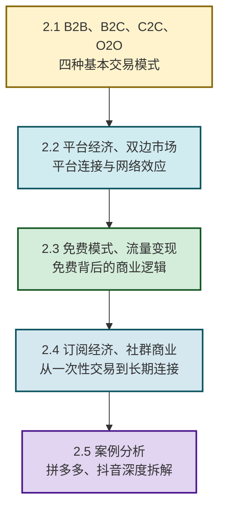

# MOC - 第2章 互联网典型商业模式

> [!info] 本章定位
> 本章是互联网创新的**核心商业理论章**。它要回答的核心问题是：**互联网催生了哪些典型的商业模式？B2B、B2C、C2C、O2O 的本质区别是什么？平台经济和双边市场如何运作？免费模式如何实现流量变现？订阅经济和社群商业有何不同？** 本章从"交易结构→平台生态→免费逻辑→订阅社群→综合案例"五条主线，系统构建互联网商业模式的知识框架。理解本章是后续 [[MOC - 第4章|第4章 互联网产品创新与设计思维]]（产品设计服务于商业模式）和 [[MOC - 第7章|第7章 互联网创业与创新项目落地]]（商业模式是创业计划书的核心）的理论基础。

## 学习路线图

## 知识点导航

| 小节 | 标题 | 核心内容 | 关键概念 |
| ---- | ---- | -------- | -------- |
| [[2.1 B2B、B2C、C2C、O2O 模式解析\|2.1]] | 四种基本商业模式 | B2B/B2C/C2C/O2O 定义、核心逻辑、交易流程、代表企业 | 交易主体、线上线下融合 |
| [[2.2 平台经济、双边市场理论\|2.2]] | 平台经济理论 | 双边市场定义、交叉网络效应、平台治理策略 | 网络效应、平台治理、生态系统 |
| [[2.3 免费模式、流量变现机制\|2.3]] | 免费模式与变现 | 免费模式本质、变现路径、漏斗模型 | 流量变现、注意力经济、双边补贴 |
| [[2.4 订阅经济、社群商业模式\|2.4]] | 订阅与社群 | 订阅经济模式、社群商业、私域流量 | 复购率、用户留存、社群裂变 |
| [[2.5 互联网商业模式案例分析\|2.5]] | 综合案例分析 | 拼多多、抖音商业模式画布拆解 | 商业模式画布、核心壁垒 |

## 核心考点

> [!summary] 本章核心考点（8 点）
> 1. **四种交易模式的核心区别**：B2B（企业对企业，如阿里巴巴）、B2C（企业对消费者，如京东）、C2C（消费者对消费者，如淘宝）、O2O（线上获客+线下交付，如美团），核心差异在于**交易主体**和**线上线下关系**；
> 2. **双边市场的交叉网络效应**：一边用户数量增加会吸引另一边用户（如淘宝买家越多→卖家越多→买家更多），这是平台经济的核心动力，也是"赢者通吃"的根本原因；
> 3. **免费模式的本质是"注意力经济"**：免费不是慈善，而是用零价格获取用户注意力，再通过广告、增值服务、数据变现等方式实现变现，核心是**用户规模×变现效率**；
> 4. **订阅经济的核心是"长期连接"**：从一次性交易转向持续服务关系，关键指标是**客户生命周期价值（LTV）**和**月度经常性收入（MRR）**，代表企业 Netflix、得到；
> 5. **社群商业的核心是"信任与认同"**：通过社群运营建立用户信任和身份认同，降低获客成本、提高复购率，代表企业元气森林、完美日记；
> 6. **平台治理的三大核心问题**：质量保障（如 Airbnb 的评分系统）、负外部性（如滴滴的安全问题）、生态激励（如淘宝的商家扶持计划）；
> 7. **商业模式画布的九大要素**：客户细分、价值主张、渠道通路、客户关系、收入来源、核心资源、关键活动、关键合作伙伴、成本结构，是分析商业模式的标准工具；
> 8. **中国互联网商业模式的特色**：人口基数大带来的规模效应、移动支付的高度普及、O2O 场景的丰富性、社交与电商的深度融合（拼多多、抖音电商是中国独创）。

## 章节导航

> [!nav] 导航
> 上级：[[MOC - 互联网创新|课程总览]]
> 上一章：[[MOC - 第1章|第1章 互联网发展基础与演进历程]]
> 下一章：[[MOC - 第3章|第3章 支撑互联网创新的关键技术]]
> 配套习题：[[MOC - 第2章习题|第2章 习题]]