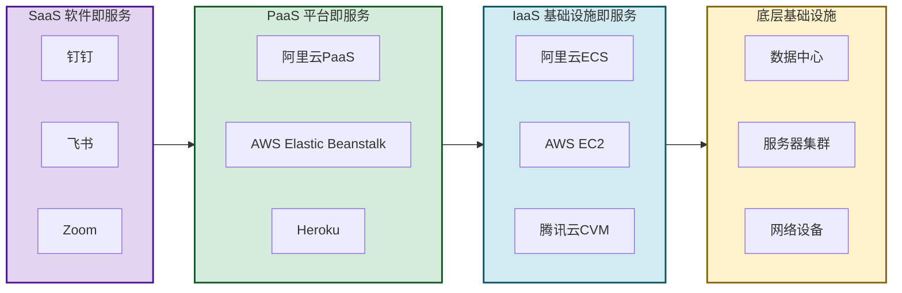
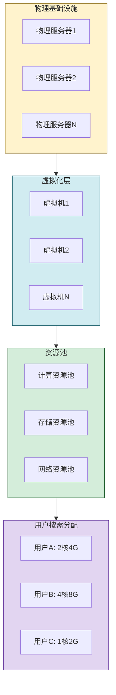

# 3.1 云计算、虚拟化与资源共享

> [!abstract] 本节概述
> 云计算是支撑互联网创新的**基础设施层技术**。它将计算、存储、网络等IT资源从"本地部署"转变为"按需调用"，催生了云原生的产品开发模式和"一切皆服务"的商业范式。本节从云计算的核心定义出发，对比三种服务模式（IaaS/PaaS/SaaS）和四种部署模式，解析虚拟化与资源池化的工作原理，最后通过阿里云与AWS的案例展示云计算如何重塑互联网产品的开发与运营。

## 一、什么是云计算

> [!definition] 云计算（Cloud Computing）
> 云计算是一种通过网络按需提供可配置计算资源（服务器、存储、网络、软件等）的**计算模式**。用户无需关心底层基础设施的管理和维护，只需按需调用、按使用量付费。

### 1.1 云计算的核心特征

| 特征 | 含义 | 说明 |
| ---- | ---- | ---- |
| 按需自助服务 | 用户自行申请资源 | 无需人工干预，分钟级开通 |
| 广泛的网络访问 | 通过网络访问资源 | 支持多种终端（PC、手机、IoT设备） |
| 资源池化 | 多租户共享物理资源 | 通过虚拟化实现逻辑隔离、物理共享 |
| 弹性伸缩 | 资源可快速扩缩 | 分钟级扩容/缩容，应对流量波动 |
| 可度量的服务 | 资源使用可监控计费 | 按CPU、内存、存储、流量等计量 |

> [!note] 云计算的本质
> 云计算的本质是**将IT资源"电力化"**——就像用电不需要自己建发电厂，使用计算资源也不需要自己建数据中心。云服务商负责建设和维护基础设施，用户只需为使用量付费。

## 二、三种服务模式对比

### 2.1 IaaS（基础设施即服务）

> [!definition] IaaS（Infrastructure as a Service）
> 提供最基础的IT基础设施：虚拟化的服务器、存储、网络。用户需要自行部署操作系统、中间件、应用程序。

**代表产品**：阿里云ECS、AWS EC2、腾讯云CVM

**适用场景**：需要高度定制化IT环境的企业、互联网初创公司快速搭建服务器集群。

### 2.2 PaaS（平台即服务）

> [!definition] PaaS（Platform as a Service）
> 在IaaS之上，提供操作系统、中间件、数据库、开发工具等平台服务。用户只需关注应用程序的开发和部署。

**代表产品**：阿里云PaaS、AWS Elastic Beanstalk、Google App Engine、Heroku

**适用场景**：应用开发者、SaaS产品快速迭代、微服务架构部署。

### 2.3 SaaS（软件即服务）

> [!definition] SaaS（Software as a Service）
> 在PaaS之上，直接提供可使用的软件应用。用户通过浏览器或App即可使用，无需安装和维护。

**代表产品**：钉钉、飞书、企业微信、Salesforce、Zoom、GitHub

**适用场景**：所有终端用户和企业客户，是"一切皆服务"的最终形态。

### 2.4 三种模式对比

| 对比维度 | IaaS | PaaS | SaaS |
| -------- | ---- | ---- | ---- |
| 管控层级 | 基础设施 | 平台 | 应用 |
| 用户需管理 | OS、中间件、应用 | 应用 | 无 |
| 灵活性 | 最高 | 中等 | 最低 |
| 成本 | 较低（需运维） | 中等 | 较高（含服务费） |
| 典型客户 | 技术团队 | 开发团队 | 所有用户 |
| 类比 | 租地皮自己盖房子 | 租毛坯房自己装修 | 拎包入住酒店 |

> [!tip] 服务模式的演进规律
> 从IaaS→PaaS→SaaS，**抽象层级逐层上升**，用户的管控自由度逐层降低，但便捷性和专注业务的程度逐层提高。这一演进路径反映了云计算的核心趋势：**让专业的人做专业的事，让用户专注于业务创新**。

## 三、四种部署模式

### 3.1 对比分析

| 部署模式 | 定义 | 适用场景 | 优势 | 劣势 |
| -------- | ---- | -------- | ---- | ---- |
| 公有云 | 第三方云服务商提供，多租户共享 | 中小企业、初创公司、互联网产品 | 成本低、弹性好、免运维 | 数据隔离性弱、定制化有限 |
| 私有云 | 企业自建或委托第三方，单租户独享 | 金融、政府、大型企业 | 数据可控、定制化强、SLA高 | 成本高、运维复杂 |
| 混合云 | 公有云+私有云组合使用 | 需要兼顾敏感数据和弹性扩展的企业 | 灵活、兼顾安全与成本 | 架构复杂、技术门槛高 |
| 社区云 | 为特定行业/社区共享的云 | 医疗、教育、政务等行业 | 行业定制化、成本分担 | 覆盖有限、供应商锁定 |

> [!example] 混合云的典型用法
> 电商公司将前台网站、订单系统部署在公有云（弹性应对流量洪峰），将支付系统、用户数据部署在私有云（满足合规要求），通过专线/VPN实现互联。这就是混合云的实际应用。

## 四、虚拟化与资源池化

### 4.1 虚拟化技术

> [!definition] 虚拟化（Virtualization）
> 虚拟化是将一台物理计算机**逻辑上分割为多台虚拟计算机**的技术。每台虚拟机拥有独立的CPU、内存、磁盘、网络，像物理机一样运行。

**核心虚拟化技术**：

| 技术 | 作用 | 代表产品 |
| ---- | ---- | -------- |
| CPU虚拟化 | 虚拟CPU核心 | Intel VT-x、AMD-V、KVM |
| 内存虚拟化 | 虚拟内存地址空间 | 影子页表、EPT |
| 存储虚拟化 | 虚拟磁盘 | LVM、Ceph、VMware vSAN |
| 网络虚拟化 | 虚拟网卡、虚拟交换机 | Open vSwitch、NSX |

### 4.2 资源池化

> [!definition] 资源池化（Resource Pooling）
> 将多个物理资源通过虚拟化整合成一个**逻辑资源池**，用户从池中按需分配资源，无需关心底层物理位置。

> [!info] 容器技术 vs 虚拟机
> 近年来，**容器技术（Docker/Kubernetes）** 作为更轻量的虚拟化方案被广泛采用。与虚拟机相比：
> - 虚拟机通过 **Hypervisor** 实现硬件级隔离，每个VM有独立OS，启动慢（分钟级）；
> - 容器通过 **Docker Engine** 实现进程级隔离，共享宿主OS内核，启动快（秒级）；
> - Kubernetes 已成为容器编排的事实标准，支撑云原生架构。

## 五、典型案例

### 5.1 阿里云

> [!example] 阿里云的创新路径
> 1. **起步**：2009年成立，源自淘宝/天猫的内部技术需求（双11流量洪峰）；
> 2. **技术输出**：将内部积累的技术（OSS存储、ODPS计算、SLB负载均衡）产品化，对外提供云服务；
> 3. **生态建设**：构建云原生生态（ECS、RDS、MaxCompute、ACK），服务百万开发者；
> 4. **差异化**：在电商云、政务云、工业云等垂直领域形成优势，"阿里云+钉钉"组合打造企业数字化闭环。

**关键数据**：
- 国内市场份额第一（约40%）
- 全球市场份额第三（仅次于AWS、Azure）
- 服务超过100万企业客户

### 5.2 AWS（亚马逊云科技）

> [!example] AWS的创新路径
> 1. **起源**：2006年上线，最初是为了解决亚马逊内部IT资源利用率低的问题；
> 2. **创新模式**：首创"IaaS"商业模式，将闲置IT能力商业化；
> 3. **产品矩阵**：覆盖200+云服务（计算、存储、数据库、AI、物联网、区块链等）；
> 4. **全球布局**：全球32个地理区域、102个可用区，支撑全球化业务部署。

**核心竞争力**：
- 先发优势（领先竞争对手5-7年）
- 最完整的产品矩阵
- 强大的合作伙伴生态

## 六、易错点

> [!warning] 易错点
> 1. **云计算 ≠ 只是远程服务器**：云计算的核心是"按需、弹性、可度量"的服务模式，而不仅仅是远程托管；
> 2. **公有云 ≠ 不安全**：公有云通过多租户隔离、VPC、加密等机制保障安全，很多场景下安全能力甚至优于自建机房；
> 3. **IaaS → PaaS → SaaS 不是替代关系**：三种模式并存，企业常根据不同业务需求组合使用；
> 4. **虚拟化 ≠ 云计算**：虚拟化是实现云计算的关键技术之一，但云计算还包括资源池化、自动调度、按需计费等更丰富的能力。

## 七、与其他小节的联系

- 云计算为大数据处理（[[3.2 大数据、数据挖掘与用户画像]]）提供弹性计算和存储基础设施；
- 云计算是物联网平台（[[3.3 物联网与万物互联应用]]）的核心支撑——设备接入、数据处理都在云端完成；
- 云计算为AI模型训练和推理（[[3.4 人工智能赋能互联网产品]]）提供GPU算力集群；
- 区块链节点（[[3.5 区块链基础与互联网价值创新]]）也常部署在云环境中。

## 章节导航

- 上一级：[[MOC - 第3章]]
- 下一节：[[3.2 大数据、数据挖掘与用户画像]]
- 习题：[[MOC - 第3章习题]]