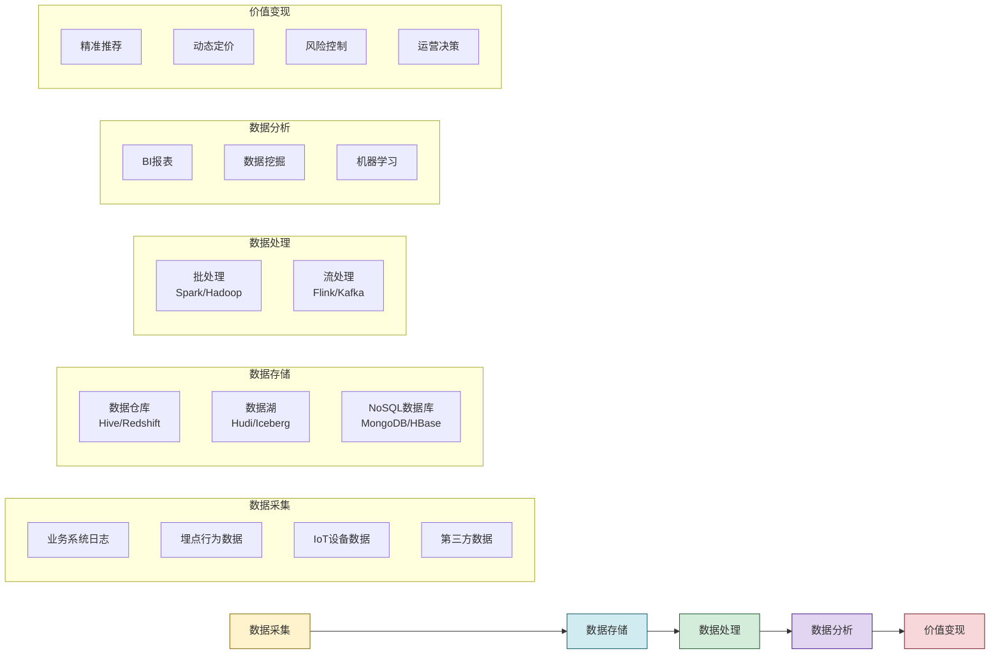
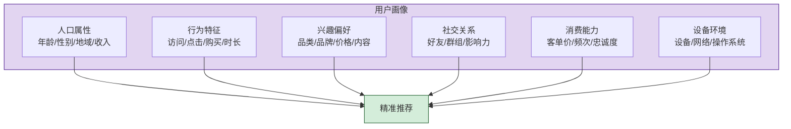

# 3.2 大数据、数据挖掘与用户画像

> [!abstract] 本节概述
> 大数据是互联网创新的**核心驱动引擎**。互联网产品在运行中产生海量用户行为数据，通过大数据处理、数据挖掘和用户画像技术，企业能够实现精准推荐、动态定价、智能运营等创新能力。本节从大数据的4V特征出发，梳理从数据采集到价值变现的完整流程，重点解析用户画像的构建方法，最后以阿里巴巴"御膳房"为例展示大数据如何赋能电商运营。

## 一、什么是大数据

> [!definition] 大数据（Big Data）
> 大数据是指规模庞大、类型多样、处理复杂的数据集合，传统数据处理工具已无法高效处理，需要新的技术架构和分析方法来挖掘其价值。

### 1.1 大数据的4V特征

| 特征 | 英文 | 含义 | 说明 | 示例 |
| ---- | ---- | ---- | ---- | ---- |
| 体量巨大 | Volume | 数据规模大 | PB级甚至ZB级 | 淘宝双11单日产生数十亿条订单日志 |
| 类型多样 | Variety | 数据类型丰富 | 结构化+半结构化+非结构化 | 交易记录（结构化）、商品图片（非结构化）、用户评论（半结构化） |
| 价值密度低 | Value | 海量数据中价值密度低 | 需要有效筛选和挖掘 | 数十亿条日志中，真正影响决策的可能只有几千条 |
| 速度快 | Velocity | 数据生成和处理速度快 | 需要实时或准实时处理 | 直播弹幕、实时交易、传感器数据流 |

> [!note] 4V的本质
> 4V特征揭示了大数据的**矛盾统一体**：数据量大但价值密度低，类型多样但需要快速处理。大数据技术的核心使命就是**在海量、多样、高速的数据中，高效挖掘有价值的信息**。

> [!tip] 大数据与传统数据的区别
> 传统数据处理关注"**数据质量**"（准确性、完整性），而大数据更关注"**数据全覆盖**"（海量、多样、关联性）。传统BI回答"发生了什么"，大数据分析回答"正在发生什么"和"将会发生什么"。

## 二、大数据处理流程

### 2.1 五大环节

### 2.2 关键技术栈

| 环节 | 技术分类 | 代表技术 |
| ---- | -------- | -------- |
| 数据采集 | 日志采集 | Flume、Logstash、Kafka |
| | 埋点SDK | GrowingIO、神策、友盟 |
| 数据存储 | 数据仓库 | Hive、ClickHouse、Redshift、MaxCompute |
| | 数据湖 | Hudi、Iceberg、Delta Lake |
| | NoSQL | MongoDB、HBase、Redis、Elasticsearch |
| 数据处理 | 批处理 | Hadoop MapReduce、Spark |
| | 流处理 | Flink、Spark Streaming、Kafka Streams |
| 数据分析 | BI工具 | Tableau、Power BI、Superset、Quick BI |
| | 数据挖掘 | Mahout、Spark MLlib、TensorFlow |

> [!example] 实时数仓 vs 离线数仓
> - **离线数仓**（Lambda架构）：T+1延迟，适合历史分析，典型技术：Hive + Spark；
> - **实时数仓**（Kappa架构）：秒级延迟，适合实时决策，典型技术：Flink + Kafka + ClickHouse。
>
> 现代互联网产品（如抖音推荐、淘宝直播）都需要**实时数仓**支撑实时决策。

## 三、数据挖掘方法

### 3.1 核心任务

| 任务类型 | 含义 | 典型算法 | 应用场景 |
| -------- | ---- | -------- | -------- |
| 分类预测 | 预测离散标签 | 逻辑回归、决策树、随机森林、XGBoost | 用户流失预测、欺诈识别 |
| 回归预测 | 预测连续数值 | 线性回归、神经网络 | 销量预测、价格预测 |
| 聚类分析 | 发现数据分组 | K-Means、DBSCAN、层次聚类 | 用户分群、商品分群 |
| 关联规则 | 发现关联关系 | Apriori、FP-Growth | 购物篮分析、搭配推荐 |
| 序列模式 | 发现序列规律 | PrefixSpan、GSP | 用户行为路径分析 |
| 异常检测 | 发现异常行为 | Isolation Forest、LOF | 反作弊、系统监控 |

### 3.2 数据挖掘在互联网中的典型应用

> [!example] 推荐系统的数据挖掘逻辑
> 1. **协同过滤**：基于"和你行为相似的人还喜欢什么"，计算用户或物品相似度进行推荐；
> 2. **内容推荐**：基于用户历史偏好的内容特征（如喜欢什么品类、价格带）进行匹配推荐；
> 3. **深度学习推荐**：使用DNN、Transformer等模型，从海量行为数据中自动学习复杂的推荐模式。

## 四、用户画像

### 4.1 什么是用户画像

> [!definition] 用户画像（User Profile / Persona）
> 用户画像是基于用户的**人口属性、行为特征、兴趣偏好、社交关系、消费能力**等多维度数据，构建的**虚拟用户模型**。它使企业能够"像了解朋友一样了解用户"，实现精准的产品设计和营销策略。

### 4.2 用户画像的维度

### 4.3 用户画像的构建方法

| 步骤 | 内容 | 方法 |
| ---- | ---- | ---- |
| 1. 数据采集 | 多渠道数据整合 | 埋点SDK、业务日志、第三方数据采购 |
| 2. 数据清洗 | 去重、补全、标准化 | ETL工具、数据治理平台 |
| 3. 特征工程 | 提取有业务意义的特征 | 统计方法、NLP、CV特征提取 |
| 4. 标签体系 | 构建用户标签体系 | 规则引擎+机器学习自动打标 |
| 5. 画像更新 | 实时/准实时更新 | 流处理+实时数仓 |

> [!tip] 标签体系设计
> 优秀的用户标签体系遵循**MECE原则**（相互独立、完全穷尽），通常分为：
> - **基础标签**：性别、年龄、地域等稳定属性；
> - **行为标签**：访问频次、活跃度、最近购买时间等动态属性；
> - **偏好标签**：品类偏好、品牌偏好、价格敏感度等兴趣属性；
> - **模型标签**：基于算法生成的高价值、流失风险等预测标签。

### 4.4 用户画像的应用场景

| 场景 | 说明 | 案例 |
| ---- | ---- | ---- |
| 精准推荐 | 为不同用户推荐不同内容/商品 | 淘宝"千人千面"首页 |
| 精准营销 | 向不同用户投放不同广告 | 朋友圈定向广告、DSP投放 |
| 产品优化 | 基于画像优化产品设计 | 小红书根据年龄段优化UI |
| 风险控制 | 识别欺诈、异常行为 | 支付宝反欺诈系统 |
| 运营决策 | 基于用户分群制定运营策略 | 京东PLUS会员的差异化权益 |

## 五、典型案例：阿里"御膳房"

> [!example] 阿里御膳房——大数据驱动的电商中台
>
> **定位**：御膳房是阿里的**数据中台**，为淘宝、天猫、菜鸟等业务提供统一的大数据服务。
>
> **核心能力**：
> 1. **数据资产化**：将分散在各业务线的数据整合为统一的数据资产；
> 2. **标签工厂**：生产超过10000个用户标签，覆盖4亿+活跃用户；
> 3. **算法服务**：提供推荐、搜索、定价等AI算法能力；
> 4. **决策引擎**：支持双11等大促的实时决策。
>
> **关键创新**：
> - **"千人千面"首页**：基于用户画像，为每个淘宝用户展示不同的首页商品，点击率提升50%+；
> - **动态定价**：基于供需关系和用户画像，实现商品的实时动态定价；
> - **智能选品**：基于大数据分析，预测下一季爆款趋势，辅助商家选品。
>
> **启示**：大数据不是目的，**用数据创造业务价值**才是核心。御膳房的成功在于将大数据能力"服务化"，让非技术业务团队也能轻松使用数据能力。

## 六、易错点

> [!warning] 易错点
> 1. **大数据 ≠ 数据量大**：数据量大只是必要条件，更重要的是数据的**多样性、时效性和关联性**；
> 2. **数据挖掘 ≠ 统计分析**：统计分析关注"是什么"，数据挖掘关注"为什么"和"预测什么"，是从数据中发现隐藏模式的过程；
> 3. **用户画像 ≠ 用户隐私**：用户画像基于**用户行为数据**（非个人敏感信息），合法合规前提下使用；
> 4. **大数据不是万能的**：大数据是决策的**辅助工具**，而非替代人类判断。在创意、战略等领域，人的洞察力仍然不可替代。

## 七、与其他小节的联系

- 大数据依赖云计算（[[3.1 云计算、虚拟化与资源共享]]）提供的弹性存储和计算资源；
- 大数据是AI（[[3.4 人工智能赋能互联网产品]]）的"燃料"——没有足够的数据，AI模型无法发挥作用；
- 物联网（[[3.3 物联网与万物互联应用]]）产生的海量传感器数据是大数据的重要数据来源；
- 大数据中的数据资产可通过区块链（[[3.5 区块链基础与互联网价值创新]]）实现可信流通。

## 章节导航

- 上一级：[[MOC - 第3章]]
- 下一节：[[3.3 物联网与万物互联应用]]
- 习题：[[MOC - 第3章习题]]