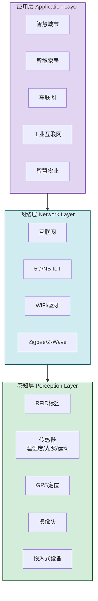
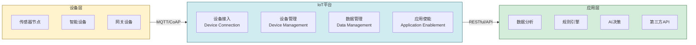

# 3.3 物联网与万物互联应用

> [!abstract] 本节概述
> 物联网（IoT）是互联网从"连接人"到"连接万物"的延伸。通过感知层、网络层、应用层的三层架构，物联网将物理世界数字化，催生了智慧城市、智能家居、车联网等创新应用。本节解析物联网的核心架构与关键技术，介绍典型应用场景，最后以小米米家为例展示生态化物联网平台的构建思路。

## 一、什么是物联网

> [!definition] 物联网（Internet of Things, IoT）
> 物联网是通过**信息传感设备**（射频识别、传感器、GPS、摄像头等），按约定协议，把任何物品与互联网相连接，进行信息交换和通信，以实现对物品的**智能化识别、定位、跟踪、监控和管理**的一种网络。

### 1.1 物联网的核心价值

| 价值维度 | 含义 | 说明 |
| -------- | ---- | ---- |
| 感知 | 让物品"看得见、摸得着" | 传感器实时采集物理世界数据 |
| 连接 | 让物品"互联互通" | 通过网络将物品接入互联网 |
| 智能 | 让物品"会思考、会行动" | 基于AI实现自动化决策和控制 |

> [!note] 物联网的本质
> 物联网的本质是**将物理世界映射为数字世界**，使得每一个物理物品都能成为互联网的一个"节点"，从而实现"万物互联"。这是互联网继"人人互联"、"人机互联"之后的第三次浪潮。

## 二、物联网三层架构

### 2.1 总体架构

### 2.2 各层详解

#### 感知层——"感官"

> [!definition] 感知层
> 感知层是物联网的"感官"，负责**采集物理世界的各种数据**并转换为数字信号。

| 技术 | 作用 | 应用场景 |
| ---- | ---- | -------- |
| RFID（射频识别） | 非接触式自动识别 | 商品防伪、物流追踪、门禁系统 |
| 传感器 | 采集环境数据 | 温度、湿度、光照、压力、加速度 |
| GPS/北斗 | 定位导航 | 车辆追踪、户外设备定位 |
| 摄像头 | 图像/视频采集 | 安防监控、人脸识别、行为分析 |
| 嵌入式设备 | 本地处理+通信 | 智能手表、智能音箱、工业控制器 |

#### 网络层——"神经"

> [!definition] 网络层
> 网络层是物联网的"神经"，负责**将感知层采集的数据可靠地传输到应用层**。

| 通信技术 | 频段/协议 | 特点 | 适用场景 |
| -------- | -------- | ---- | -------- |
| WiFi | 2.4GHz/5GHz | 高速、距离远 | 家庭/办公室高速物联网 |
| 蓝牙/BLE | 2.4GHz | 低功耗、短距离 | 智能穿戴、耳机 |
| Zigbee | 2.4GHz | 低功耗、自组网 | 智能家居传感器网络 |
| Z-Wave | 800-900MHz | 低功耗、干扰少 | 智能家居（欧美主流） |
| NB-IoT | 运营商频段 | 广覆盖、低功耗、大连接 | 智能表计、资产追踪 |
| 5G | FR1/FR2 | 高速、低时延、大连接 | 车联网、工业互联网 |
| LoRa | 125MHz-1.5GHz | 远距离、低功耗 | 智慧农业、环境监测 |

#### 应用层——"大脑"

> [!definition] 应用层
> 应用层是物联网的"大脑"，负责**对数据进行处理、分析和决策**，提供面向用户的应用服务。

## 三、物联网关键技术

### 3.1 核心技术矩阵

| 技术领域 | 关键技术 | 作用 |
| -------- | -------- | ---- |
| 感知技术 | RFID、传感器、MEMS | 数据采集 |
| 通信技术 | 5G、NB-IoT、LoRa、Zigbee | 数据传输 |
| 计算技术 | 边缘计算、云计算、AI | 数据处理 |
| 安全技术 | 设备认证、数据加密、隐私保护 | 安全保障 |
| 平台技术 | IoT平台、设备管理、数据分析 | 服务支撑 |

> [!info] 边缘计算在物联网中的作用
> 物联网场景中，大量设备产生海量数据。如果全部传到云端处理，会面临**网络带宽压力大、响应延迟高、隐私风险大**等问题。**边缘计算**将部分计算任务下沉到靠近数据源的边缘设备/网关节点，实现"实时处理+按需上传"，是物联网的关键使能技术。

### 3.2 IoT平台架构

## 四、典型应用场景

### 4.1 场景总览

| 应用领域 | 典型场景 | 创新价值 |
| -------- | -------- | -------- |
| 智能家居 | 智能音箱、扫地机器人、智能照明 | 提升生活便利性 |
| 智慧城市 | 智能交通、环境监测、安防监控 | 提升城市治理效率 |
| 车联网 | 自动驾驶、车路协同、车队管理 | 交通安全与效率 |
| 工业互联网 | 设备监控、 predictive maintenance、柔性生产 | 提升制造业效率 |
| 智慧农业 | 环境监测、精准灌溉、溯源系统 | 提升农业生产效率 |
| 智慧医疗 | 远程监护、医疗设备互联、药品追溯 | 提升医疗服务水平 |
| 智慧零售 | 智能货架、无人超市、供应链追踪 | 提升零售运营效率 |

### 4.2 智能家居：小米米家

> [!example] 小米米家生态——"连接一切"的物联网生态
>
> **生态规模**：米家IoT平台连接设备超过 **9亿台**，覆盖 **2000+ 品牌**、**10000+ 品类**，是全球最大的消费级IoT平台。
>
> **核心策略**：
> 1. **开放生态**：不自己生产所有设备，而是开放平台吸引第三方品牌接入，通过"米家APP"统一管理；
> 2. **互联互通**：基于米家通用协议（miIO），实现不同品牌设备的互联互通（如门锁打开→灯光自动开启→窗帘自动拉开）；
> 3. **AI+IoT**：小爱同学作为AI入口，通过语音控制全屋设备，实现"场景化智能"；
> 4. **手机为中心**：小米手机作为"超级网关"，近距离用蓝牙+WiFi控制设备，远距离用云端控制。
>
> **技术架构亮点**：
> - 米家通用协议（miIO）：定义了设备与云、设备与手机之间的通信标准；
> - 米家网关：支持Zigbee、蓝牙、WiFi等多种协议的转换，实现异构设备互联；
> - 米家云：统一存储和处理所有设备数据，提供场景编排能力。
>
> **启示**：物联网的核心竞争力不是单一产品，而是**生态平台**。小米通过开放协议和品牌合作，构建了"硬件+软件+云+AI"的四位一体生态。

### 4.3 车联网

> [!example] 车联网的三层体系
> - **车载网（In-Vehicle）**：车辆内部各部件互联（发动机、传感器、娱乐系统）；
> - **车际网（V2V）**：车辆之间互联，实现防撞提醒、协同驾驶；
> - **车联网（V2X）**：车辆与道路基础设施、行人、网络互联，实现自动驾驶。
>
> 比亚迪DiLink、蔚来NIO OS、特斯拉Autopilot是典型的车联网解决方案。

## 五、易错点

> [!warning] 易错点
> 1. **物联网 ≠ 只有传感器**：传感器只是感知层的一部分，物联网还包括网络传输、数据处理、应用服务等完整链条；
> 2. **物联网 ≠ 独立网络**：物联网是互联网的延伸，底层仍依赖互联网基础设施；
> 3. **物联网安全 ≠ 传统网络安全**：物联网设备数量多、资源有限、部署分散，安全挑战更大，需要轻量级加密和设备级认证；
> 4. **物联网 ≠ 所有设备都需要高带宽**：不同场景对带宽、时延、功耗的要求不同，需要根据场景选择合适的通信技术（如NB-IoT适合低功耗大连接场景）。

## 六、与其他小节的联系

- 物联网产生的海量设备数据是大数据（[[3.2 大数据、数据挖掘与用户画像]]）的重要数据来源；
- 物联网设备的控制和智能化依赖AI（[[3.4 人工智能赋能互联网产品]]）算法；
- 物联网设备的身份认证和数据可信传输可借助区块链（[[3.5 区块链基础与互联网价值创新]]）；
- 物联网平台通常部署在云计算（[[3.1 云计算、虚拟化与资源共享]]）基础设施之上。

## 章节导航

- 上一级：[[MOC - 第3章]]
- 下一节：[[3.4 人工智能赋能互联网产品]]
- 习题：[[MOC - 第3章习题]]