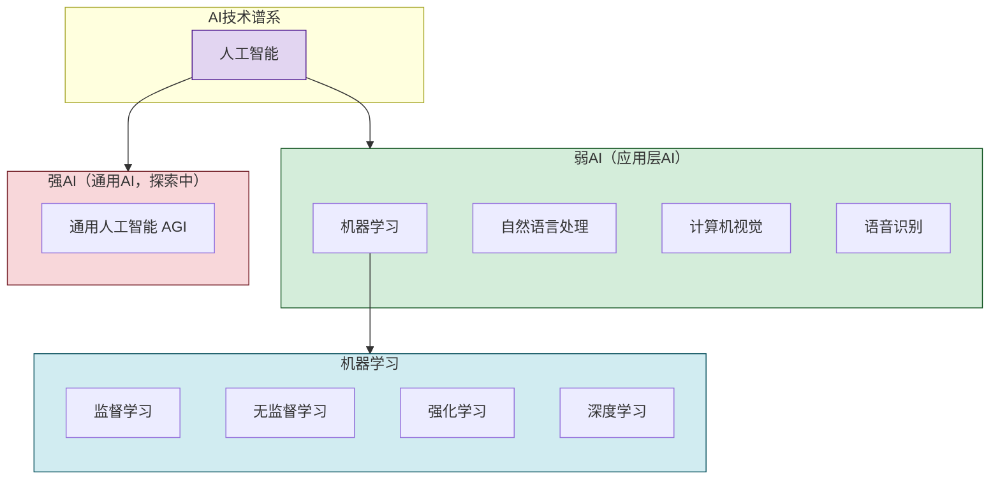
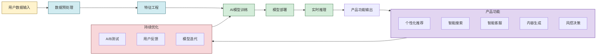
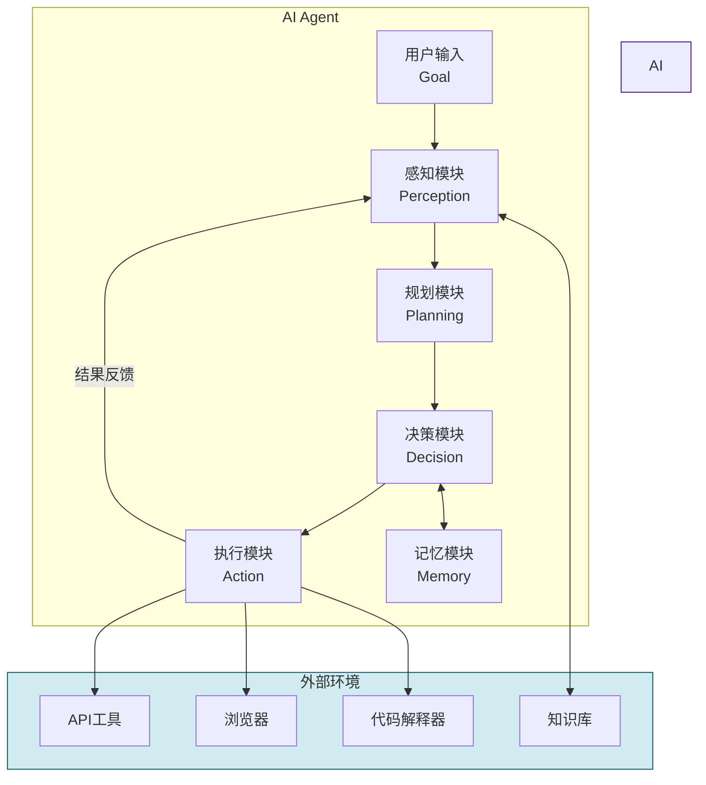

# 3.4 人工智能赋能互联网产品

> [!abstract] 本节概述
> 人工智能是互联网创新的**智能引擎**。从推荐算法到生成式AI，从AI客服到自动驾驶，AI正在重塑互联网产品的每一个环节。本节解析人工智能的核心技术谱系，重点介绍生成式AI和AI Agent两大前沿方向，通过字节跳动的推荐系统案例展示AI如何创造商业价值，最后讨论AI带来的伦理与治理挑战。

## 一、人工智能概述

> [!definition] 人工智能（Artificial Intelligence, AI）
> 人工智能是研究如何让机器模拟人类**感知、学习、推理、决策、创造**等智能活动的学科。在互联网领域，AI的核心应用是**从海量数据中自动学习规律，并用于预测、推荐、生成和决策**。

### 1.1 AI技术谱系

### 1.2 深度学习的崛起

> [!info] 深度学习为何重要
> 传统机器学习依赖人工设计特征，在图像、语音、语言等复杂任务上表现有限。**深度学习**通过多层神经网络自动学习特征表示，在以下领域取得了突破性进展：
> - 图像识别：准确率从75%→98%+，超越人类水平；
> - 语音识别：准确率从80%→97%+；
> - 自然语言处理：从"语法正确"到"语义理解"再到"内容生成"。

## 二、AI在互联网产品中的应用场景

### 2.1 六大应用场景

| 应用场景 | 技术类型 | 应用方式 | 典型案例 |
| -------- | -------- | -------- | -------- |
| 智能推荐 | 协同过滤+深度学习 | 个性化内容/商品推荐 | 抖音推荐、淘宝"千人千面" |
| 智能搜索 | NLP+知识图谱 | 语义搜索、问答搜索 | Google搜索、百度搜索 |
| 智能客服 | NLP+对话管理 | 自动应答、工单处理 | 阿里小蜜、京东JIMI |
| 图像/内容识别 | 计算机视觉 | 内容审核、人脸识别 | 抖音内容审核、支付宝刷脸 |
| 智能风控 | 异常检测+图计算 | 反欺诈、反作弊 | 支付宝反欺诈、京东白条风控 |
| 智能生成 | 生成模型（AIGC） | 文本、图像、视频生成 | ChatGPT、Midjourney、Sora |

### 2.2 AI赋能链路

> [!tip] 飞轮效应
> AI产品的核心增长逻辑是**数据飞轮效应**：
> 1. 用户使用产品 → 产生行为数据；
> 2. 行为数据 → 优化AI模型；
> 3. 更优的AI模型 → 更好的产品体验；
> 4. 更好的体验 → 更多用户使用。
>
> 这形成了一个正向循环，数据越多→模型越好→用户越多→数据越多。

## 三、生成式AI

### 3.1 什么是生成式AI

> [!definition] 生成式AI（Generative AI）
> 生成式AI是指能够**生成全新内容**（文本、图像、音频、视频、代码等）的AI技术。与传统AI的"分析已有数据"不同，生成式AI的核心是"创造新内容"。

### 3.2 核心技术：大语言模型（LLM）

> [!definition] 大语言模型（Large Language Model）
> 大语言模型是基于**Transformer架构**，用**海量文本数据**（数千亿甚至数万亿token）训练的神经网络模型。它通过学习语言的统计规律，具备了**理解、生成、推理、翻译**等多种能力。

> [!example] LLM发展时间线
> - 2018年：GPT-1（1.5B参数），首次展示Transformer在生成任务上的潜力；
> - 2019年：GPT-2（1.5B参数，开放源码），引起广泛关注；
> - 2020年：GPT-3（175B参数），展示了"few-shot"学习能力；
> - 2022年：ChatGPT（基于GPT-3.5），通过RLHF实现对齐，用户量爆发式增长；
> - 2023年：GPT-4（多模态）、文心一言、通义千问、Claude等相继发布；
> - 2024年：Sora（视频生成）、GPT-4o（实时多模态）。

### 3.3 生成式AI的技术能力

| 能力 | 说明 | 应用示例 |
| ---- | ---- | -------- |
| 文本生成 | 撰写文章、摘要、翻译 | AI写作助手、智能客服 |
| 图像生成 | 根据文字描述生成图像 | Midjourney、DALL·E、Stable Diffusion |
| 视频生成 | 根据文字/图像生成视频 | Sora、Runway、Pika |
| 代码生成 | 辅助编写、调试代码 | GitHub Copilot、Cursor |
| 语音合成 | 生成自然语音 | ElevenLabs、豆包语音 |
| 多模态理解 | 同时理解文本+图像+音频 | GPT-4o、VLM |

> [!info] 生成式AI对互联网产品的影响
> 1. **内容生产成本趋近于零**：生成一篇文章、一张图片的成本从数元降至几厘钱；
> 2. **用户从"消费者"变为"创造者"**：每个人都能轻松创建高质量内容；
> 3. **产品交互方式变革**：从"点击交互"变为"自然语言交互"；
> 4. **商业模式创新**：催生AI原生应用（AI搜索、AI编程、AI设计等）。

## 四、AI Agent

### 4.1 什么是AI Agent

> [!definition] AI Agent（智能体）
> AI Agent是一个能够**自主感知环境、进行决策、执行任务**的AI系统。与传统AI模型"被动响应"不同，AI Agent能够**主动规划并完成复杂任务**。

### 4.2 核心能力

| 能力 | 说明 | 关键技术 |
| ---- | ---- | -------- |
| 感知 | 理解用户意图和环境 | NLP、CV、语音识别 |
| 规划 | 分解复杂任务为子任务 | 任务规划、ReAct范式 |
| 工具使用 | 调用外部API和工具 | 函数调用、Tool Use |
| 记忆 | 存储和调用历史信息 | 向量数据库、上下文窗口 |
| 执行 | 执行具体操作 | 代码执行、浏览器操作 |

### 4.3 AI Agent架构

> [!example] AI Agent的应用示例
> - **AutoGPT**：给定一个目标（如"调研市场并生成报告"），自主规划研究步骤、调用搜索API、整理信息、生成报告；
> - **Microsoft Copilot**：在Office中，根据用户意图自动生成文档、制作PPT、分析数据；
> - **Devin**：AI软件工程师，能自主完成编码、调试、测试任务；
> - **电商Agent**：自主进行市场调研、选品、定价、上架的电商运营Agent。

## 五、典型案例：字节跳动推荐系统

> [!example] 字节跳动的AI推荐系统——"AI增长飞轮"
>
> **核心产品**：今日头条、抖音、TikTok
>
> **技术架构**：
> 1. **多路召回**：从不同维度（兴趣、协同、热门）快速筛选候选集（从百万级→千级）；
> 2. **粗排模型**：用轻量级模型快速排序（从千级→百级）；
> 3. **精排模型**：用复杂的深度学习模型精确排序（从百级→十级）；
> 4. **重排层**：加入业务规则（多样性、广告、社交等）调整最终排序。
>
> **核心算法**：
> - **双塔模型**：用户塔和物品塔独立编码，高效计算相似度；
> - **多目标优化**：同时优化点击率、完播率、互动率、留存率；
> - **强化学习**：长期优化用户价值（LTV），而非短期点击；
> - **大模型应用**：将大模型引入推荐系统，提升冷启动和语义理解能力。
>
> **业务成果**：
> - 今日头条：DAU超过1.2亿，用户日均使用时长超过70分钟；
> - 抖音：DAU超过7亿，用户日均使用时长超过120分钟；
> - TikTok：全球DAU超过10亿。
>
> **启示**：AI不是"锦上添花"，而是**产品的核心引擎**。字节跳动的产品本质上是"AI驱动的内容分发引擎"，AI能力直接决定了用户体验和商业价值。

## 六、AI的挑战与治理

### 6.1 技术挑战

| 挑战 | 说明 | 应对方向 |
| ---- | ---- | -------- |
| 数据隐私 | AI训练需要大量用户数据 | 联邦学习、差分隐私、数据脱敏 |
| 算法偏见 | 训练数据中的偏见导致模型偏见 | 数据治理、公平性评估、可解释性 |
| 可解释性 | 深度学习是"黑箱" | XAI（可解释AI）、注意力可视化 |
| 算力成本 | 大模型训练需海量GPU | 模型压缩、专用芯片（NPU/TPU） |
| 安全风险 | AI可能被攻击或滥用 | 对抗样本检测、模型水印 |

### 6.2 生成式AI特有挑战

> [!warning] 生成式AI的独特风险
> 1. **幻觉问题**：LLM可能生成看似合理但事实上错误的内容；
> 2. **版权争议**：AI训练数据可能侵犯创作者版权；
> 3. **内容安全**：可能生成有害、偏见、虚假内容；
> 4. **就业冲击**：AI自动化可能替代部分人类工作岗位；
> 5. **算力垄断**：训练大模型的算力成本极高，可能导致AI能力集中在少数巨头手中。

## 七、易错点

> [!warning] 易错点
> 1. **AI ≠ 只有大语言模型**：AI是一个广阔的领域，包括传统机器学习、深度学习、强化学习、CV、NLP等多个方向，大语言模型只是其中一个分支；
> 2. **生成式AI ≠ 随机生成**：生成式AI基于训练数据的统计规律，生成的内容是"最可能的下一个token"的组合，具有语义连贯性；
> 3. **AI Agent ≠ 聊天机器人**：聊天机器人是被动响应，AI Agent能够主动规划和执行复杂任务，是从"对话"到"行动"的质变；
> 4. **AI ≠ 万能**：AI在特定任务上超越人类，但在创造性、常识推理、情感理解等方面仍有局限。

## 八、与其他小节的联系

- AI的训练和推理依赖云计算（[[3.1 云计算、虚拟化与资源共享]]）提供的GPU算力；
- AI是大数据（[[3.2 大数据、数据挖掘与用户画像]]）的分析工具——大数据是AI的"燃料"；
- AI控制物联网设备（[[3.3 物联网与万物互联应用]]）实现智能化；
- AI生成的内容和决策上链可借助区块链（[[3.5 区块链基础与互联网价值创新]]）实现可信存证。

## 章节导航

- 上一级：[[MOC - 第3章]]
- 下一节：[[3.5 区块链基础与互联网价值创新]]
- 习题：[[MOC - 第3章习题]]