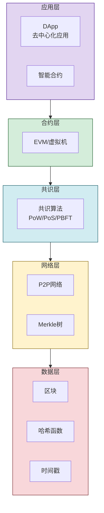

# 3.5 区块链基础与互联网价值创新

> [!abstract] 本节概述
> 区块链是互联网从"信息互联网"到"价值互联网"的关键技术。它通过去中心化、不可篡改、可追溯的特性，为互联网提供了**信任基础设施**。本节从区块链的核心原理出发，介绍公有链、联盟链、私有链三种类型及其适用场景，解析智能合约和DApp的运作机制，最后以比特币和以太坊为例展示区块链如何创新互联网的价值创造与分配方式。

## 一、什么是区块链

> [!definition] 区块链（Blockchain）
> 区块链是一种**分布式账本技术**，通过密码学方法将数据以"区块"的形式链式连接，存储在网络中所有节点上。其核心特征是**去中心化、不可篡改、可追溯、公开透明**。

### 1.1 区块链的核心特征

| 特征 | 含义 | 说明 |
| ---- | ---- | ---- |
| 去中心化 | 无单点故障、无单一控制方 | 数据分布在成千上万个节点 |
| 不可篡改 | 历史数据一旦写入无法修改 | 密码学哈希确保数据完整性 |
| 可追溯 | 每一笔交易都可追溯源头 | 链式结构提供完整审计链 |
| 公开透明 | 所有人可查看账本内容 | 增强信任和可审计性 |
| 匿名性 | 用户身份通过公钥地址表示 | 保护隐私但仍可追溯 |

> [!note] 区块链的本质
> 区块链的本质是**在不信任的网络中建立信任**。在传统互联网中，信任依赖中心化机构（银行、平台、政府）；在区块链中，信任由密码学和共识算法保障，无需中心化机构。

## 二、核心原理

### 2.1 区块与链式结构

> [!definition] 区块（Block）
> 区块是区块链中存储数据的基本单位，包含：
> - **区块头**：上一个区块的哈希、时间戳、随机数、Merkle根；
> - **区块体**：交易列表或其他数据。

```mermaid
flowchart LR
    subgraph Block N-1
        direction TB
        H1[区块头<br/>Hash=N-2的哈希<br/>时间戳<br/>随机数]
        D1[区块体<br/>交易列表]
    end

    subgraph Block N
        direction TB
        H2[区块头<br/>Hash=N-1的哈希<br/>时间戳<br/>随机数]
        D2[区块体<br/>交易列表]
    end

    subgraph Block N+1
        direction TB
        H3[区块头<br/>Hash=N的哈希<br/>时间戳<br/>随机数]
        D3[区块体<br/>交易列表]
    end

    Block N-1 -->|Hash链接| Block N
    Block N -->|Hash链接| Block N+1

    style Block N fill:#d4edda,stroke:#155724
    style Block N-1 fill:#d1ecf1,stroke:#0c5460
    style Block N+1 fill:#e2d5f1,stroke:#4a148c
```

> [!info] 哈希指针的防篡改原理
> 每个区块的头部包含**前一个区块的哈希值**。如果有人篡改了历史区块的数据，该区块的哈希值会改变，导致后续所有区块的哈希校验失败。要修改一个区块，需要重新计算之后所有区块的哈希并获得网络多数算力的认可（即51%攻击），在公有链上这几乎不可能实现。

### 2.2 共识算法

> [!definition] 共识算法（Consensus Algorithm）
> 共识算法是区块链网络中**所有节点就数据一致性达成共识**的规则和机制。

| 共识算法 | 原理 | 代表项目 | 特点 |
| -------- | ---- | -------- | ---- |
| PoW（工作量证明） | 节点通过算力竞争解决密码学难题 | 比特币 | 安全性高，但能耗大、速度慢 |
| PoS（权益证明） | 节点根据持有的代币数量获得出块权 | 以太坊2.0、Cardano | 能耗低、速度快，但可能富者愈富 |
| DPoS（委托权益证明） | 代币持有者投票选举见证人节点 | EOS、TRON | 速度快，但去中心化程度较低 |
| PBFT（实用拜占庭容错） | 节点投票达成共识 | 联盟链（Hyperledger Fabric） | 效率高，适合许可链场景 |
| PoA（权威证明） | 预先授权的节点出块 | 私有链、联盟链 | 高效、可管控 |

> [!tip] 共识算法的权衡
> 共识算法在**安全性、性能、去中心化**三者之间权衡。没有完美的共识算法，只有最适合场景的选择：
> - 公有链：更看重安全性和去中心化 → PoW/PoS；
> - 联盟链/私有链：更看重性能和可管控 → PBFT/PoA。

### 2.3 交易与账户模型

| 模型 | 说明 | 代表链 |
| ---- | ---- | ---- |
| UTXO（未花费交易输出） | 交易基于"输入-输出"模型，无账户概念 | 比特币 |
| 账户模型 | 基于账户的余额管理，类似银行账户 | 以太坊 |

## 三、区块链类型对比

### 3.1 三种类型

| 对比维度 | 公有链 | 联盟链 | 私有链 |
| -------- | ------ | ------ | ------ |
| 参与方 | 任何人 | 授权组织 | 单一组织 |
| 去中心化 | 完全去中心化 | 部分去中心化 | 中心化 |
| 共识算法 | PoW/PoS | PBFT/DPoS | PoA |
| 交易速度 | 慢（15-60分钟） | 中（秒级） | 快（毫秒级） |
| 数据公开性 | 公开 | 公开（联盟内） | 内部 |
| 适用场景 | 数字货币、公开DApp | 供应链、金融、政务 | 审计、内部管理 |
| 代表项目 | 比特币、以太坊 | Hyperledger Fabric、蚂蚁链 | 各企业私有链 |

### 3.2 技术架构



## 四、智能合约与DApp

### 4.1 智能合约

> [!definition] 智能合约（Smart Contract）
> 智能合约是部署在区块链上的**可执行程序**，当满足预设条件时自动执行。它将传统合同的条款转化为代码，实现"代码即法律"。

**经典示例**：
- **代币发行**（ICO/IDO）：智能合约管理代币的创建、分配和交易；
- **去中心化交易所**（DEX）：智能合约自动匹配买卖订单；
- **众筹平台**：达成目标金额自动释放资金，未达成自动退款。

### 4.2 DApp（去中心化应用）

> [!definition] DApp（Decentralized Application）
> DApp是运行在区块链上的应用，**后端逻辑在智能合约中运行**，前端界面与传统Web应用类似。DApp具有以下特征：
> - 数据存储在区块链上，不可篡改；
> - 无中心化服务器，无单点故障；
> - 用户直接掌控自己的数据和资产。

## 五、应用场景

### 5.1 主要应用领域

| 领域 | 应用场景 | 说明 |
| ---- | -------- | ---- |
| 数字货币 | 比特币、稳定币（USDT/USDC） | 去中心化的价值存储和交换 |
| 跨境支付 | Ripple、Stellar | 降低跨境汇款成本和时间 |
| 供应链金融 | 蚂蚁链、Hyperledger | 供应链溯源和融资 |
| 数字身份 | 去中心化身份（DID） | 用户自主控制身份数据 |
| NFT | 数字艺术品、游戏道具 | 数字资产确权和交易 |
| 去中心化金融（DeFi） | 借贷、交易、保险 | 无需中介的金融服务 |
| 投票治理 | DAO治理、电子投票 | 透明、可审计的治理 |
| 数据存证 | 版权存证、合同存证 | 不可篡改的证据链 |

### 5.2 典型案例

#### 比特币（Bitcoin）

> [!example] 比特币——第一个去中心化数字货币
>
> **核心设计**：
> - 发行总量：2100万枚（通缩模型），通过挖矿逐步释放；
> - 共识算法：PoW（工作量证明），矿工竞争算力解决SHA-256难题；
> - 交易模型：UTXO，每笔交易由输入和输出组成；
> - 区块时间：约10分钟出一个块。
>
> **创新意义**：
> - 首次在互联网上实现了**无需中心化机构的价值转移**；
> - 证明了"去中心化共识"在大规模网络中的可行性；
> - 催生了整个加密货币行业和Web3.0生态。
>
> **局限**：
> - 交易速度慢（7 TPS）、手续费波动大；
> - 能耗极高（年耗电相当于中等国家GDP）；
> - 功能单一，不支持智能合约。

#### 以太坊（Ethereum）

> [!example] 以太坊——可编程的区块链平台
>
> **核心创新**：
> - **智能合约**：在区块链上执行任意逻辑，将区块链从"数字货币"升级为"计算平台"；
> - **DApp生态**：支持开发者构建去中心化应用；
> - **ERC标准**：ERC-20（同质化代币）、ERC-721（NFT）等标准催生了代币经济和NFT市场。
>
> **发展历程**：
> - 2015年上线，采用PoW共识；
> - 2022年完成"合并"（The Merge），转向PoS共识，能耗降低99.95%；
> - 当前正在进行分片升级（Proto-Danksharding），目标10万+ TPS。
>
> **生态影响**：
> - DeFi：锁仓价值超过1000亿美元；
> - NFT：交易额累计超过1000亿美元；
> - 稳定币：USDT/USDC等稳定币成为加密市场的"血液"。

## 六、互联网价值创新

### 6.1 从信息互联网到价值互联网

| 维度 | 信息互联网（Web2.0） | 价值互联网（Web3.0） |
| ---- | -------------------- | -------------------- |
| 核心功能 | 信息传递 | 价值转移 |
| 信任基础 | 中心化机构 | 密码学+共识算法 |
| 数据归属 | 平台所有 | 用户拥有 |
| 价值分配 | 平台主导 | 智能合约自动分配 |
| 商业模式 | 广告、佣金 | 代币经济、交易费 |
| 典型应用 | Google、微信、淘宝 | 比特币、Uniswap、OpenSea |

### 6.2 区块链带来的价值创新

> [!info] 区块链如何改变互联网价值创造
> 1. **价值直接交换**：无需中介，降低交易成本；
> 2. **数据资产化**：用户数据可通过NFT确权并获得收益；
> 3. **激励机制创新**：通过代币激励驱动网络增长（Play-to-Earn、Learn-to-Earn）；
> 4. **去中心化自治**：DAO实现社区共治，取代中心化管理；
> 5. **可信协作**：在无需信任的各方之间建立协作关系。

## 七、易错点

> [!warning] 易错点
> 1. **区块链 ≠ 比特币**：比特币是区块链技术的第一个应用，但区块链还有智能合约、供应链、存证等众多应用场景；
> 2. **区块链 ≠ 完全匿名**：区块链是"伪匿名"——通过公钥地址标识身份，但所有交易都是公开的，可以通过链上分析关联真实身份；
> 3. **公有链 ≠ 所有场景都适用**：对于需要高并发、强管控的场景（如支付清算、供应链），联盟链或私有链更合适；
> 4. **智能合约 ≠ 智能**：智能合约并不具备"智能"，它只是自动执行的代码，一旦部署无法修改，错误也会被强制执行；
> 5. **区块链 ≠ 万能**：区块链解决的是"信任"问题，但不解决性能、成本、易用性等问题，需要结合其他技术。

## 八、与其他小节的联系

- 区块链的节点和智能合约执行依赖云计算（[[3.1 云计算、虚拟化与资源共享]]）基础设施；
- 区块链上的数据分析需要大数据（[[3.2 大数据、数据挖掘与用户画像]]）技术；
- 区块链可为物联网设备（[[3.3 物联网与万物互联应用]]）提供身份认证和数据可信传输；
- AI模型的训练数据和生成内容可通过区块链（[[3.5 区块链基础与互联网价值创新]]）实现可信存证和溯源。

## 章节导航

- 上一级：[[MOC - 第3章]]
- 习题：[[MOC - 第3章习题]]
- 下一章：[[MOC - 第4章]]