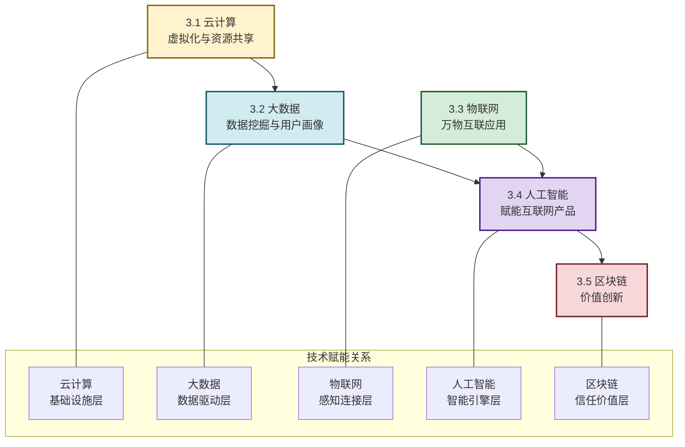

# MOC - 第3章 支撑互联网创新的关键技术

> [!info] 本章定位
> 本章是互联网创新的**技术底座章**。如果说商业模式是互联网创新的"灵魂"，那么关键技术就是"躯体"。本章要回答的核心问题是：**支撑互联网创新的五大关键技术（云计算、大数据、物联网、人工智能、区块链）分别解决什么问题？它们的核心原理是什么？如何组合赋能创造新的产品和商业模式？** 理解技术底座，才能在 [[MOC - 第4章|第4章 互联网产品创新与设计思维]] 和 [[MOC - 第5章|第5章 产业互联网与行业数字化转型]] 中灵活运用技术方案解决实际问题。

## 学习路线图

## 知识点导航

| 小节 | 标题 | 核心内容 | 关键概念 |
| ---- | ---- | -------- | -------- |
| [[3.1 云计算、虚拟化与资源共享\|3.1]] | 云计算、虚拟化与资源共享 | 云计算定义、IaaS/PaaS/SaaS对比、公有云/私有云/混合云、虚拟化与资源池化 | 云原生、弹性伸缩、容器、云原生架构 |
| [[3.2 大数据、数据挖掘与用户画像\|3.2]] | 大数据、数据挖掘与用户画像 | 4V特征、数据处理流程、数据挖掘方法、用户画像构建 | 实时数仓、数据挖掘、标签体系、千人千面 |
| [[3.3 物联网与万物互联应用\|3.3]] | 物联网与万物互联应用 | 三层架构、关键通信技术、IoT平台、智能家居/车联网案例 | 感知层、边缘计算、V2X、生态平台 |
| [[3.4 人工智能赋能互联网产品\|3.4]] | 人工智能赋能互联网产品 | AI技术谱系、生成式AI、AI Agent、推荐系统案例 | 深度学习、大语言模型、Agent、数据飞轮 |
| [[3.5 区块链基础与互联网价值创新\|3.5]] | 区块链基础与互联网价值创新 | 核心原理、共识算法、智能合约、DApp、比特币/以太坊案例 | PoW/PoS、智能合约、DeFi、Web3.0 |

## 核心考点

> [!summary] 本章核心考点（8 点）
> 1. **云计算的三种服务模式对比**：IaaS（基础设施即服务）、PaaS（平台即服务）、SaaS（软件即服务）的管控层级、用户职责、适用场景差异；理解从IaaS→PaaS→SaaS抽象层级逐步上升的演进规律；
> 2. **大数据的4V特征与处理流程**：Volume（体量）、Variety（类型）、Value（价值密度）、Velocity（速度）的辩证关系；从数据采集→存储→处理→分析→价值变现的完整链路；
> 3. **用户画像的构建与应用**：用户画像的五维度（人口属性、行为特征、兴趣偏好、社交关系、消费能力）；标签体系设计（基础/行为/偏好/模型标签）；在精准推荐、精准营销、风险控制中的应用；
> 4. **物联网三层架构**：感知层（数据采集）、网络层（数据传输）、应用层（数据处理与服务）的分工与协作；关键通信技术（WiFi/蓝牙/Zigbee/NB-IoT/5G）的适用场景对比；
> 5. **AI在互联网产品中的赋能路径**：从数据→特征→模型→产品功能的AI赋能链路；推荐系统的多路召回→粗排→精排→重排的工程架构；数据飞轮效应；
> 6. **生成式AI与AI Agent的区别**：生成式AI是"内容生成工具"（被动响应），AI Agent是"任务执行体"（主动规划）；大语言模型的核心能力与局限；
> 7. **区块链核心原理与类型**：区块链式结构、哈希指针防篡改、共识算法（PoW/PoS/PBFT）；公有链/联盟链/私有链的适用场景对比；智能合约和DApp的运作机制；
> 8. **五大技术的协同赋能**：云计算是基础设施、大数据是数据引擎、物联网是感知触角、AI是智能大脑、区块链是信任基石——五大技术不是孤立的，而是共同构成互联网创新的技术底座。

## 技术协同关系

> [!example] 五大技术如何协同工作
> 以"智慧城市"为例：
> 1. **物联网**：部署摄像头、传感器、交通灯等设备，采集城市运行数据；
> 2. **云计算**：将设备数据存储在云端，提供弹性计算资源；
> 3. **大数据**：对海量城市数据进行实时处理和分析（交通流量、空气质量等）；
> 4. **人工智能**：基于数据训练AI模型，实现智能交通调度、环境预测等；
> 5. **区块链**：对关键数据（如交通违章、环境监测数据）进行可信存证，确保不可篡改。
>
> 这就是"**技术组合创新**"的典型体现——单一技术无法实现的能力，通过多技术协同得以实现。

## 章节导航

> [!nav] 导航
> 上级：[[MOC - 互联网创新|课程总览]]
> 上一章：[[MOC - 第2章|第2章 互联网典型商业模式]]
> 下一章：[[MOC - 第4章|第4章 互联网产品创新与设计思维]]
> 配套习题：[[MOC - 第3章习题|第3章 习题]]