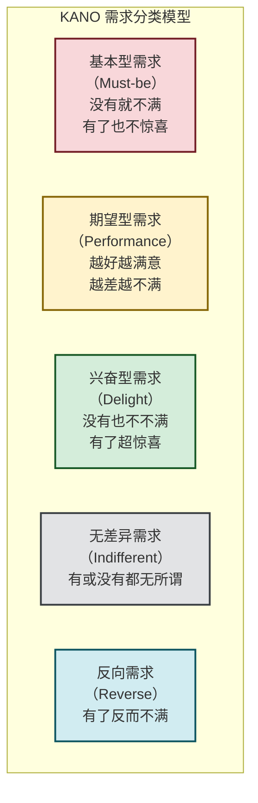
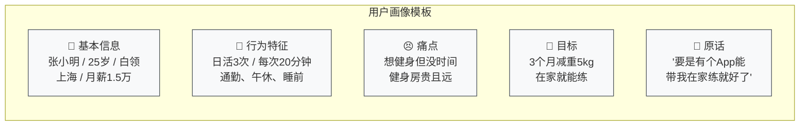

# 4.1 用户需求挖掘、用户画像构建

> [!abstract] 本节概述
> 用户需求挖掘是互联网产品创新的**起点**，用户画像是产品决策的**锚点**。本节系统介绍需求挖掘的核心方法（定性+定量）、KANO 需求分类模型，以及如何构建高质量的用户画像（Persona）。通过美团外卖和抖音的实战案例，展示如何将"用户声音"转化为"产品方向"。

## 一、需求挖掘：产品创新的起点

### 1.1 为什么需求挖掘如此重要

> [!tip] 需求挖掘的核心逻辑
> 互联网产品的失败，80% 不是因为技术不行，而是因为**做了用户不需要的东西**。需求挖掘的本质是：**在你投入大量资源之前，先验证"用户是否真的有这个痛点"**。这就像盖楼之前先做地质勘探——勘探做不好，楼盖得再高也会塌。

### 1.2 需求挖掘的两大方法体系

| 维度 | 定性研究（Qualitative） | 定量研究（Quantitative） |
| ---- | ----------------------- | ------------------------ |
| **核心目标** | 探索"为什么" | 验证"有多少" |
| **典型方法** | 用户访谈、焦点小组、 diary study | 问卷调查、数据分析、A/B 测试 |
| **样本量** | 小（5-15 人） | 大（100+ 份） |
| **优势** | 深入了解动机、情感、场景 | 统计上可靠、可量化 |
| **局限** | 主观性强、难以推广 | 难以发现"未知需求" |
| **适用场景** | 产品早期、探索新领域 | 产品成熟期、验证假设 |

### 1.3 核心需求挖掘方法详解

#### 用户访谈

> [!definition] 用户访谈
> 用户访谈是通过与目标用户进行一对一深度对话，挖掘其使用场景、痛点和潜在需求的**定性研究方法**。

**访谈核心技巧（5 要点）：**

1. **不问"你想要什么"** — 用户不知道自己想要什么（亨利·福特名言："如果我问人们想要什么，他们会说想要一匹更快的马"）
2. **关注"用户做了什么"** — 通过具体行为还原真实需求
3. **追问"为什么"** — 连问 5 次"为什么"，挖到根因
4. **关注"使用场景"** — 在具体场景中理解需求
5. **记录原话** — 不要用自己的话转述，保留用户原话

> [!example] 美团外卖的需求挖掘
> 美团早期团队通过用户访谈发现：
> - 用户说"我不想下楼吃饭" → 不是不想下楼，而是**不想穿衣服下楼**（场景：冬天/下雨天）
> - 用户说"外卖太慢" → 不是真的慢，而是**等待时的焦虑**（场景：饭点前 30 分钟下单）
> - 商家说"外卖订单管理混乱" → 需要**与现有收银系统对接**（商家真实痛点）
> 这些洞察直接决定了美团的产品形态：预测式调度、订单管理系统、骑手 App。

#### 数据分析

> [!tip] 数据是"被动的用户访谈"
> 用户说的可能是谎言，但数据不会。通过分析用户行为数据，可以发现用户**没有说出来的真实需求**：
> - **漏斗分析**：用户在哪一步流失了？→ 那一步就是痛点
> - **留存分析**：哪些功能的用户留存率最高？→ 核心价值点
> - **路径分析**：用户实际的使用路径是什么？→ 优化路径

### 1.4 KANO 模型：需求分类与优先级

> [!definition] KANO 模型
> KANO 模型由日本学者狩野纪昭提出，将需求分为五类，帮助团队确定需求优先级。



**KANO 模型实战（以抖音为例）：**

| 需求类型 | 抖音案例 | 优先级 |
| -------- | -------- | ------ |
| **基本型** | 视频能正常播放、网络不卡 | 必须做，不做会死 |
| **期望型** | 视频推荐精准、加载速度快 | 做得越好用户越满意 |
| **兴奋型** | AI 特效、合拍、直播打赏 | 差异化竞争力，让用户惊喜 |
| **无差异型** | 设置页面的排版 | 不重要 |
| **反向需求** | 强制看长广告、复杂的注册流程 | 做了反而流失用户 |

> [!warning] KANO 模型的常见误区
> 1. 不要把所有需求都当"兴奋型"——兴奋型是**稀缺资源**，每个版本最多做 1-2 个
> 2. 需求会进化——今天的"兴奋型"明天可能变成"期望型"，后天变成"基本型"（例如：短视频推荐从"惊喜"变成"理所当然"）
> 3. 不要忽视"反向需求"——有些功能做得越多越糟糕

## 二、用户画像：让需求"看得见、摸得着"

### 2.1 什么是用户画像

> [!definition] 用户画像（Persona）
> 用户画像是**基于真实用户研究构建的"虚拟用户代表"**，它不是一个真实的人，而是"真实用户的浓缩"。画像包含目标用户的核心特征、行为模式、痛点和目标，帮助团队在产品决策时"有一个具体的人可以讨论"。

### 2.2 用户画像的核心要素

> [!info] 用户画像六要素
> 1. **基本信息**：姓名、年龄、性别、职业、城市、收入
> 2. **行为特征**：产品使用频率、使用场景、使用时长、操作路径
> 3. **痛点与需求**：核心痛点（Pain）、真实需求（Gain）、待完成任务（JTBD）
> 4. **目标与动机**：使用产品的核心目标、内在动机、外在压力
> 5. **态度与偏好**：技术水平、设计偏好、品牌敏感度、社交属性
> 6. **典型引用**：用户原话（最有力量的画像元素）

### 2.3 用户画像模板



### 2.4 案例：美团外卖用户画像

> [!example] 美团外卖核心用户画像
>
> **画像 1：都市白领 "李经理"**
> | 要素 | 内容 |
> | ---- | ---- |
> | 基本信息 | 李经理 / 28岁 / 互联网产品经理 / 北京望京 / 年薪 40 万+ |
> | 行为特征 | 工作日日均下单 1.5 次 / 午餐 12:00 / 晚餐 18:30 / 午休时在工位快速下单 |
> | 痛点 | 午餐选择少、外卖等待时间不确定、办公室不允许下楼 |
> | 目标 | 吃到健康、多样、准时的午餐 |
> | 原话 | "每天中午最头疼的不是吃什么，而是等外卖的焦虑" |
>
> **画像 2：高校学生 "小张"**
> | 要素 | 内容 |
> | ---- | ---- |
> | 基本信息 | 小张 / 21岁 / 大学生 / 广州大学城 / 月生活费 2000 元 |
> | 行为特征 | 每周下单 3-4 次 / 夜宵订单占比高(40%) / 价格敏感度高 |
> | 痛点 | 食堂排队人多、宿舍懒得下楼、预算有限 |
> | 目标 | 用最少的钱吃到最多样的食物 |
> | 原话 | "有没有满 30 减 15 的券？我想凑单" |

### 2.5 案例：抖音用户画像

> [!example] 抖音核心用户画像
>
> **画像 1：小镇青年 "阿强"**
> | 要素 | 内容 |
> | ---- | ---- |
> | 基本信息 | 阿强 / 23岁 / 县城快递员 / 四川某县城 / 月薪 5000 元 |
> | 行为特征 | 日活 3 小时+ / 下班后刷 / 喜欢搞笑段子和三农内容 |
> | 痛点 | 县城娱乐少、想了解外面的世界、想赚钱 |
> | 目标 | 通过抖音看世界、学习赚钱方法、拍自己的视频 |
> | 原话 | "抖音让我看到了外面的世界，我也想拍视频赚钱" |
>
> **画像 2：都市白领 "Lisa"**
> | 要素 | 内容 |
> | ---- | ---- |
> | 基本信息 | Lisa / 27岁 / 市场总监 / 上海静安区 / 年薪 60 万 |
> | 行为特征 | 日活 45 分钟 / 碎片化刷 / 关注时尚、美食、旅行 |
> | 痛点 | 工作压力大、想放松、想获取灵感 |
> | 目标 | 放松心情、获取时尚资讯、学习生活技巧 |
> | 原话 | "抖音是我的解压神器，睡前刷 15 分钟就好" |

## 三、从需求到画像：实战流程

> [!tip] 需求挖掘到画像构建的完整流程
>
> ```mermaid
> flowchart LR
>     A["1. 背景分析<br/>市场规模、竞争格局<br/>用户基数"] --> B["2. 研究设计<br/>选择研究方法<br/>（定性/定量）"]
>     B --> C["3. 执行研究<br/>用户访谈/问卷调查<br/>数据分析"]
>     C --> D["4. 洞察提炼<br/>识别核心痛点<br/>发现真实需求"]
>     D --> E["5. 画像构建<br/>整合为 Persona<br/>验证画像有效性"]
>     E --> F["6. 画像应用<br/>指导产品设计<br/>指导营销传播"]
> ```
>
> 整个过程的核心原则：**让数据说话，让用户发声**。

## 四、易错点

> [!warning] 需求挖掘与画像的常见误区
> 1. **"用户说的就是对的"** — 用户说想要一匹更快的马，实际想要的是更快的交通工具。关注"行为"而非"言论"
> 2. **画像 = 平均用户** — 画像不是"所有人的平均值"，而是"最典型的 2-3 类用户"
> 3. **画像一次性完成** — 用户画像是动态的，需要根据市场变化和数据反馈持续更新
> 4. **忽视非用户** — 除了现有用户，还要研究"为什么非用户不使用"——这里往往藏着最大的创新机会
> 5. **画像放在抽屉里积灰** — 画像必须嵌入到产品决策流程中，否则就是无用的装饰

## 五、与其他小节的联系

- 需求验证的下一步是 [[4.2 产品原型、MVP 最小可行产品|MVP 原型]]，将需求转化为可验证的产品形态；
- 用户画像贯穿 [[4.4 用户体验 UX、交互设计基础|UX 设计]] 全过程，指导交互设计决策；
- 需求数据是 [[4.5 增长思维、用户运营基础|增长运营]] 的基础，AARRR 模型的每个环节都需要用户画像指导。

## 章节导航

- 上一级：[[MOC - 第4章]]
- 下一节：[[4.2 产品原型、MVP 最小可行产品]]
- 习题：[[MOC - 第4章习题]]