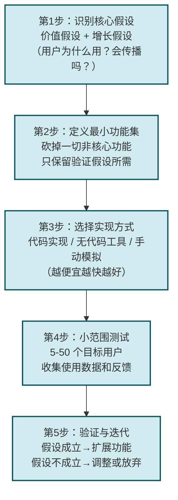
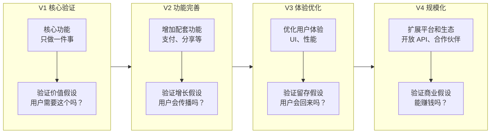

# 4.2 产品原型、MVP 最小可行产品

> [!abstract] 本节概述
> 从"用户需求"到"产品落地"之间，需要一座桥梁——**产品原型和 MVP**。本节介绍原型的三种类型（草图、线框图、高保真原型）和 MVP 的核心方法论（价值假设→最小实现→用户验证→迭代优化）。通过 Dropbox、Zapier 等经典案例，展示如何用最少的成本验证最核心的产品假设。

## 一、产品原型：想法的"纸面实现"

### 1.1 原型的定义与价值

> [!definition] 产品原型（Prototype）
> 原型是**产品的初步可视化表示**，用于在正式开发之前验证设计假设、沟通想法、收集反馈。原型的核心价值是：**用"设计"替代"开发"来验证想法，成本降低 90%+**。

### 1.2 原型的三种类型

| 类型 | 制作工具 | 制作时间 | 核心用途 | 特点 |
| ---- | -------- | -------- | -------- | ---- |
| **低保真原型**（草图） | 纸笔、白板 | 分钟级 | 快速探索想法、团队内部讨论 | 粗糙、快速、低成本 |
| **中保真原型**（线框图） | Balsamiq、Figma | 小时级 | 验证信息架构、交互逻辑 | 清晰、可点击、可演示 |
| **高保真原型**（视觉稿） | Figma、Sketch、Adobe XD | 天/周级 | 验证视觉设计、用户测试 | 精美、接近真实产品 |

> [!tip] 原型选择的黄金法则
> - **产品早期**：用低保真原型快速探索 3-5 个不同方案
> - **产品中期**：用中保真原型确定核心交互流程
> - **产品后期**：用高保真原型做用户测试、获取投资

### 1.3 原型的核心原则

1. **目的明确**：每个原型都要回答一个具体问题（"这个流程用户能理解吗？"、"这个布局合理吗？"）
2. **快速迭代**：原型的价值在于"快速试错"，不要追求完美
3. **用户测试**：原型做出来就要给用户看，5 个用户就能发现 85% 的问题（尼尔森法则）
4. **不要过度投入**：原型不是产品，投入过多时间在原型上会拖慢进度

## 二、MVP：最小可行产品

### 2.1 MVP 的核心定义

> [!definition] MVP（Minimum Viable Product）
> MVP 是**最小可行产品**——用最少的开发资源，构建一个"功能足够"的产品版本，用来验证最核心的价值假设。MVP 的本质不是"简陋"，而是"聚焦"：去掉一切非核心功能，只保留验证核心假设所需的最小功能集。

> [!info] MVP 的两个关键词
> - **最小（Minimum）**：只保留验证核心假设所需的功能，砍掉一切"锦上添花"
> - **可行（Viable）**：产品必须"能用"，能够完整跑通核心业务流程，给用户创造真实价值

### 2.2 MVP 的核心逻辑

> [!tip] MVP 的价值假设驱动
> MVP 不是"先做出来再找用户"，而是"先有假设再做产品"：
> 1. **价值假设**：用户是否会因为这个产品而获得价值？
> 2. **增长假设**：用户是否会传播这个产品？
> 3. **可行性假设**：我们能否用合理的成本构建这个产品？

### 2.3 MVP 五步法

### 2.4 MVP 的经典实现方式

| 方式 | 说明 | 成本 | 适用场景 |
| ---- | ---- | ---- | -------- |
| **纯代码开发** | 用正式技术栈开发 MVP | 高（$10k+） | 有技术团队、预算充足 |
| **无代码/低代码平台** | Bubble、Webflow、Appsheet | 低（$0-5k） | 非技术创始人、快速验证 |
| **手动模拟（Wizard of Oz）** | 后台人工模拟产品功能 | 极低（$0） | 验证服务类产品 |
| **落地页（Landing Page）** | 用落地页测试用户付费意愿 | 极低（$0-100） | 验证市场需求 |
| **众筹验证** | Kickstarter/Indiegogo 众筹 | 极低 | 验证付费意愿+筹集资金 |

### 2.5 成功案例

> [!example] 案例一：Dropbox 的视频 MVP
>
> Dropbox 创始人 Drew Houston 在 MIT 读书时，发现自己总是忘记带 U 盘。他的 MVP 验证方式非常聪明：
> 1. 做了一个 **3 分钟的演示视频**，展示 Dropbox 的核心功能（文件云同步）
> 2. 视频发布在 Hacker News 上，**24 小时内获得了 7 万注册用户**
> 3. 确认了用户需求后，才开始正式开发
>
> **核心启示**：MVP 不一定是"可运行的产品"，也可以是"演示视频"——关键是**验证核心假设**。Dropbox 用一个视频验证了"用户确实需要文件云同步"这个假设。

> [!example] 案例二：Zapier 的"手动 MVP"
>
> Zapier（自动化工作流平台）的创始人 Wade Foster 在创业初期，没有资金和技术团队：
> 1. 做了一个简单的网站，提供 5 个应用的自动化对接服务
> 2. 当用户下单后，**他手动帮用户完成对接**（每天工作 16 小时）
> 3. 通过手动执行验证了"用户愿意为自动化付费"这个假设
> 4. 拿到了第一轮融资后，才把手动流程自动化
>
> **核心启示**：当你有服务类产品的想法时，Wizard of Oz 方法——**用人工模拟产品功能**——是最廉价的 MVP 方式。

> [!example] 案例三：美团的"外包 MVP"
>
> 美团早期没有自建配送团队：
> 1. 先做了一个简单的点餐网站
> 2. 用户下单后，美团员工**自己骑自行车去餐厅取餐送餐**
> 3. 验证了"用户愿意在线点餐、等待配送"这个核心假设
> 4. 确认需求后，才开始建立配送团队和调度系统
>
> **核心启示**：MVP 的关键是**验证价值假设**，而不是验证技术可行性。用最"笨"的方法跑通流程，比技术完美更重要。

### 2.6 MVP 迭代路径

## 三、MVP 的常见误区

> [!warning] MVP 五大误区
>
> **误区 1：MVP = 简陋产品**
> MVP 不是"做得粗糙"，而是"做得聚焦"。核心流程必须流畅，体验不能差到让用户无法完成核心任务。如果用户连核心功能都用不了，MVP 验证的不是"价值假设"，而是"体验假设"。
>
> **误区 2：一次验证所有假设**
> 一个 MVP 只能验证 1-2 个核心假设。试图验证所有假设会导致 MVP 过重、上线过慢、无法归因。
>
> **误区 3：忽视非功能需求**
> 即使是 MVP，安全性、性能、兼容性等非功能需求也不能完全忽视。如果你的 MVP 因为安全问题导致用户数据泄露，再好的概念也没用。
>
> **误区 4：过度关注技术实现**
> MVP 的关键是"验证假设"，不是"实现技术"。用 3 周时间手动模拟出来的 MVP，比用 3 个月开发出来的完美产品更有价值。
>
> **误区 5：不做用户测试就上线**
> 有些团队"自信地"认为自己的想法是对的，直接投入大量资源开发。结果产品上线后发现根本没人用——这不是"勇敢"，这是"浪费"。

## 四、与其他小节的联系

- MVP 验证的假设来自 [[4.1 用户需求挖掘、用户画像构建|用户需求挖掘]] 的成果；
- MVP 开发过程采用 [[4.3 迭代开发、敏捷思想在互联网应用|敏捷开发]] 的迭代模式；
- MVP 的用户体验需要 [[4.4 用户体验 UX、交互设计基础|UX 设计]] 的指导；
- MVP 的数据验证是 [[4.5 增长思维、用户运营基础|增长思维]] 的起点。

## 章节导航

- 上一级：[[MOC - 第4章]]
- 上一节：[[4.1 用户需求挖掘、用户画像构建]]
- 下一节：[[4.3 迭代开发、敏捷思想在互联网应用]]
- 习题：[[MOC - 第4章习题]]