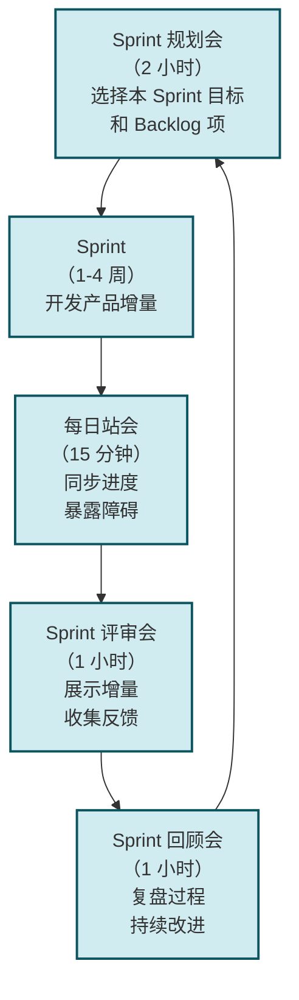
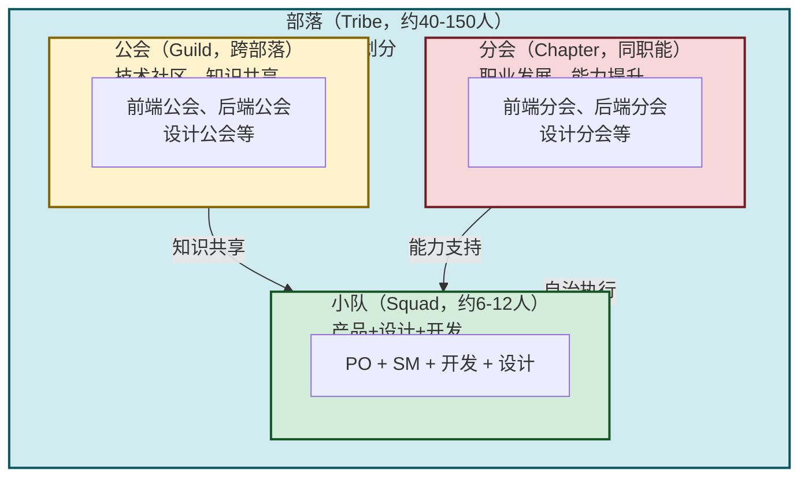

# 4.3 迭代开发、敏捷思想在互联网应用

> [!abstract] 本节概述
> 互联网产品的核心竞争力之一是**速度**——快速迭代、快速学习、快速适应市场变化。本节对比传统瀑布模型与敏捷开发的核心差异，系统介绍 Scrum 框架的三大角色、三大工件和五大事件，并通过 Spotify 模型展示敏捷在大型互联网团队的规模化实践。

## 一、为什么互联网产品需要敏捷

### 1.1 互联网产品的独特挑战

> [!warning] 互联网产品面临的三大挑战
> 1. **需求变化快**：用户需求、竞品动作、技术趋势瞬息万变，半年前的需求文档可能已经过时
> 2. **用户期望高**：互联网用户习惯了"每周更新"，一个产品半年不更新就会被遗忘
> 3. **试错成本低**：互联网产品的边际成本趋近于零，快速上线、快速试错比"一次做对"更重要

### 1.2 传统瀑布模型的局限

> [!definition] 瀑布模型（Waterfall Model）
> 瀑布模型是**线性的、顺序的开发方法**：需求→设计→开发→测试→部署，每个阶段必须完成后才能进入下一个阶段。

| 维度 | 瀑布模型 | 敏捷开发 |
| ---- | -------- | -------- |
| **开发模式** | 线性顺序，一步到位 | 迭代增量，快速循环 |
| **需求变化** | 前期冻结，变化成本极高 | 拥抱变化，随时调整 |
| **交付节奏** | 一次性交付整个产品 | 2-4 周交付一个可用增量 |
| **用户参与** | 主要在需求阶段参与 | 每个迭代都参与反馈 |
| **风险控制** | 后期集中测试，风险集中 | 早期持续测试，风险分散 |
| **适用场景** | 需求稳定、变化少（如硬件、政府项目） | 需求变化快、创新产品（如互联网 App） |

## 二、敏捷开发核心思想

### 2.1 敏捷宣言四大价值观

> [!info] 敏捷宣言（2001 年发布）
> 1. **个体与互动** 高于 流程与工具
> 2. **可工作的软件** 高于 详尽的文档
> 3. **客户合作** 高于 合同谈判
> 4. **响应变化** 高于 遵循计划

> [!tip] 敏捷宣言的本质
> 敏捷不是一套具体的工具或流程，而是一种**思维方式**：以人为本、结果导向、拥抱变化、持续改进。

### 2.2 敏捷十二原则

1. 最高优先级是满足客户需求
2. 欢迎需求变化，即使在开发后期
3. 频繁交付可用的软件（几周而非几个月）
4. 业务人员和开发人员必须天天在一起
5. 围绕激励的个体构建项目
6. 面对面的交流是最有效率的方法
7. 可工作的软件是衡量进度的首要标准
8. 促进可持续的开发节奏
9. 持续关注技术卓越性
10. 简单化——最大化未完成工作量的艺术
11. 最好的架构、需求和设计出自自组织团队
12. 定期反思如何变得更有效，然后调整

## 三、Scrum 框架详解

### 3.1 Scrum 三大角色

> [!definition] Scrum 角色
>
> | 角色 | 职责 | 关键能力 |
> | ---- | ---- | -------- |
> | **产品负责人（Product Owner, PO）** | 定义产品愿景、管理产品 Backlog、确定优先级 | 商业思维、需求分析、优先级判断 |
> | **敏捷教练（Scrum Master, SM）** | 促进 Scrum 实践、移除障碍、保护团队 | 沟通协调、冲突解决、流程优化 |
> | **开发团队（Development Team）** | 自组织、跨职能、在 Sprint 内交付可用产品 | 技术能力、协作能力、自管理 |

### 3.2 Scrum 三大工件

| 工件 | 说明 | 所有者 |
| ---- | ---- | ------ |
| **产品 Backlog（Product Backlog）** | 产品所有需求的有序列表，按优先级排列 | PO |
| **Sprint Backlog** | 当前 Sprint 需要完成的任务列表 | 开发团队 |
| **产品增量（Increment）** | Sprint 结束时交付的可用产品 | 开发团队 |

### 3.3 Scrum 五大事件

> [!tip] Scrum Sprint 流程详解
> 1. **Sprint 规划会**：PO 展示 Product Backlog，团队选择本 Sprint 要完成的条目，确定 Sprint Goal
> 2. **Sprint 执行**：1-4 周的开发周期，团队自组织完成任务
> 3. **每日站会**：每天 15 分钟，团队成员回答三个问题：昨天做了什么？今天要做什么？有什么障碍？
> 4. **Sprint 评审会**：Sprint 结束后，团队展示增量给 PO 和利益相关者，收集反馈
> 5. **Sprint 回顾会**：团队回顾本 Sprint 的过程，识别改进点，持续优化

### 3.4 Scrum 看板与速率

> [!example] Scrum 实践工具
> - **看板（Kanban）**：用可视化卡片追踪任务状态，典型列：待办→进行中→待验证→已完成
> - **速率图（Velocity Chart）**：追踪团队每个 Sprint 完成的工作量，预测交付能力
> - **燃尽图（Burndown Chart）**：追踪剩余工作量随时间的变化，预测 Sprint 是否能按时完成

## 四、敏捷 vs 瀑布：实战对比

> [!example] 某电商平台的开发模式对比
>
> | 维度 | 瀑布模式体验 | 敏捷模式体验 |
> | ---- | ------------ | ------------ |
> | **周期** | 6 个月交付一次大版本 | 2 周交付一个小版本 |
> | **需求变化** | 中途改需求需要走变更流程，可能等待 2-4 周 | 直接在下一个 Sprint 纳入 Backlog |
> | **用户反馈** | 产品上线后才能收集反馈 | 每个 Sprint 都可以收集真实用户反馈 |
> | **风险** | 6 个月后才发现问题，修复成本高 | 2 周内发现问题，修复成本低 |
> | **团队士气** | 长期看不到成果，士气容易低落 | 每 2 周有交付成果，成就感强 |
> | **结果** | 产品上线后可能已过时 | 产品持续迭代，保持竞争力 |

## 五、Spotify 模型：规模化敏捷

### 5.1 Spotify 团队结构

> [!definition] Spotify 模型
> Spotify 模型是 Spotify 公司发展出的**规模化敏捷框架**，核心是将大公司拆分为小的、自治的团队单元。

### 5.2 Spotify 模型核心特点

> [!tip] Spotify 模型的成功之道
> 1. **小队自治**：每个 Squad 有自己的 PO、SM 和开发团队，独立负责一个产品领域，50% 的时间做规划、50% 做执行
> 2. **部落对齐**：Tribe 内部通过会议和协作机制保持对齐，但不干涉 Squad 日常工作
> 3. **公会知识共享**：Guild 是跨 Squad 的技术社区，定期分享技术实践和经验教训
> 4. **分会职业发展**：Chapter 是同职能人员的职业发展社区，确保每个职能领域的能力提升
> 5. **"尝试、检查、学习"文化**：鼓励 Squad 大胆尝试，快速验证，从失败中学习

### 5.3 Spotify 模式的启示

> [!example] Spotify 模型对中国互联网的启示
> - **阿里巴巴**：采用类似的"大中台、小前台"模式，前台业务小队自治，中台提供共享服务
> - **字节跳动**：采用"Project X"模式，小团队快速推进新项目，成功后再扩容
> - **美团**：采用"特种部队"模式，小团队独立负责一个业务方向，从 0 到 1 快速验证

## 六、敏捷在互联网的常见误区

> [!warning] 敏捷实践的五大误区
>
> **误区 1：敏捷 = 快**
> 敏捷的核心不是"快"，而是"持续交付价值"。为了快而牺牲质量，最终只会导致技术债务累积。
>
> **误区 2：敏捷 = 无政府**
> 敏捷不是"没有流程"，而是"流程轻量化"。Scrum 仍然有明确的角色、工件和事件，只是更灵活。
>
> **误区 3：敏捷 = 小团队**
> 敏捷适用于任何规模的团队，关键是"自组织"和"跨职能"。Spotify 模型证明了敏捷可以扩展到数千人的组织。
>
> **误区 4：敏捷 = 不需要文档**
> 敏捷减少的是"过度的前期文档"，但不是不要文档。用户故事、架构决策、API 文档等仍然需要。
>
> **误区 5：敏捷 = Scrum**
> Scrum 只是敏捷的一种框架，还有 Kanban、XP、Crystal 等。选择适合团队的框架比"套用 Scrum"更重要。

## 七、与其他小节的联系

- 敏捷的 Sprint 节奏与 [[4.2 产品原型、MVP 最小可行产品|MVP 迭代]] 天然契合，每个 Sprint 交付一个 MVP 增量；
- 敏捷的快速迭代为 [[4.4 用户体验 UX、交互设计基础|UX 设计]] 提供了持续优化的机制；
- 敏捷的"数据驱动"理念与 [[4.5 增长思维、用户运营基础|增长思维]] 一脉相承。

## 章节导航

- 上一级：[[MOC - 第4章]]
- 上一节：[[4.2 产品原型、MVP 最小可行产品]]
- 下一节：[[4.4 用户体验 UX、交互设计基础]]
- 习题：[[MOC - 第4章习题]]