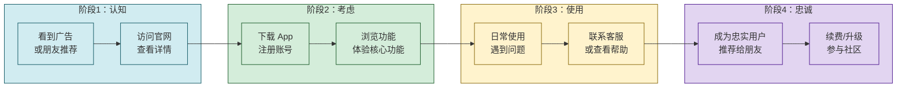

# 4.4 用户体验 UX、交互设计基础

> [!abstract] 本节概述
> 用户体验（UX）是互联网产品的**终极竞争力**——技术可以被复制，商业模式可以被模仿，但优秀的用户体验是难以超越的壁垒。本节介绍 UX 的核心定义、设计原则（特别是尼尔森十大可用性原则）、交互设计基础，并通过 iOS 系统的交互设计案例和用户旅程图，展示如何将"用户为中心"的理念落地到产品细节中。

## 一、UX：不仅仅是"好不好看"

### 1.1 UX 的定义

> [!definition] 用户体验（User Experience, UX）
> 用户体验是**用户在使用产品过程中的全部感受**——包括情感、认知、行为三个维度。UX 不是单一的视觉设计，而是"设计整个用户旅程"，从用户接触产品的第一刻起，到使用结束后的全部感受。

**UX 的三层结构：**

| 层次 | 说明 | 示例 |
| ---- | ---- | ---- |
| **感官层** | 视觉、听觉、触觉等感官体验 | 好看的界面、悦耳的提示音、流畅的动画 |
| **行为层** | 操作效率、易用性、反馈及时性 | 一键下单、即时反馈、手势操作 |
| **认知层** | 信息架构、导航逻辑、理解成本 | 清晰的菜单、易懂的图标、合理的流程 |

> [!tip] UX 的核心公式
> 优秀的 UX = **功能 × 易用性 × 情感连接**
> - 功能：产品能完成核心任务吗？
> - 易用性：用户能轻松完成任务吗？
> - 情感连接：用户享受使用过程吗？

### 1.2 UX 与 UI 的区别

| 维度 | UX（用户体验） | UI（用户界面） |
| ---- | -------------- | -------------- |
| **关注点** | 用户"感受"如何 | 界面"看起来"如何 |
| **范围** | 整个用户旅程的设计 | 视觉元素的设计 |
| **目标** | 解决用户问题 | 呈现产品功能 |
| **类比** | 建筑设计（空间布局、人流动线） | 室内装潢（颜色、家具、装饰） |
| **核心问题** | 这个流程合理吗？ | 这个按钮好看吗？ |

## 二、尼尔森十大可用性原则

> [!info] 尼尔森十大原则
> 由 usability.gov 整理，是 UX 设计领域的"宪法"，所有设计决策都应参照这十大原则。

### 原则 1：系统状态可见

> [!example] 系统必须在合理时间内，通过适当的反馈告知用户当前状态
>
> **好的案例**：外卖 App 中的"骑手位置实时追踪"——用户随时知道骑手在哪、预计多久送达
>
> **差的案例**：网页提交表单后没有任何反馈，用户不知道是否提交成功

### 原则 2：匹配真实世界

> [!example] 设计应使用用户熟悉的概念和语言，避免技术术语
>
> **好的案例**：iOS 的"删除"按钮用垃圾桶图标，全球通用
>
> **差的案例**：用"资源回收"代替"删除"，或用专业术语让用户困惑

### 原则 3：控制与自由

> [!example] 提供"撤销"和"重做"功能，给用户后悔的机会
>
> **好的案例**：微信"撤回"消息、Photoshop 的多步撤销
>
> **差的案例**：删除操作不可恢复，用户误操作后只能认倒霉

### 原则 4：一致性与标准化

> [!example] 保持设计元素和交互模式的一致性
>
> **好的案例**：所有按钮使用相同的样式和位置、相同的操作使用相同的图标
>
> **差的案例**：不同页面的"返回"按钮位置和样式不统一

### 原则 5：错误预防

> [!example] 在错误发生之前就预防，而不是等错误发生后再提示
>
> **好的案例**：表单提交前验证、危险操作二次确认、删除前提示"将永久删除"
>
> **差的案例**：用户误删重要数据后才提示"操作已完成"

### 原则 6：识别而非回忆

> [!example] 减少用户的记忆负担，让信息"可见"而不是"需要回忆"
>
> **好的案例**：登录时自动记住账号、历史记录可追溯、最近使用的文件置顶
>
> **差的案例**：要求用户每次输入复杂的验证码、不提供密码找回功能

### 原则 7：灵活与高效

> [!example] 为新用户提供简洁的路径，为熟练用户提供快捷方式
>
> **好的案例**：网页的"快捷键"、iPhone 的 3D Touch/长按手势、Excel 的公式自动补全
>
> **差的案例**：强制所有用户走相同的复杂流程

### 原则 8：极简美学

> [!example] 界面应只包含必要信息，避免干扰
>
> **好的案例**：Google 首页只有一个搜索框、微信启动页只有 Logo
>
> **差的案例**：首页充满广告弹窗、装饰性元素过多

### 原则 9：容错与恢复

> [!example] 帮助用户识别、诊断和恢复错误
>
> **好的案例**：404 页面提供返回首页的链接、表单验证提示具体错误位置
>
> **差的案例**：错误提示只有"出错了"而没有任何恢复建议

### 原则 10：帮助与文档

> [!example] 提供清晰的帮助文档和引导
>
> **好的案例**：新用户引导流程、上下文帮助、搜索式帮助中心
>
> **差的案例**：没有帮助文档或帮助文档晦涩难懂

## 三、交互设计基础

### 3.1 核心交互模式

| 交互模式 | 说明 | 适用场景 | 案例 |
| -------- | ---- | -------- | ---- |
| **直接操作** | 直接操纵对象完成任务 | 视觉化操作 | 拖拽文件、滑动排序、双指缩放 |
| **间接操作** | 通过控件间接完成任务 | 精确控制 | 音量调节、亮度调整、输入框 |
| **手势操作** | 用手指/笔的特定动作触发 | 移动设备 | 滑动删除、双指旋转、长按菜单 |
| **语音操作** | 通过语音指令完成任务 | 无手操作 | Siri、小爱同学、语音输入 |
| **物理隐喻** | 模拟现实世界的物理操作 | 增强直觉 | 拨动开关、旋转旋钮、拉动抽屉 |

### 3.2 交互设计三原则

> [!tip] 交互设计的"三不"原则
> 1. **不让用户想**：操作应该是"直觉的"，用户不需要思考就能完成
> 2. **不让用户等**：任何操作都应有即时反馈，超过 1 秒的操作必须有进度提示
> 3. **不让用户错**：预防错误比修复错误更重要，危险操作必须二次确认

### 3.3 iOS 交互设计案例

> [!example] iOS 系统的交互设计亮点
>
> **1. 滑动返回手势**
> - 从屏幕左边缘向右滑动即可返回上一级，替代了传统的"返回按钮"
> - 核心优势：单手操作友好、视觉直觉、符合手指运动习惯
>
> **2. 3D Touch / 长按**
> - 轻按应用图标弹出快捷菜单（微信扫码、支付宝付款）
> - 深按预览内容（不打开就能看到邮件、短信预览）
>
> **3. 控制中心**
> - 从屏幕顶部/底部下拉，快速访问 Wi-Fi、蓝牙、手电筒等
> - 核心优势：减少操作路径，常用功能"一触即达"
>
> **4. 灵动岛（iPhone 14 Pro+）**
> - 将通知、音乐播放、来电等状态整合到屏幕顶部的"动态岛"
> - 核心优势：不打断用户当前操作，优雅地展示系统状态

## 四、用户旅程图

### 4.1 什么是用户旅程图

> [!definition] 用户旅程图（User Journey Map）
> 用户旅程图是**可视化工具**，展示用户在使用产品完成特定任务过程中的全部交互、情感变化和痛点。它帮助团队从用户视角审视整个体验，发现改进机会。

### 4.2 用户旅程图模板

### 4.3 案例：外卖 App 用户旅程

> [!example] 美团外卖用户旅程（核心路径）
>
> | 阶段 | 用户行为 | 情感 | 触点 | 痛点 | 优化机会 |
> | ---- | -------- | ---- | ---- | ---- | -------- |
> | 认知 | 看到外卖 App 广告 | 好奇 | 朋友圈/短视频 | 不知道有什么好吃的 | 个性化推荐 |
> | 搜索 | 打开 App 选择餐厅 | 期待 | 首页/搜索页 | 选择困难 | 榜单/评分 |
> | 下单 | 选择菜品、支付 | 焦虑 | 订单页/支付页 | 不知道什么时候到 | 预计送达时间 |
> | 等待 | 查看骑手位置 | 焦虑→放松 | 实时追踪页 | 等待时焦虑 | 骑手位置追踪 |
> | 收货 | 收到外卖 | 满意/不满意 | 评价页 | 无反馈渠道 | 评价/客服 |

> [!tip] 用户旅程图的核心价值
> - 让团队**站在用户的角度**看问题，而不是"内部视角"
> - 发现"断点"——用户在哪个环节流失
> - 识别"痛点"——用户在哪个环节感到不便
> - 明确"机会点"——在哪些环节可以创造惊喜

## 五、UX 研究与测试

### 5.1 可用性测试

> [!definition] 可用性测试（Usability Testing）
> 可用性测试是**让真实用户使用产品完成特定任务，并观察其行为和反应**的研究方法。只需 5 个用户，就能发现 85% 的可用性问题（尼尔森研究结论）。

**可用性测试核心步骤：**

1. **定义测试目标**：要回答什么问题？（"新用户能在 5 分钟内完成下单吗？"）
2. **招募测试用户**：选择代表性的目标用户
3. **设计测试任务**：给用户具体的任务，不要给提示
4. **执行测试**：观察但不干扰，记录用户行为、错误、表情
5. **分析结果**：统计成功率、错误类型、完成时间
6. **报告与改进**：整理问题清单，按严重程度排序，制定改进计划

### 5.2 启发式评估

> [!tip] 启发式评估（Heuristic Evaluation）
> 由可用性专家基于尼尔森十大原则对产品进行系统性检查的方法。每个评估者独立检查，3 个评估者通常能发现 75% 的可用性问题。适用于没有时间或资源招募测试用户的场景。

## 六、易错点

> [!warning] UX 设计的常见误区
> 1. **UX = UI**：UX 是"体验设计"，UI 是"视觉呈现"。UX 决定了"用户怎么用"，UI 决定了"看起来怎么样"
> 2. **过度设计**：为了好看而添加的装饰性元素，往往会增加认知负担、降低易用性
> 3. **忽视可访问性**：UX 设计必须考虑视障、听障等特殊需求群体，这不仅是道德问题，也是法律要求
> 4. **以己度人**：设计师自己熟悉产品，容易忽略新手的困惑。必须用"新手的视角"审视产品
> 5. **忽略情感设计**：优秀的 UX 不仅"好用"，还要"有温度"。比如错误提示语、空状态设计等

## 七、与其他小节的联系

- UX 设计的"以用户为中心"理念源于 [[4.1 用户需求挖掘、用户画像构建|用户需求研究]]；
- UX 设计需要在 [[4.2 产品原型、MVP 最小可行产品|原型阶段]] 就进行可用性测试；
- UX 设计的持续优化依赖 [[4.3 迭代开发、敏捷思想在互联网应用|敏捷迭代]]；
- UX 是 [[4.5 增长思维、用户运营基础|增长运营]] 的基础——好的体验带来高留存。

## 章节导航

- 上一级：[[MOC - 第4章]]
- 上一节：[[4.3 迭代开发、敏捷思想在互联网应用]]
- 下一节：[[4.5 增长思维、用户运营基础]]
- 习题：[[MOC - 第4章习题]]