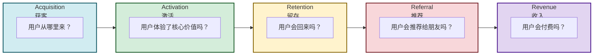
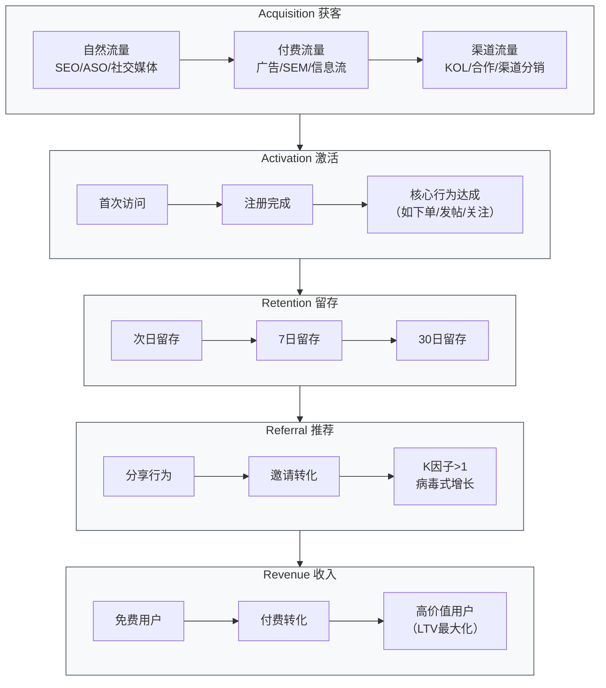

# 4.5 增长思维、用户运营基础

> [!abstract] 本节概述
> 互联网产品的终极目标是**可持续增长**。本节系统介绍增长思维的核心框架——AARRR 海盗指标模型（获客→激活→留存→推荐→收入），拆解每个环节的关键策略和实战方法。通过抖音和拼多多的增长案例，展示数据驱动的增长实验如何帮助产品实现从 0 到亿级用户的跃迁。

## 一、增长思维的本质

### 1.1 什么是增长思维

> [!definition] 增长思维
> 增长思维是一种**数据驱动、实验导向、用户全生命周期**的思维方式。它不仅仅关注"用户获取"，而是关注用户从进入产品到成为忠实用户的**完整旅程中的每一个增长机会**。

**增长思维的三大核心：**

1. **数据驱动**：所有增长决策基于数据，而非直觉
2. **实验文化**：持续进行 AB 测试，快速验证假设
3. **全链路思维**：关注用户生命周期的每个环节，而非单一环节

### 1.2 增长黑客 vs 传统营销

| 维度 | 传统营销 | 增长黑客 |
| ---- | -------- | -------- |
| **核心方法** | 品牌广告、公关活动 | 数据实验、产品迭代 |
| **关注焦点** | 品牌曝光、用户获取 | 全链路增长、留存转化 |
| **决策依据** | 经验、创意 | 数据、实验 |
| **团队构成** | 市场+品牌+内容 | 产品+技术+数据+运营 |
| **周期** | 长期（季度/年度） | 短期（周/双周） |
| **适用阶段** | 产品成熟期 | 产品全生命周期 |

## 二、AARRR 海盗指标模型

### 2.1 模型总览

> [!info] AARRR 模型
> AARRR 由增长专家 Dave McClure 提出，又称"海盗指标"，描述用户从进入产品到成为忠实用户的五个关键阶段。



### 2.2 AARRR 漏斗图



## 三、AARRR 各环节详解

### 3.1 获客（Acquisition）：用户从哪里来

> [!tip] 获客渠道分类
> | 渠道类型 | 说明 | 典型渠道 | 成本 |
> | -------- | ---- | -------- | ---- |
> | **自然流量** | 用户主动搜索/发现 | SEO、ASO、社交媒体自然流量 | 低（时间成本） |
> | **付费流量** | 花钱买流量 | 信息流广告、SEM、KOL 推广 | 高（直接成本） |
> | **渠道流量** | 合作/联盟 | 渠道分销、品牌合作、异业联盟 | 中（分成模式） |
> | **病毒流量** | 用户主动传播 | 邀请有礼、社交裂变、口碑推荐 | 极低（激励成本） |

**获客核心指标：**
- CAC（Customer Acquisition Cost）：获客成本
- 各渠道转化率：不同渠道的用户质量
- 渠道 ROI：获客投入产出比

> [!example] 拼多多的获客策略
>
> 拼多多的核心获客策略是**社交裂变**：
> 1. **拼团模式**：用户发起拼团，邀请好友一起买，价格更低
> 2. **砍价免费拿**：用户发起砍价，邀请好友帮忙砍价
> 3. **果园/牧场**：游戏化的邀请机制，邀请好友获得奖励
> 4. **结果**：获客成本远低于行业平均，实现了病毒式增长

### 3.2 激活（Activation）：让用户体验核心价值

> [!definition] 激活的定义
> 激活不是"注册完成"，而是**用户第一次体验到产品核心价值的时刻**。不同产品的激活标准不同：
> - 电商 App：完成首次下单
> - 社交 App：完成首次关注+发帖
> - 工具 App：完成首次核心功能（如记账、拍照修图）

**激活的关键策略：**

1. **优化新手引导**：
   - 减少注册步骤（一键登录、第三方登录）
   - 聚焦核心功能（不展示全部功能，只引导核心路径）
   - 即时价值交付（注册后立即体验核心功能）

2. **激活漏斗优化**：
   - 追踪激活路径上每一步的转化率
   - 找到最大的"泄漏点"，集中优化

> [!example] 抖音的激活策略
> 1. **极简注册**：手机号一键注册，或微信/QQ 直接登录
> 2. **首次体验**：打开 App 立即看到推荐视频，无需任何操作
> 3. **即时上瘾**：15 秒视频+算法推荐，让用户 3 分钟内沉浸
> 4. **结果**：激活率高达 80%+，远高于行业平均 40-60%

### 3.3 留存（Retention）：让用户回来

> [!tip] 留存是增长的基石
> - 拉新成本是留存的 5-10 倍
> - 留存率提升 5%，LTV（用户生命周期价值）可提升 25%+
> - 留存率是衡量产品"真实价值"的核心指标

**留存的关键指标：**
- **次日留存**：反映首次体验质量（目标 40%+）
- **7 日留存**：反映产品核心价值（目标 25%+）
- **30 日留存**：反映产品长期粘性（目标 15%+）

**留存的关键策略：**

| 策略 | 说明 | 案例 |
| ---- | ---- | ---- |
| **核心价值强化** | 确保用户每次使用都能获得价值 | 抖音的算法推荐越来越精准 |
| **习惯养成** | 通过打卡、积分等机制形成使用习惯 | 支付宝蚂蚁森林、微信运动 |
| **内容/社交粘性** | 让产品成为用户社交生活的一部分 | 微信的社交关系链、小红书的内容社区 |
| **推送通知** | 通过 Push 唤醒沉睡用户 | 外卖平台的"附近有 5 折"、电商的"限时秒杀" |

> [!example] 抖音的留存策略
> 1. **算法迭代**：持续优化推荐算法，让用户"越刷越上瘾"
> 2. **内容生态**：丰富内容类型（搞笑、美食、知识、游戏），满足不同场景
> 3. **创作者激励**：给创作者流量和收入激励，保证内容供给
> 4. **社交功能**：评论、关注、私信、合拍，增加社交粘性
> 5. **结果**：DAU/MAU 比超过 50%，远超行业平均水平

### 3.4 推荐（Referral）：病毒式增长的核心

> [!definition] K因子
> K因子 = 每个用户平均带来的新用户数。K > 1 时，产品实现病毒式增长；K < 1 时，增长会逐渐停滞。

**推荐的关键要素：**

1. **推荐动机**：用户为什么要推荐？
   - 情感驱动（"这个太好用了，分享给朋友"）
   - 利益驱动（"邀请好友得奖励"）
   - 社交驱动（"一起使用更有趣"）

2. **推荐便捷性**：推荐过程要尽可能简单
   - 一键分享到微信/QQ/微博
   - 邀请链接/二维码
   - 直接@好友

3. **推荐激励**：让推荐者和被推荐者都获得价值
   - 双方奖励（滴滴：推荐者和被推荐者各得 20 元券）
   - 等级奖励（邀请越多，等级越高，权益越多）

> [!example] 拼多多的推荐（裂变）逻辑
> 1. 用户发起"砍价"或"拼团"
> 2. 生成邀请链接，分享到微信好友/群
> 3. 好友点击链接，完成砍价/拼团
> 4. 用户获得低价商品，好友也获得优惠
> 5. 结果：实现了"一个用户拉 N 个用户"的病毒式传播

### 3.5 收入（Revenue）：价值变现

> [!tip] 收入不是增长的终点，而是增长的燃料
> - 收入可以再投入到获客、产品优化中，形成增长飞轮
> - 不同产品有不同的变现模式，需要找到适合自己的模式

**核心变现模式：**

| 模式 | 说明 | 适用场景 | 案例 |
| ---- | ---- | -------- | ---- |
| **广告变现** | 展示/点击/效果广告 | 用户量大、免费产品 | 抖音、微信、百度 |
| **交易抽佣** | 收取交易服务费 | 电商、O2O 平台 | 淘宝（5%）、美团（15-25%） |
| **订阅模式** | 用户定期付费 | 内容/工具类产品 | Netflix（月费）、爱奇艺（VIP） |
| **增值服务** | 基础免费、增值付费 | SaaS、工具类产品 | 飞书（基础免费+增值付费） |
| **虚拟物品** | 游戏币、道具、皮肤 | 游戏、社交产品 | 王者荣耀、原神 |

**收入核心指标：**
- ARPU（Average Revenue Per User）：每用户平均收入
- LTV（Lifetime Value）：用户生命周期总价值
- 付费转化率：免费用户→付费用户的比例
- CAC/LTV 比：获客成本与生命周期价值的比值（目标 > 3）

## 四、增长实验：数据驱动的迭代

### 4.1 AB 测试：增长的核心武器

> [!definition] AB 测试
> AB 测试是**将用户随机分组，对不同组展示不同版本，比较效果差异的实验方法**。它是数据驱动增长的核心工具。

**AB 测试的关键步骤：**

1. **提出假设**："如果我们将注册按钮从蓝色改为红色，点击率会提升 15%"
2. **设计实验**：确定实验组、对照组、实验周期、样本量
3. **执行实验**：分流用户，展示不同版本
4. **分析数据**：比较两组的核心指标差异
5. **得出结论**：统计检验显著后，决定是否推广

### 4.2 增长实验案例

> [!example] 某电商 App 的增长实验
>
> **假设**：将首页"新人福利"从"满 100 减 20"改为"首单立减 30 元"，新人转化率会提升。
>
> **实验设计**：
> - 对照组：满 100 减 20（现有方案）
> - 实验组：首单立减 30 元（新方案）
> - 实验周期：7 天
> - 样本量：每组 5000 新用户
>
> **实验结果**：
> - 对照组转化率：22.3%
> - 实验组转化率：28.7%（提升 28.7%，统计显著）
>
> **结论**：采用新方案，预计每月新增付费用户增加 6400+

### 4.3 增长飞轮

> [!tip] 增长飞轮模型
> 优秀的产品增长不是"线性的"，而是"飞轮式"的——产品价值驱动增长，增长又反过来提升产品价值。
>
> ```mermaid
> flowchart LR
>     A["用户增长"] --> B["更多内容/数据"]
>     B --> C["更好的体验"]
>     C --> D["更强的口碑"]
>     D --> A
> ```
>
> **抖音的增长飞轮**：
> 1. 用户增长 → 更多创作者和内容
> 2. 更多内容 → 算法推荐更精准
> 3. 更精准推荐 → 用户体验更好
> 4. 更好体验 → 更强口碑传播
> 5. 更强口碑 → 更多新用户
>
> 飞轮一旦转动，增长就会"自动加速"。

## 五、增长常见误区

> [!warning] 增长的五大误区
>
> **误区 1：只关注获客，忽视留存**
> 获客是"输血"，留存是"造血"。如果留存率低，再多的获客也只是"竹篮打水一场空"。
>
> **误区 2：数据驱动 = 数据迷信**
> 数据不是万能的。有些重要的东西无法用数据衡量（如品牌、口碑），需要结合定性分析。
>
> **误区 3：增长 = 黑客技术**
> 增长的核心是**为用户创造真实价值**，而不是用技术手段"欺骗"用户。
>
> **误区 4：追求短期增长，忽视长期价值**
> 病毒式获客可能带来大量低质量用户，反而损害产品口碑和长期留存。
>
> **误区 5：增长团队独立作战**
> 增长需要产品、技术、运营、市场的紧密协作，不是一个独立团队能完成的。

## 六、与其他小节的联系

- 增长的起点是 [[4.1 用户需求挖掘、用户画像构建|用户需求]]，了解用户才能有效增长；
- 增长的数据验证依赖 [[4.2 产品原型、MVP 最小可行产品|MVP 迭代]]，快速试错是增长的前提；
- 增长的载体是 [[4.3 迭代开发、敏捷思想在互联网应用|敏捷开发]]，快速迭代是增长的引擎；
- 增长的根基是 [[4.4 用户体验 UX、交互设计基础|优秀的 UX]]，好体验带来高留存、好口碑。

## 章节导航

- 上一级：[[MOC - 第4章]]
- 上一节：[[4.4 用户体验 UX、交互设计基础]]
- 习题：[[MOC - 第4章习题]]
- 下一章：[[MOC - 第5章]]