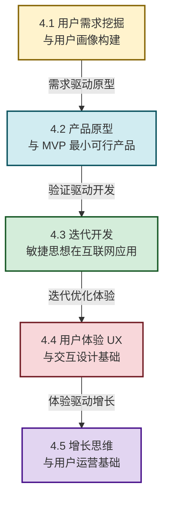

# MOC - 第4章 互联网产品创新与设计思维

> [!info] 本章定位
> 本章是互联网创新的**产品方法论核心章**。它要回答的核心问题是：**互联网产品如何从"用户需求"出发，通过 MVP 快速验证、敏捷迭代、UX 设计和增长运营，实现从 0 到 1 再到 100 的成长？** 本章将商业思维与产品方法结合，构建"需求—原型—开发—体验—增长"的完整产品创新闭环，是后续 [[MOC - 第5章|第5章 产业互联网与行业数字化转型]]（产业产品设计）和 [[MOC - 第7章|第7章 互联网创业与创新项目落地]]（创业产品实践）的方法论基础。

## 学习路线图

## 知识点导航

| 小节 | 标题 | 核心内容 | 关键概念 |
| ---- | ---- | -------- | -------- |
| [[4.1 用户需求挖掘、用户画像构建\|4.1]] | 用户需求挖掘与用户画像 | 需求挖掘方法、用户画像构建、案例分析 | 用户访谈、KANO 模型、Persona、美团画像 |
| [[4.2 产品原型、MVP 最小可行产品\|4.2]] | 产品原型与 MVP | 原型类型、MVP 五步法、成功案例、常见误区 | 低保真原型、MVP 迭代、Dropbox 案例 |
| [[4.3 迭代开发、敏捷思想在互联网应用\|4.3]] | 迭代开发与敏捷思想 | 敏捷核心、Scrum 框架、瀑布vs敏捷、案例 | Sprint、Product Backlog、Spotify 模型 |
| [[4.4 用户体验 UX、交互设计基础\|4.4]] | UX 与交互设计 | UX 原则、尼尔森十大原则、用户旅程图 | User-centered Design、交互模式、iOS 案例 |
| [[4.5 增长思维、用户运营基础\|4.5]] | 增长思维与用户运营 | AARRR 模型、增长实验、数据驱动 | 海盗指标、增长黑客、抖音增长案例 |

## 核心考点

> [!summary] 本章核心考点（8 点）
> 1. **用户需求挖掘方法**：区分定量研究（问卷调查、数据分析）与定性研究（用户访谈、焦点小组），掌握 KANO 模型对需求的分类（基本型、期望型、兴奋型）；
> 2. **用户画像构建**：Persona 的核心要素（基本信息、行为特征、痛点、目标），美团/抖音画像的实战启示——画像不是描述"所有人"，而是描述"核心用户"；
> 3. **MVP 的核心逻辑**：最小可行产品≠简陋产品，而是"最小+可行"——用最少的成本验证最核心的价值假设，Dropbox 的视频 MVP 是经典案例；
> 4. **原型到 MVP 的路径**：低保真原型（草图）→高保真原型（Figma）→MVP（可运行），每一步的目标是"验证假设"而非"构建产品"；
> 5. **敏捷 vs 瀑布**：敏捷以"迭代、增量、拥抱变化"为核心，Scrum 的三大角色（PO/SM/开发团队）和三大工件（Backlog/Sprint Backlog/增量）；Spotify 模型是规模化敏捷的代表；
> 6. **尼尔森十大可用性原则**：系统状态可见、匹配真实世界、控制与自由、一致性、错误预防、识别而非回忆、灵活与高效、极简美学、容错、帮助与文档——是 UX 设计的"宪法"；
> 7. **AARRR 海盗指标模型**：获客（Acquisition）→激活（Activation）→留存（Retention）→推荐（Referral）→收入（Revenue），是增长思维的"指南针"；
> 8. **数据驱动的产品决策**：AB 测试、漏斗分析、留存分析是三大核心分析方法，抖音的"算法推荐+内容激励"增长飞轮是数据驱动增长的极致案例。

## 章节导航

> [!nav] 导航
> 上级：[[MOC - 互联网创新|课程总览]]
> 先修：[[MOC - 第2章|第2章 互联网典型商业模式]]（商业模式决定产品形态）
> 下一章：[[MOC - 第5章|第5章 产业互联网与行业数字化转型]]
> 配套习题：[[MOC - 第4章习题|第4章 习题]]